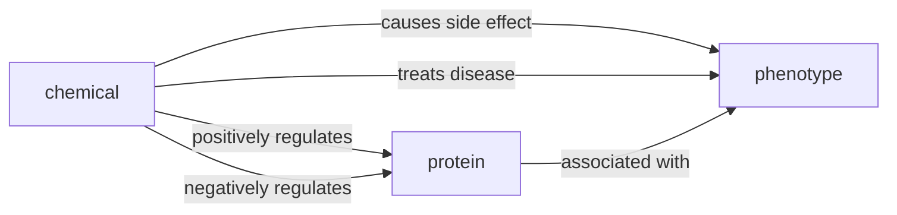
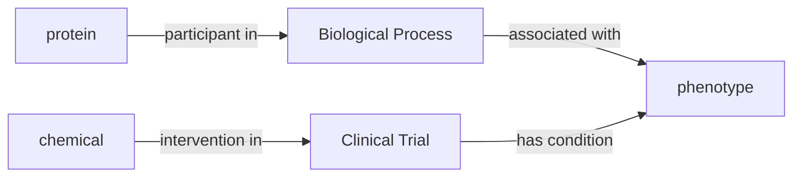

1. Drug discovery/repositioning
2. Systems toxicology (side effect prediction)
3.



## Drug Discovery/Repositioning (chemical-disease)

Rank which chemicals might be active against which diseases, taking into account
their protein targets and pathways. For chemicals that already have passed phase
II trials, this is called repositioning.

```mermaid
graph LR
    thalidomide@{ img: "https://upload.wikimedia.org/wikipedia/commons/thumb/0/08/Thalidomide_enantiomers.svg/400px-Thalidomide_enantiomers.svg.png", label: "Thalidomide", pos: "t", w: 60, h: 220, constraint: "off" }
    thalidomide -- causes side effect --> defects
    thalidomide -- treats --> anxiety
    thalidomide -- treats --> insomnia
    thalidomide -- treats --> morningsickness[morning sickness]
    thalidomide -- treats --> mm[multiple myeloma]
```

https://www.sciencedirect.com/topics/medicine-and-dentistry/drug-repositioning

## Systems Toxicology (chemical-side effect)

Predict potential side effects for chemicals by learning the relationships
between structure, function, and phenotype

## Proteochemometrics (chemical-protein)

Systematically uncover the relationship between structure and function of
chemicals across all protein targets

## Target Prioritization (protein-disease)

Rank targets' relevance in the context of each disease based on the entire
neighborhood of interactions

## Physical and Functional Interactions (protein-protein, chemical-chemical)

Which proteins have physical interactions? Which drugs have functional
interactions?

## Entity Similarity (X-X)

Which chemicals, proteins, pathways, diseases, etc. are similar on the basis of
their local community and global community structure?

1. Identifying diverse compounds, e.g., for creating a screening deck
2. Identifying similar compounds, e.g., for exploring the space around known
   hits

This is also a jumping-in point for user-driven exploration.

Identifying similar diseases to uncover shared mechanisms, and give a
knowledge-driven approach to drug repositioning (e.g., Alzheimers and Diabetes
are very similar drugs based on their underlying mechanisms, which is why some
repositing has been proposed)


