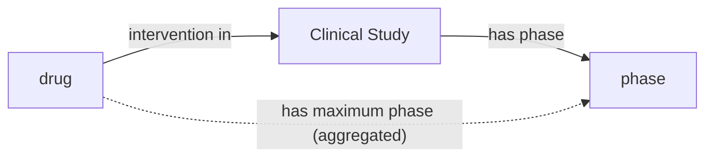
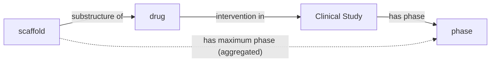
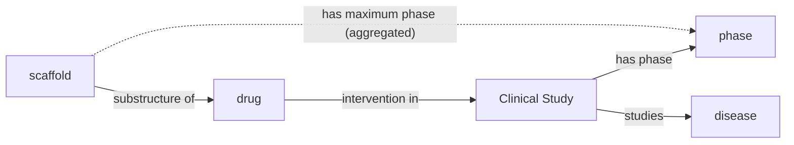
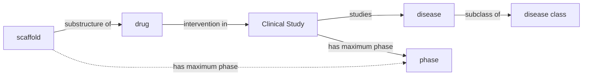
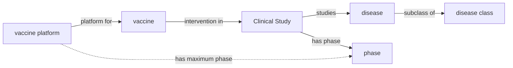
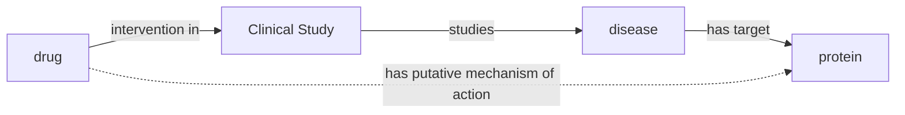

I've recently worked with clinical studies from [ClinicalTrials.gov](https://clinicaltrials.gov)
and [other international registries](https://bioregistry.io/collection/0000012). This post is a review on
how to access data, a proposal for how it can be modeled using
the [Ontology for Biomedical Investigations (OBI)](https://obi-ontology.org/),
a [proof-of-concept ontologization](https://w3id.org/biopragmatics/resources/clinicaltrials) of
ClinicalTrials.gov, and some insights into how this data can be integrated with other resources to address classical
problems in drug discovery from a knowledge graph perspective.

## Table of Contents

1. [Automated download of ClinicalTrails.gov with `clinicaltrials-downloader`](#automated-download)
2. [Summarizing ClincialTrials.gov study types, allocations, and phases](#summarization)
3. [Example clinical studies](#example-clinical-studies)
4. [Proposing an ontology meta-model](#proposing-an-ontology-meta-model)
5. [Proof-of-concept ontology export of ClinicalTrials.gov](#proof-of-concept-ontology-export-of-clinicaltrialsgov)
6. [Reflections and what's missing](#reflections-and-whats-missing)
7. [What's this all useful for, anyway?](#whats-this-all-useful-for-anyway)

## Automated Download

Similar to [ChEMBL](),
[DrugBank](), and
[UMLS](), I authored a Python package,
`clinicaltrials-downloader` that automates download and caching clinical studies
from [ClinicalTrials.gov](https://clinicaltrials.gov). Its source code is
available under the MIT license at
[https://github.com/cthoyt/clinicaltrials-downloader](https://github.com/cthoyt/clinicaltrials-downloader),
and it can be installed with:

```console
$ pip install clinicaltrials_downloader
```

`clinicaltrials-downloader` exposes two main functions for getting the raw,
unprocessed data:

```python
from clinicaltrials_downloader import get_studies, get_studies_slim

# contains all fields, (~2GB, gzipped)
studies = get_studies()

# contains a useful subset of the fields, much smaller (~70MB, gzipped)
studies_slim = get_studies_slim()
```

## Summarization

I generated a few summary tables over the slim subset of ClinicalTrials.gov. Keep in mind that the
data is updated daily, so these statistics reflect the state of the database in mid-January 2025.
Of course, they can be updated anytime by passing `force=True` to the downloader function to update
the local cache of the database.

### Study Type and Allocation

ClinicalTrials.gov contains three main study types:

1. [interventional study](https://clinicaltrials.gov/study-basics/glossary#interventional-study-clinical-trial)
   (i.e., clinical trial) - a study in which participants are assigned zero or more diagnostic, therapeutic, or other
   types of interventions depending on the arm into which they are allocated
2. [observational study](https://clinicaltrials.gov/study-basics/glossary#observational-study) - a study in
   which participants are assessed for biomedical or health outcomes. They may receive interventions, but they are not
   assigned like in interventional studies
3. [expanded access](https://clinicaltrials.gov/study-basics/glossary#expanded-access) (i.e., compassionate use) - a
   mechanism through which patients who are not participants in a clinical trial to receive access to
   non-approved/experimental medicine.

Interventional studies can be divided into two categories based on
their [allocation](https://clinicaltrials.gov/study-basics/glossary#allocation) - the used to assign participants to an
arm of a clinical study. They are [randomized](https://clinicaltrials.gov/study-basics/glossary#randomized-allocation)
and non-randomized.

The table below adjusts the internal labels for legibility, aggregates missing values and `NA` entries, and sorts
by most common.

| Study Type      | Allocation     |   Count |
|-----------------|----------------|--------:|
| Interventional  | Randomized     | 261,643 |
| Observational   |                | 120,775 |
| Interventional  |                |  95,249 |
| Interventional  | Non-Randomized |  42,759 |
| Expanded Access |                |     966 |
|                 |                |     902 |

### Phases


Image above from
the [Hepatitis B Foundation](https://www.hepb.org/research-and-programs/hepdeltaconnect/clinical-trials/).

The [phase](https://clinicaltrials.gov/study-basics/glossary#phase) primarily communicates the objective of a
clinical trial (i.e., interventional study). Observational trials and expanded access studies therefore do not have
phases. There are six common phases appearing on ClinicalTrials.gov:

- [Early Phase 1](https://clinicaltrials.gov/study-basics/glossary#early-phase-1-formerly-listed-as-phase-0) (formerly,
  Phase 0) - Assess oral bioavailability, pharmacokinetics (very small group)
- [Phase 1](https://clinicaltrials.gov/study-basics/glossary#phase-1) - Assess safety in healthy volunteers (small
  group)
- [Phase 2](https://clinicaltrials.gov/study-basics/glossary#phase-2) - Assess efficacy and side effects (medium group)
- [Phase 3](https://clinicaltrials.gov/study-basics/glossary#phase-3) - Assess efficacy, effectiveness, and safety (
  large group)
- [Phase 4](https://clinicaltrials.gov/study-basics/glossary#phase-4) - Post-approval surveillance
- [Phase Not Applicable (N/A)](https://clinicaltrials.gov/study-basics/glossary#phase-not-applicable) - Applied to
  trials without phases, such as trials with devices or behavioral interventions

The table below adjusts the internal clinical trial phases' labels for legibility, aggregates missing values and `NA`
entries, and sorts by progression.

| Phase          |   Count |
|----------------|--------:|
| 0              |   5,434 |
| 1              |  44,195 |
| 1, 2           |  15,219 |
| 2              |  59,412 |
| 2, 3           |   6,982 |
| 3              |  39,160 |
| 4              |  33,129 |
| N/A or missing | 318,763 |

Some trials are annotated with multiple phases, either 1/2 or 2/3. These could also be combined in a different
way for "maximum clinical phase" aggregation operations.

Unsurprisingly, there is an attrition through the progression of phases, but it is not as stark as I would have
expected. It might also be interesting to stratify this by year to see if trials are more likely to succeed as time goes
on.

## Example Clinical Studies

I generated a table containing example clinical trials for each study type, allocation, and phase.
While there are many studies with more than one intervention and/or condition, this table only shows
trials with a single one of each to reduce complexity.

| Study/Phase(s)             | NCT ID                                                           | Title                                                                           | Condition                                                        | Intervention                                                        | Structure                                                   |
|----------------------------|------------------------------------------------------------------|---------------------------------------------------------------------------------|------------------------------------------------------------------|---------------------------------------------------------------------|-------------------------------------------------------------|
| Expanded Access            | [NCT01317953](https://bioregistry.io/clinicaltrials:NCT01317953) | Oral Green Tea Extract for Small Cell Lung Cancer                               | [Small Cell Lung Carcinoma](https://bioregistry.io/mesh:D055752) | [(-)-epigallocatechin 3-gallate](https://bioregistry.io/chebi:4806) |    |
| Observational              | [NCT03418987](https://bioregistry.io/clinicaltrials:NCT03418987) | The Vertebral Vector in a Horizontal Plane. A Simple Way to See in 3D.          | [Scoliosis](https://bioregistry.io/mesh:D012600)                 |                                                                     |                                                             |
| Non-Randomized (Phase 0)   | [NCT01209533](https://bioregistry.io/clinicaltrials:NCT01209533) | Inhaled Iloprost in Mild Asthma                                                 | [Asthma](https://bioregistry.io/mesh:D001249)                    | [iloprost](https://bioregistry.io/chebi:63916)                      |   |
| Non-Randomized (Phase 1)   | [NCT01682187](https://bioregistry.io/clinicaltrials:NCT01682187) | A Dose-Escalation Study in Participants With Recurrent Malignant Glioma         | [Glioma](https://bioregistry.io/mesh:D005910)                    | [lomustine](https://bioregistry.io/chebi:6520)                      |    |
| Non-Randomized (Phase 1/2) | [NCT00379587](https://bioregistry.io/clinicaltrials:NCT00379587) | Rituximab for Prevention of Chronic GVHD                                        | [Hematologic Neoplasms](https://bioregistry.io/mesh:D019337)     | [rituximab](https://bioregistry.io/chebi:64357)                     |   |
| Non-Randomized (Phase 2)   | [NCT00176787](https://bioregistry.io/clinicaltrials:NCT00176787) | Radiation Therapy With Capecitabine in Rectal Cancer                            | [Rectal Neoplasms](https://bioregistry.io/mesh:D012004)          | [capecitabine](https://bioregistry.io/chebi:31348)                  |   |
| Non-Randomized (Phase 2/3) | [NCT04431453](https://bioregistry.io/clinicaltrials:NCT04431453) | Study of Remdesivir in Participants Below 18 Years Old With COVID-19            | [COVID-19](https://bioregistry.io/mesh:D000086382)               | [remdesivir](https://bioregistry.io/chebi:145994)                   |  |
| Non-Randomized (Phase 3)   | [NCT03184987](https://bioregistry.io/clinicaltrials:NCT03184987) | A Long-term Safety Study of Fixed Dose Combination Therapy Fluticasone [...]    | [Asthma](https://bioregistry.io/mesh:D001249)                    | [albuterol](https://bioregistry.io/chebi:2549)                      |    |
| Non-Randomized (Phase 4)   | [NCT03282487](https://bioregistry.io/clinicaltrials:NCT03282487) | Optimising Steroid Replacement in Patients With Adrenal Insufficiency           | [Adrenal Insufficiency](https://bioregistry.io/mesh:D000309)     | [cortisol](https://bioregistry.io/chebi:17650)                      |   |
| Randomized (Phase 0)       | [NCT04293887](https://bioregistry.io/clinicaltrials:NCT04293887) | Efficacy and Safety of IFN-α2β in the Treatment of Novel Coronavirus Patients   | [Coronavirus Infections](https://bioregistry.io/mesh:D018352)    | [interferon](https://bioregistry.io/chebi:52999)                    |   |
| Randomized (Phase 1)       | [NCT01166087](https://bioregistry.io/clinicaltrials:NCT01166087) | Bioequivalence Study of Fluoxetine Hydrochloride Delayed-Release Capsules [...] | [Malnutrition](https://bioregistry.io/mesh:D044342)              | [fluoxetine](https://bioregistry.io/chebi:5118)                     |    |
| Randomized (Phase 1/2)     | [NCT00106587](https://bioregistry.io/clinicaltrials:NCT00106587) | Treatment of In-Stent Restenosis by Paclitaxel Coated PTCA Balloons [...]       | [Coronary Restenosis](https://bioregistry.io/mesh:D023903)       | [paclitaxel](https://bioregistry.io/chebi:45863)                    |   |
| Randomized (Phase 2)       | [NCT00094887](https://bioregistry.io/clinicaltrials:NCT00094887) | Nitric Oxide Inhalation to Treat Sickle Cell Pain Crises                        | [Anemia, Sickle Cell](https://bioregistry.io/mesh:D000755)       | [nitric oxide](https://bioregistry.io/chebi:16480)                  |   |
| Randomized (Phase 2/3)     | [NCT00136487](https://bioregistry.io/clinicaltrials:NCT00136487) | Celecoxib (Celebrex) Versus Placebo in Men With Recurrent Prostate Cancer       | [Prostatic Neoplasms](https://bioregistry.io/mesh:D011471)       | [celecoxib](https://bioregistry.io/chebi:41423)                     |   |
| Randomized (Phase 3)       | [NCT00843687](https://bioregistry.io/clinicaltrials:NCT00843687) | A Comparison of the Pharmacokinetics and Safety of Long-acting Injectable [...] | [Schizophrenia](https://bioregistry.io/mesh:D012559)             | [risperidone](https://bioregistry.io/chebi:8871)                    |    |
| Randomized (Phase 4)       | [NCT03586687](https://bioregistry.io/clinicaltrials:NCT03586687) | Osteoarthritis Shoulder Injection Study                                         | [Osteoarthritis](https://bioregistry.io/mesh:D010003)            | [triamcinolone](https://bioregistry.io/chebi:9667)                  |    |

## Proposing an Ontology Meta-model

<a href="https://docs.google.com/drawings/d/19BuWZ-C2iZkxDScxDy9WsAtLsItvkqT9bFtFaFkpbyA/edit?usp=sharing">

</a>

TODO:

1. copy conversation from post [https://github.com/obi-ontology/obi/issues/1831](https://github.com/obi-ontology/obi/issues/1831)
2. Talk about what's missing (more detailed ontologization of [expanded access types](https://clinicaltrials.gov/study-basics/glossary#expanded-access-type) and [expanded access status](https://clinicaltrials.gov/study-basics/glossary#expanded-access-status))
   1. how to capture other parts Bjorn mentioned
   2. Eligibility criteria, enrollment
   3. statistical methods linked to STATO
   4. outcomes linked to OBI:Assay
   5. ontologization of groups/cohorts in observational studies, and [observational study models](https://clinicaltrials.gov/study-basics/glossary#observational-study-model) such as case-control, case-only, case-cross-over, ecologic or community studies, family-based, and other.
   6. capturing of adverse events - this might be more of a data modeling that ontologization question
   7. capturing the investigator, funder type, and sponsor for bibliometric purposes
   8. capturing geolocations / institutions hosting parts of the trial

## Proof-of-concept Ontology Export of ClinicalTrials.gov

1. What is PyOBO
2. What is obo-db-ingest
3. What are PURLs
4. Why it's useful to do this
5. Licensing of ClinicalTrials.gov
6. Link to ClinicalTrials.gov page on obo-db-ingest
7. Summary statistics, in text (enough tables already)

PyOBO source turns it into an ontology

| Artifact       | Download PURL                                                                    |
|----------------|----------------------------------------------------------------------------------|
| OBO            | https://w3id.org/biopragmatics/resources/clinicaltrials/clinicaltrials.obo.gz    |
| OFN            | https://w3id.org/biopragmatics/resources/clinicaltrials/clinicaltrials.ofn.gz    |
| Nodes          | https://w3id.org/biopragmatics/resources/clinicaltrials/clinicaltrials.tsv       |
| SSSOM          | https://w3id.org/biopragmatics/resources/clinicaltrials/clinicaltrials.sssom.tsv |
| OWL            | https://w3id.org/biopragmatics/resources/clinicaltrials/clinicaltrials.owl.gz    |
| OBO Graph JSON | https://w3id.org/biopragmatics/resources/clinicaltrials/clinicaltrials.json.gz   |

#### Summary

| field      |     count |
|------------|----------:|
| mappings   |   879,540 |
| parents    |   522,294 |
| properties | 2,080,891 |
| terms      |   522,294 |

## Reflections, and, what's missing?

I worked on this in the scope of the DTRA RAPTER project but the code was tied
up with a lot of internal infrastructure and wasn't made public, so some of the
ideas can be reused later like:

1. using simple NER to correct the grounding of MeSH terms
2. Mapping out of mesh to vocabularies that are better linked, such as ChEBI
   (note that the examples I gave had already done this), DrugBank, ChEMBL, etc.
   and DOID/MONDO for diseases
3. Reasons for clinical trials failing and side effects measured, such as
   reported in the VAERS database
4. What are the primary, secondary, and other outcomes measured? Can these also
   be grounded to ontology terms or a more generic data model?
5. Grounding all sponsors to ROR identifiers!

## What's this all useful for, anyway?

TODO:

1. summarize knowledge graph integration, path queries, data integration

### Chemical Phase Assessment



You can find out what's the maximum phase each intervention has appeared in.
This is interesting because it's often the case that multiple trials use the
same interventions. This is especially true in drug repositioning, where a drug
might be useful for a similar disease. More generally, drugs of the same
chemical class might also be useful for the same disease

Think of the priviliged substructures:

- the beta hydroxy lactone appearing in statins that enables their HMG-CoA
  reductase inhibitor activity
- sulfonamides for antibacterial properties due to their competitive inhibition
  of dihydropteroate synthase

However, a clinical trial database isn't enough to help us understand this.

### Global Chemical Space Assessment



Checking what chemical space has been used. Substructure relations can be
imported from ChEBI

### Disease-specific Chemical Space Assessment



The graph diagram isn't great to show aggregation/filtering operations paired
with graph queries, but you can also aggregate by the disease, so you can get
information like "how far has each scaffold got in each/my disease area?"

### Disease Class

This gets even more wild if you do a second aggregation over disease class,
letting you aggregate to answer questions lie "how far has each scaffold got in
each high-level disease class?". Of course, the secret is in having a subclass
structure that reflects something meaningful, and having a good way of deciding
where to prune that hierarchy. Maybe, the question is something like aggregating
for all rare diseases, cancers, neurodegenerative dieases, etc.



### Vaccine Summaries



1. in RAPTER, it was used to get a quick overview of which vaccine platforms had
   progressed to what degree in clinical trials

Specifically, this can help summarize vaccine platforms like RNA vaccines, DNA vaccines, viral vector vaccines, etc.
and their ability to treat subclasses of coronavirus diseases, ebola, and malaria.

### Target Identification


Target identification typically covers identifying important proteins in a given
disease context whose modulation can result in a therapeutic effect.

When combining clinical trial information with chemical activity databases like
ChEMBL, it's possible to generate hypotheses of important proteins in a disease
area.

Databases like OpenTargets have several orthogonal resources for triaging target
candidates.

Knowledge driven approaches like DisGeNet use text mining approaches as a
stand-in. When applied tt scale, automated approaches are also useful (re,
INDRA)

Knockdown, knockout, or overexpression studies are typicall run to confirm
target hypotheses.

### Mechanism of Action Deconvolution



The dual problem to target identification is mechanism of action deconvolution.
This is a scenario where you know a drug works against a disease, but not why.
It turns out that having a mechanistic hypothesis is not required for FDA
approval!

Clinical trial inforamtion, combine with existing disease-target databases like
DisGeNet can give a simple path-based method for hypothesis generation.

More sophistocated methods that take into account chemical similarity and
protein similarity also exist.

MoA hypotheses can be much more easily tested in biochemical assays.

Why do we need this? Phenotypic drug discovery hype comes in cycles, and this is
a nice way to bridge the gap to target-based drug discovery. It's particularly
effective when there exist good cellular or animal models for the disease.

## Further Reading

- [https://github.com/obi-ontology/obi/issues/1831]
- [https://clinicaltrials.gov/about-site/about-ctg]
- [https://clinicaltrials.gov/study-basics/learn-about-studies]
- [https://clinicaltrials.gov/study-basics/glossary]
