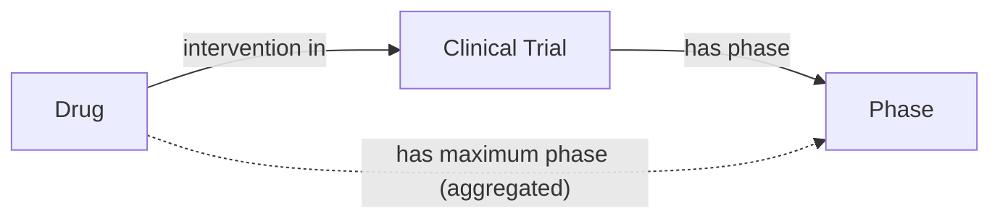
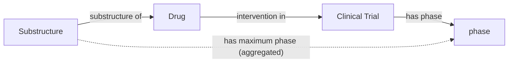
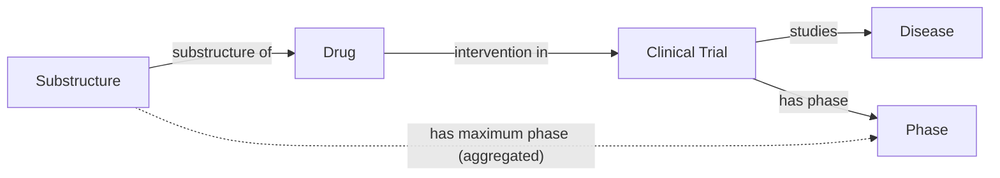
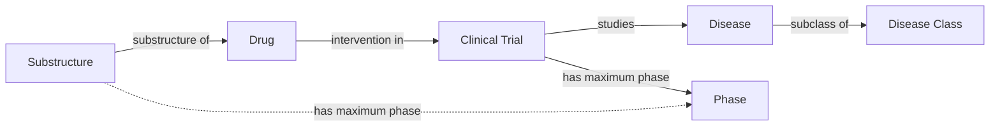
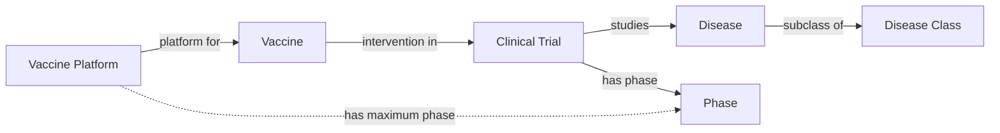
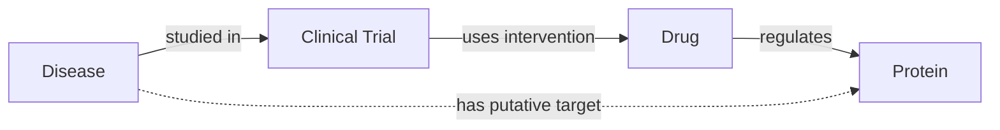
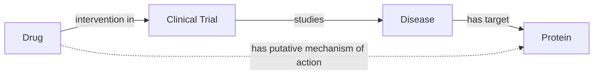

I've recently worked with clinical studies from
[ClinicalTrials.gov](https://clinicaltrials.gov) and
[other international registries](https://bioregistry.io/collection/0000012).
This post is a review on how to access data, a proposal for how it can be
modeled using the
[Ontology for Biomedical Investigations (OBI)](https://obi-ontology.org/), a
[proof-of-concept ontologization](https://w3id.org/biopragmatics/resources/clinicaltrials)
of ClinicalTrials.gov, and some insights into how this data can be integrated
with other resources to address classical problems in drug discovery from a
knowledge graph perspective.

This is a long read, so here's a table of contents:

1. [Automated download of ClinicalTrails.gov with `clinicaltrials-downloader`](#automated-download)
2. [Summarizing ClincialTrials.gov study types, allocations, and phases](#summarization)
3. [Example clinical studies](#example-clinical-studies)
4. [Proposing an ontology meta-model](#proposing-an-ontology-meta-model)
5. [Proof-of-concept ontology export of ClinicalTrials.gov using `pyobo`](#proof-of-concept-ontology-export-of-clinicaltrialsgov)
6. [Reflections and what's missing](#reflections-and-whats-missing)
7. [What's this all useful for, anyway?](#whats-this-all-useful-for-anyway)

## Automated Download

Similar to [ChEMBL](),
[DrugBank](), and
[UMLS](), I authored a Python package,
`clinicaltrials-downloader` that automates download and caching clinical studies
from [ClinicalTrials.gov](https://clinicaltrials.gov). Its source code is
available under the MIT license at
[https://github.com/cthoyt/clinicaltrials-downloader](https://github.com/cthoyt/clinicaltrials-downloader),
and it can be installed with:

```console
$ pip install clinicaltrials_downloader
```

`clinicaltrials-downloader` exposes two main functions for getting the raw,
unprocessed data:

```python
from clinicaltrials_downloader import get_studies, get_studies_slim

# contains all fields, (~2GB, gzipped)
studies = get_studies()

# contains a useful subset of the fields, much smaller (~70MB, gzipped)
studies_slim = get_studies_slim()
```

## Summarization

I generated a few summary tables over the slim subset of ClinicalTrials.gov.
Keep in mind that the data is updated daily, so these statistics reflect the
state of the database in mid-January 2025. Of course, they can be updated
anytime by passing `force=True` to the downloader function to update the local
cache of the database.

### Study Type and Allocation

ClinicalTrials.gov contains three main study types:

1. [interventional study](https://clinicaltrials.gov/study-basics/glossary#interventional-study-clinical-trial)
   (i.e., clinical trial) - a study in which participants are assigned zero or
   more diagnostic, therapeutic, or other types of interventions depending on
   the arm into which they are allocated
2. [observational study](https://clinicaltrials.gov/study-basics/glossary#observational-study) -
   a study in which participants are assessed for biomedical or health outcomes.
   They may receive interventions, but they are not assigned like in
   interventional studies
3. [expanded access](https://clinicaltrials.gov/study-basics/glossary#expanded-access)
   (i.e., compassionate use) - a mechanism through which patients who are not
   participants in a clinical trial to receive access to
   non-approved/experimental medicine.

Interventional studies can be divided into two categories based on their
[allocation](https://clinicaltrials.gov/study-basics/glossary#allocation) - the
used to assign participants to an arm of a clinical study. They are
[randomized](https://clinicaltrials.gov/study-basics/glossary#randomized-allocation)
and non-randomized.

The table below adjusts the internal labels for legibility, aggregates missing
values and `NA` entries, and sorts by most common.

| Study Type      | Allocation     |   Count |
| --------------- | -------------- | ------: |
| Interventional  | Randomized     | 261,643 |
| Observational   |                | 120,775 |
| Interventional  |                |  95,249 |
| Interventional  | Non-Randomized |  42,759 |
| Expanded Access |                |     966 |
|                 |                |     902 |

### Phases

The [phase](https://clinicaltrials.gov/study-basics/glossary#phase) primarily
communicates the objective of a clinical trial (i.e., interventional study).
Observational trials and expanded access studies therefore do not have phases.


Image above from the
[Hepatitis B Foundation](https://www.hepb.org/research-and-programs/hepdeltaconnect/clinical-trials/).

There are six common phases appearing on ClinicalTrials.gov:

- [Early Phase 1](https://clinicaltrials.gov/study-basics/glossary#early-phase-1-formerly-listed-as-phase-0)
  (formerly, Phase 0) - Assess oral bioavailability, pharmacokinetics (very
  small group; almost always left out of diagrams like the one above). This is
  not the same thing as pre-clinical trials, which are often done with
  biochemical assays, cellular assays, and work with model organisms.
- [Phase 1](https://clinicaltrials.gov/study-basics/glossary#phase-1) - Assess
  safety in healthy volunteers (small group)
- [Phase 2](https://clinicaltrials.gov/study-basics/glossary#phase-2) - Assess
  efficacy and side effects (medium group)
- [Phase 3](https://clinicaltrials.gov/study-basics/glossary#phase-3) - Assess
  efficacy, effectiveness, and safety ( large group)
- [Phase 4](https://clinicaltrials.gov/study-basics/glossary#phase-4) -
  Post-approval surveillance
- [Phase Not Applicable (N/A)](https://clinicaltrials.gov/study-basics/glossary#phase-not-applicable) -
  Applied to trials without phases, such as trials with devices or behavioral
  interventions

The table below adjusts the internal clinical trial phases' labels for
legibility, aggregates missing values and `NA` entries, and sorts by
progression.

| Phase          |   Count |
| -------------- | ------: |
| 0              |   5,434 |
| 1              |  44,195 |
| 1, 2           |  15,219 |
| 2              |  59,412 |
| 2, 3           |   6,982 |
| 3              |  39,160 |
| 4              |  33,129 |
| N/A or missing | 318,763 |

Some trials are annotated with multiple phases, either 1/2 or 2/3. These could
also be combined in a different way for "maximum clinical phase" aggregation
operations.

Unsurprisingly, there is an attrition through the progression of phases, but it
is not as stark as I would have expected. It might also be interesting to
stratify this by year to see if trials are more likely to succeed as time goes
on.

## Example Clinical Studies

Having examples and doing spot-checks is always helpful when exploring new data,
so I generated a table containing example clinical trials for each study type,
allocation, and phase. While there are many studies with more than one
intervention and/or condition, this table only shows trials with a single one of
each to reduce complexity.

| Study/Phase(s)             | NCT ID                                                           | Title                                                                           | Condition                                                        | Intervention                                                        | Structure                                                   |
| -------------------------- | ---------------------------------------------------------------- | ------------------------------------------------------------------------------- | ---------------------------------------------------------------- | ------------------------------------------------------------------- | ----------------------------------------------------------- |
| Expanded Access            | [NCT01317953](https://bioregistry.io/clinicaltrials:NCT01317953) | Oral Green Tea Extract for Small Cell Lung Cancer                               | [Small Cell Lung Carcinoma](https://bioregistry.io/mesh:D055752) | [(-)-epigallocatechin 3-gallate](https://bioregistry.io/chebi:4806) |    |
| Observational              | [NCT03418987](https://bioregistry.io/clinicaltrials:NCT03418987) | The Vertebral Vector in a Horizontal Plane. A Simple Way to See in 3D.          | [Scoliosis](https://bioregistry.io/mesh:D012600)                 |                                                                     |                                                             |
| Non-Randomized (Phase 0)   | [NCT01209533](https://bioregistry.io/clinicaltrials:NCT01209533) | Inhaled Iloprost in Mild Asthma                                                 | [Asthma](https://bioregistry.io/mesh:D001249)                    | [iloprost](https://bioregistry.io/chebi:63916)                      |   |
| Non-Randomized (Phase 1)   | [NCT01682187](https://bioregistry.io/clinicaltrials:NCT01682187) | A Dose-Escalation Study in Participants With Recurrent Malignant Glioma         | [Glioma](https://bioregistry.io/mesh:D005910)                    | [lomustine](https://bioregistry.io/chebi:6520)                      |    |
| Non-Randomized (Phase 1/2) | [NCT00379587](https://bioregistry.io/clinicaltrials:NCT00379587) | Rituximab for Prevention of Chronic GVHD                                        | [Hematologic Neoplasms](https://bioregistry.io/mesh:D019337)     | [rituximab](https://bioregistry.io/chebi:64357)                     |   |
| Non-Randomized (Phase 2)   | [NCT00176787](https://bioregistry.io/clinicaltrials:NCT00176787) | Radiation Therapy With Capecitabine in Rectal Cancer                            | [Rectal Neoplasms](https://bioregistry.io/mesh:D012004)          | [capecitabine](https://bioregistry.io/chebi:31348)                  |   |
| Non-Randomized (Phase 2/3) | [NCT04431453](https://bioregistry.io/clinicaltrials:NCT04431453) | Study of Remdesivir in Participants Below 18 Years Old With COVID-19            | [COVID-19](https://bioregistry.io/mesh:D000086382)               | [remdesivir](https://bioregistry.io/chebi:145994)                   |  |
| Non-Randomized (Phase 3)   | [NCT03184987](https://bioregistry.io/clinicaltrials:NCT03184987) | A Long-term Safety Study of Fixed Dose Combination Therapy Fluticasone [...]    | [Asthma](https://bioregistry.io/mesh:D001249)                    | [albuterol](https://bioregistry.io/chebi:2549)                      |    |
| Non-Randomized (Phase 4)   | [NCT03282487](https://bioregistry.io/clinicaltrials:NCT03282487) | Optimising Steroid Replacement in Patients With Adrenal Insufficiency           | [Adrenal Insufficiency](https://bioregistry.io/mesh:D000309)     | [cortisol](https://bioregistry.io/chebi:17650)                      |   |
| Randomized (Phase 0)       | [NCT04293887](https://bioregistry.io/clinicaltrials:NCT04293887) | Efficacy and Safety of IFN-α2β in the Treatment of Novel Coronavirus Patients   | [Coronavirus Infections](https://bioregistry.io/mesh:D018352)    | [interferon](https://bioregistry.io/chebi:52999)                    |   |
| Randomized (Phase 1)       | [NCT01166087](https://bioregistry.io/clinicaltrials:NCT01166087) | Bioequivalence Study of Fluoxetine Hydrochloride Delayed-Release Capsules [...] | [Malnutrition](https://bioregistry.io/mesh:D044342)              | [fluoxetine](https://bioregistry.io/chebi:5118)                     |    |
| Randomized (Phase 1/2)     | [NCT00106587](https://bioregistry.io/clinicaltrials:NCT00106587) | Treatment of In-Stent Restenosis by Paclitaxel Coated PTCA Balloons [...]       | [Coronary Restenosis](https://bioregistry.io/mesh:D023903)       | [paclitaxel](https://bioregistry.io/chebi:45863)                    |   |
| Randomized (Phase 2)       | [NCT00094887](https://bioregistry.io/clinicaltrials:NCT00094887) | Nitric Oxide Inhalation to Treat Sickle Cell Pain Crises                        | [Anemia, Sickle Cell](https://bioregistry.io/mesh:D000755)       | [nitric oxide](https://bioregistry.io/chebi:16480)                  |   |
| Randomized (Phase 2/3)     | [NCT00136487](https://bioregistry.io/clinicaltrials:NCT00136487) | Celecoxib (Celebrex) Versus Placebo in Men With Recurrent Prostate Cancer       | [Prostatic Neoplasms](https://bioregistry.io/mesh:D011471)       | [celecoxib](https://bioregistry.io/chebi:41423)                     |   |
| Randomized (Phase 3)       | [NCT00843687](https://bioregistry.io/clinicaltrials:NCT00843687) | A Comparison of the Pharmacokinetics and Safety of Long-acting Injectable [...] | [Schizophrenia](https://bioregistry.io/mesh:D012559)             | [risperidone](https://bioregistry.io/chebi:8871)                    |    |
| Randomized (Phase 4)       | [NCT03586687](https://bioregistry.io/clinicaltrials:NCT03586687) | Osteoarthritis Shoulder Injection Study                                         | [Osteoarthritis](https://bioregistry.io/mesh:D010003)            | [triamcinolone](https://bioregistry.io/chebi:9667)                  |    |

## Proposing an Ontology Meta-model

Given my goal to create an ontology export of ClinicalTrials.gov, I had to start
by making some modeling decisions. The first was that each clinical study in the
resource is an _instance_. This meant that I had to start by finding the right
_class_ for each, corresponding to the study types and allocations that I
explored above.

### Searching for Existing Ontology Classes

The [Ontology for Biomedical Investigations (OBI)](https://obi-ontology.org) is
a high quality ontology that contains terms for assays, devices, objectives, and
other aspects of biomedical investigations. Therefore, I would ideally be able
to find terms corresponding to the study types and allocations that I explored
above already inside it.

I used the
[Ontology Lookup Service (OLS)](https://www.ebi.ac.uk/ols4/ontologies) to search
for classes corresponding to the study types I explored above, but didn't find
anything specific enough in OBI. However, I did note that _if_ there would be
classes for clinical studies, then they would appear under its high-level class
for [investigation (OBI:0000066)](https://bioregistry.io/obi:0000066)

While searching in the OLS, I did find the following relevant classes, each with
their own issues:

1. The [Semantic Science Integrated Ontology (SIO)](https://bioregistry.io/sio)
   has a term for clinical trial
   ([SIO:001000](https://www.ebi.ac.uk/ols4/ontologies/sio/classes/http%253A%252F%252Fsemanticscience.org%252Fresource%252FSIO_001000)),
   but SIO doesn't follow best practices from
   [Open Biological and Biomedical Ontology (OBO) Foundry](https://obofoundry.org),
   meaning that it is difficult to reuse and less trustworthy.
2. The
   [Ontology of Precision Medicine and Investigation (OPMI)](https://bioregistry.io/opmi)
   has a term for clinical trial
   ([OPMI:0004507](https://www.ebi.ac.uk/ols4/ontologies/opmi/classes/http%253A%252F%252Fpurl.obolibrary.org%252Fobo%252FOPMI_0004507?lang=en)).
   I'm not comfortable reusing terms from this ontology for two main reasons:
   1. It's use-case specific, and curated based on project-based needs, which
      means that it's not a reliable resource.
   2. It's not curated using modern ontology infrastructure, so I'm not sure
      that I can trust it will be maintained.
3. The [Informed Consent Ontology (ICO)](https://bioregistry.io/ico) also has a
   term for clinical trial
   ([ICO:0000065](https://www.ebi.ac.uk/ols4/ontologies/ico/classes/http%253A%252F%252Fpurl.obolibrary.org%252Fobo%252FICO_0000065?lang=en))
   but I have the same reservations as for OPMI. There's an overlap of the same
   authors with OPMI, so I have reservations to invest in reusing terms they
   haven't been able to deduplicate themselves.
4. [Eagle-I Resource Ontology (ERO)](https://obofoundry.org/ontology/ero) is an
   OBO Foundry ontology that has a term
   [clinical trial (ERO:0000016)](https://purl.obolibrary.org/obo/ERO_0000016)
   which nicely subclasses OBI's investigation class, but ERO has been abandoned
   and marked as deprecated in the OBO Foundry.
5. The [Ontology for MicroRNA Target (OMIT)](https://bioregistry.io/omit)
   haphazardly imported all of MeSH at some point and has a term
   [Clinical Trial (OMIT:0016936)](https://www.ebi.ac.uk/ols4/ontologies/omit/classes/http%253A%252F%252Fpurl.obolibrary.org%252Fobo%252FOMIT_0016936).
6. The [Clinical Trials Ontology (CTO)](https://bioregistry.io/registry/cto) is
   an OBO Foundry ontology that nominally has the correct scope and has a term
   [clinical trial (CTO:0000220)](https://purl.obolibrary.org/obo/CTO_0000220),
   but there are potential issues with its design choices, and it was produced
   by a group that has historically had difficulty maintaining its resources and
   actively participating in the OBO community. Despite these issues making it
   less suitable for reuse, the associated workshop proceeding
   [CTO: a Community-Based Clinical Trial Ontology and its Applications in PubChemRDF and SCAIView](https://bioregistry.io/pmc:PMC9389640)
   contains some interesting ideas.

Honorable mentions from non-ontology resources, which are a not ideal from a
modeling perspective to use as a parent class in an ontology:

1. [BioLink model](https://bioregistry.io/biolink) has a term
   [clinical trial (biolink:ClinicalTrial)](https://w3id.org/biolink/vocab/ClinicalTrial).
2. SNOMED has a term
   [Clinical trial (procedure) (SNOMED:110465008)](http://snomed.info/id/110465008),
   but is not an ontology and is notorious for being a closed resource,
   hampering reuse.
3. NCIT has a term for
   [Clinical Trial (NCIT:C71104)](https://bioregistry.io/NCIT:C71104), but it is
   not curated an ontology (despite OBO Foundry having an OWL conversion of it).
4. MeSH has a term
   [Clinical Trials as Topic (mesh:D002986)](https://bioregistry.io/mesh:D002986).

Despite all of what I could find, none of these terms were part of an ontology
that I can trust. Further, most of them conflated interventional clinical
studies, i.e., clinical trials, with all other clinical studies.

Therefore, the next step was to get in touch with OBI and ask them to mint an
authoritative term, that also can capture the nuance in clinical studies that is
lost in the other resources. I did that in their issue tracker
[obi-ontology/obi#1831](https://github.com/obi-ontology/obi/issues/1831). They
were very receptive, we had a nice conversation that brought up several points,
and they challenged me to go even further than just proposing the parent terms
and begin to develop a standardized model.

### A draft proposal

The following diagram represents a draft proposal that includes several terms
that OBI could mint as well as the kinds of relations between them. This is not
a perfect proposal - its goal is to be a discussion piece for an upcoming OBI
community call. There are still several parts missing and open questions.

<a href="https://docs.google.com/drawings/d/19BuWZ-C2iZkxDScxDy9WsAtLsItvkqT9bFtFaFkpbyA/edit?usp=sharing">

</a>

Here are some missing parts to this model that could be added incrementally:

1. A more detailed categorization of expanded access studies based on the
   [expanded access types](https://clinicaltrials.gov/study-basics/glossary#expanded-access-type)
   and
   [expanded access status](https://clinicaltrials.gov/study-basics/glossary#expanded-access-status)
2. A more detailed categorization of observational studies based on the 1)
   assembly of groups and cohorts and 2)
   [observational study models](https://clinicaltrials.gov/study-basics/glossary#observational-study-model)
   such as case-control, case-only, case-cross-over, ecologic or community
   studies, and family-based.
3. A model for eligibility criteria and enrollment
4. A model for outcomes, linked to OBI's assay terms
5. A model for investigators, funder types, and sponsors to support bibliometric
   investigation
6. A model for geolocation data associated with clinical study sites
7. A model for capturing adverse events and reasons for trial cancellation/end.
   In downstream applications, this could be used in tandem with the
   [FDA's Adverse Event Reporting System (FAERS)](https://www.fda.gov/drugs/surveillance/fdas-adverse-event-reporting-system-faers)
   and the
   [Vaccine Adverse Event Reporting System (VAERS)](https://vaers.hhs.gov/).

There is high potential for applying natural language processing methods to
extract more detailed information from the unstructured parts of clinical study
records. I've been focusing on ClincialTrials.gov as an example in this post,
but other clinical trial registries comprise almost exclusively unstructured
text.

## Proof-of-concept Ontology Export of ClinicalTrials.gov

[PyOBO](https://github.com/biopragmatics/pyobo) is Python software package that
implements an in-memory data structure for OBO/OWL ontologies as well as I/O
operations. On top of this, it implements workflows for converting databases
like HGNC, MeSH, and ChEMBL into OBO/OWL ontolgies. These workflows are careful
to make good design decisions, reusing classes and relations from other OBO
ontologies when possible. This is crucial for them to be readily integratable
with other resources.

The [`obo-db-ingest`](https://github.com/biopragmatics/obo-db-ingest) repository
is responsible for automatically downloading new versions of the resources
covered by PyOBO, converting them to OBO/OWL, archiving them to Zenodo, and
assigning persistent URLs (PURLs) so the files can be accessed in a sustainable
way. It's also careful to include licensing information such that anyone can
download these resources in a ready-to-use format, whereas the underlying
resources are often less easy to use directly.

As a proof-of-concept, I implemented a converter for ClinicalTrials.gov in PyOBO
at
[https://github.com/biopragmatics/pyobo/blob/main/src/pyobo/sources/clinicaltrials.py](https://github.com/biopragmatics/pyobo/blob/main/src/pyobo/sources/clinicaltrials.py).
The draft converter uses temporary classes to represent the study types and
allocations I'm proposing to OBI. It also mints some of its own relationships,
which would ideally be encoded in either OBI or the Relation Ontology (RO) for
maximum reusability.

The initial export contains more than 500K clinical studies; nearly one million
literature references, and near two million relationships between trials,
interventions, and conditions (there are still several places for expansion and
improvement discussed below). The ClinicalTrials.gov data is licensed under an
[equivalent to a public domain dedication](https://clinicaltrials.gov/about-site/terms-conditions#availability),
so there are few restrictions on remixing and redistributing the data this way.

A summary page can be found in the `obo-db-ingest` repository
[here](https://github.com/biopragmatics/obo-db-ingest/tree/main/export/clinicaltrials)
and the exported artifacts are listed here:

| Artifact       | Download PURL                                                                                                                                                    |
| -------------- | ---------------------------------------------------------------------------------------------------------------------------------------------------------------- |
| OBO            | [https://w3id.org/biopragmatics/resources/clinicaltrials/clinicaltrials.obo.gz](https://w3id.org/biopragmatics/resources/clinicaltrials/clinicaltrials.obo.gz)   |
| OFN            | [https://w3id.org/biopragmatics/resources/clinicaltrials/clinicaltrials.ofn.gz](https://w3id.org/biopragmatics/resources/clinicaltrials/clinicaltrials.ofn.gz)   |
| OWL            | [https://w3id.org/biopragmatics/resources/clinicaltrials/clinicaltrials.owl.gz](https://w3id.org/biopragmatics/resources/clinicaltrials/clinicaltrials.owl.gz)   |
| OBO Graph JSON | [https://w3id.org/biopragmatics/resources/clinicaltrials/clinicaltrials.json.gz](https://w3id.org/biopragmatics/resources/clinicaltrials/clinicaltrials.json.gz) |
| Nodes          | [https://w3id.org/biopragmatics/resources/clinicaltrials/clinicaltrials.tsv](https://w3id.org/biopragmatics/resources/clinicaltrials/clinicaltrials.tsv)         |

Here's what some OBO instances for clinical studies look like for each clinical
study type:

```
[Instance]
id: clinicaltrials:NCT00000102
name: Congenital Adrenal Hyperplasia\: Calcium Channels as Therapeutic Targets
property_value: clinicaltrials:has_intervention mesh:D009543 ! has intervention Nifedipine
property_value: clinicaltrials:investigates_condition mesh:D000308 ! investigates condition Adrenocortical Hyperfunction
property_value: clinicaltrials:investigates_condition mesh:D000312 ! investigates condition Adrenal Hyperplasia, Congenital
property_value: clinicaltrials:investigates_condition mesh:D006965 ! investigates condition Hyperplasia
property_value: clinicaltrials:investigates_condition mesh:D047808 ! investigates condition Adrenogenital Syndrome
instance_of: interventional-clinical-trial

[Instance]
id: clinicaltrials:NCT00000104
name: Does Lead Burden Alter Neuropsychological Development?
property_value: clinicaltrials:investigates_condition mesh:D007855 ! investigates condition Lead Poisoning
property_value: clinicaltrials:investigates_condition mesh:D011041 ! investigates condition Poisoning
instance_of: observational-clinical-trial

[Instance]
id: clinicaltrials:NCT00000106
name: 41.8 Degree Centigrade Whole Body Hyperthermia for the Treatment of Rheumatoid Diseases
property_value: clinicaltrials:investigates_condition mesh:D003095 ! investigates condition Collagen Diseases
property_value: clinicaltrials:investigates_condition mesh:D012216 ! investigates condition Rheumatic Diseases
instance_of: randomized-interventional-clinical-trial

[Instance]
id: clinicaltrials:NCT00000250
name: Cold Water Immersion Modulates Reinforcing Effects of Nitrous Oxide - 2
property_value: clinicaltrials:has_intervention mesh:D009609 ! has intervention Nitrous Oxide
property_value: clinicaltrials:investigates_condition mesh:D009293 ! investigates condition Opioid-Related Disorders
property_value: clinicaltrials:investigates_condition mesh:D019966 ! investigates condition Substance-Related Disorders
instance_of: non-randomized-interventional-clinical-trial

[Instance]
id: clinicaltrials:NCT00040625
name: ALIMTA \(Pemetrexed\) Alone or in Combination With Cisplatin for Patients With Malignant Mesothelioma.
property_value: clinicaltrials:has_intervention mesh:D000068437 ! has intervention Pemetrexed
property_value: clinicaltrials:investigates_condition mesh:D000086002 ! investigates condition Mesothelioma, Malignant
property_value: clinicaltrials:investigates_condition mesh:D008654 ! investigates condition Mesothelioma
instance_of: expanded-access-study
```

## Reflections, and, what's missing?

I first became familiar with ClinicalTrials.gov and other clinical study
registries while working on the
[RAPTER project](https://globalbiodefense.com/2023/05/10/rapter-expediting-medical-countermeasure-response/),
funded by the America Defense Threat Reduction Agency (DTRA) with the goal to
integrate vaccine information and build computational tools to quicken the
development of vaccines in response to future pandemics.

One of the key issues to overcome was the accuracy of the data within these
resources. For example, ClinicalTrials.gov contains both a free-text and
processed field for its conditions and interventions. In many cases,
re-processing was required to ensure complete and accurate information. In my
draft export of ClincalTrials.gov, I exclusively used the processed data fields,
but a more careful conversion would require additional data science techniques.

Similarly, for data from the World Health Organization and other clinical trial
registries, full NER and relation extraction is required to identify
interventions, conditions, outcomes, and other fields.

Even when processed data is available, it's using MeSH identifiers, which are
not readily integrable with other resources. That's why ontologies often curate
MeSH cross-references themselves. I created the
[Biomappings](https://github.com/biopragmatics/biomappings) project as a way to
quickly predict and curate MeSH mappings to other chemical and disease
vocabularies, such as
[Chemical Entities of Biological Interest (ChEBI)](https://bioregistry.io/chebi)
and the [Disease Ontology (DOID)](https://bioregistry.io/doid). I also built
[SeMRA](https://github.com/biopragmatics/semra), a workflow for assembling and
inferring mappings to best reuse existing mappings available from a wide variety
of sources. These two approaches are crucial for making clinical study and trial
information actionable in a data integration scenario.

I didn't even mention the PICO (patient/population, intervention, comparison and
outcomes) data model - this is a whole other can of worms for a different
discussion. I will try to come back to that if I get the chance to write up some
of my work with Jeremy Zucker's team at PNNL on the
[y0 Causal Reasoning Engine](https://github.com/y0-causal-inference/y0) and
Judea Pearl-style causal inference applications in clinical study statistical
analysis.

---

There's a lot of work to do in this space, but this is a nice first step. For
me, exporting lots of resources in a standard ontology format makes it easy to
load up a complete set of nodes when building knowledge graphs. As a coda, I
will say a little bit about what I like to do with this kind of data once I have
got it structured and integrated with other sources.

## What's this all useful for, anyway?

My work in the past decade has focused on constructing and applying knowledge
graphs to tasks in drug discovery. While a large part of this has incorporated
machine learning, artificial intelligence, and causal inference, many problems
can be formulated as queries over a graph-like data structure.

In this last section, I'm going to give a few examples of graph queries that can
enable experts to explore and generate interesting, explainable, testable
hypotheses. In practice, I have been using Neo4j and RDF as graph models with
their respective Cypher and SPARQL query languages, but the case studies here
will stay at a high level.

### Maximum Phase for a Drug



Because the same intervention may appear in multiple clinical trials, it's
useful to know the maximum phase reached over all trials. If the maximum phase
is four, then it can be concluded that the drug was approved for use. If the
maximum phase is three (and they are all completed), then it can be concluded
that the drug ultimately failed to be effective. Such drugs are can be good
candidates for repositioning since the expensive safety studies have already
been run.

### Maximum Phase for a Scaffold or Substructure



For small molecule drugs, the principle of structure-activity relationship (SAR)
states that there is often a high correlation between the chemical structure and
its functional activity. Many similar drugs work because they share a privileged
substructure. For example, the beta-hydroxy lactone appearing in statins enable
their HMC-CoA reducatase inhibitor activity, which confers their ability to
reduce LDL and risk of cardiovascular disease. Similarly, sulfonamides were a
classic substructure used in first-generation antibacterials due to their
competitive inhibition of dihydropteroate synthase, a key part of folate
biosynthesis in most non-human, non-eukaryote organisms.

Ontologies like ChEBI contain relationships between these substructures (and
scaffolds) and chemicals. By combining ChEBI and ClinicalTrials.gov in a single
graph, the previous query that aggregated maximum phase over a specific chemical
can be generalized to substructures. Further, the "substructure of" relationship
is transitive, meaning that multiple substructure relations can be chained
together to ask the same question at many levels of granularity.

Ultimately, you can get results like _beta-hydroxy lactone have appeared in
clinical trials of a maximum phase of 4_ and ask even more granular questions,
like what is the maximum clinical phase for drugs with an arsenic atom as part
of their structure (surprisingly, the answer is more than 0!). On the flip side,
this can either identify opportunities for structures that haven't been in
clinical trials, or beg the question of why they haven't so far.

Note that the aggregation over maximum phase is just an example - being able to
query over a combination of one resource (here, ClinicalTrials.gov) and the
hierarchy of another (here, ChEBI) is a more general and powerful concept.

### Maximum Phase for Pairs of Substructures and Diseases



The previous query becomes even more powerful when extending the path from the
clinical trial to a disease. Then, the aggregation operation can be done over
the pair of the substructure and the disease to answer questions like _what's
the maximum phase that arsenic-containing drugs have been used in for each
disease?_, or, more specifically, _what's the maximum phase that
arsenic-containing drugs have been used in for malaria?_

### Maximum Phase for Pairs of Substructures and Disease Classes



The second case study extended the way we look at drugs by adding the
hieararchical substructure relationships from ChEBI. If we want to aggregate
diseases at a different granularity, we can do so by incorporating the subclass
relationships from a resource like the Disease Ontology. Then, we can ask the
previous question at a chosen level of granularity, like _what's the maximum
phase that arsenic-containing drugs have been used in for each parasitic
infectious disease?_

It's a bit tricky to ask the open-ended question _what's the maximum phase that
arsenic-containing drugs have been used in for each disease class?_ because it
depends on the construction of the disease hierarchy. Other common aggregations
here are for rare diseases, cancers, neurodegenerative diseases, etc. In
practice, I usualy have an additional way of tagging the terms in the hierarchy
that I want to aggregate on, either by labeling the node in a property graph, or
using yet another relationship to a node representing a grouping of my desired
query terms.

### Maximum Phase for Pairs of Vaccine Platforms and Disease Classes



The original use case for a query like the one before was for the RAPTER
project, where we were asked to summarize for each vaccine platform (e.g., RNA
vaccines, DNA vaccines, viral vector vaccines) what was the maximum clinical
trial phase for trials over COVID-19 and a few other classes of parasitic and
bacterial infections. The diagram above has the same shape and flavor as the
previous one with substructures, chemicals, and diseases except the type of
relation and direction between a vaccine and a vaccine platform is different.
Despite this, the query is effectively shaped the same.

### Phenotypic Drug Discovery Scenarios

When there exists a good cellular model of disease or good model organisms, it's
possible to eschew the typical target focus of a drug discovery campaign.
However, during or after a phenotypic drug discovery, it's useful to uncover a
deeper mechanistic context through a combination of target identification and
mechanism of action deconvolution.

#### Target Identification



Target identification is typically the process of identifying a protein whose
modulation in a given disease context can result in a therapeutic effect.

If we have a successful clinical trial performed following a phenotypic drug
discovery campaign, it might not be known what targets it modulates. Therefore,
we can combine the clinical trial data with a chemical activity database like
ChEMBL, so we can get all the targets for the chemical, then hypothesize that
one or more of them are responsible for the drug's therapeutic effect.

This is even more powerful when combining other databases like OpenTargets,
which aggregates a wide variety of orthogonal evidence and provide workflows and
resources for further triage and DisGeNet, which aggregates text mining
co-occurrence evidence as a proxy for association, which can be useful when done
at scale with the appropriate statistical adjustments.

Finally, target identification hypotheses are testable, especially following a
phenotypic drug discovery campaign with a good cellular model or model organism.
Tool compounds that are specific modulators for the target or genomic
experiments like knockdowns, knockouts, or over-expression can provide more
confident confirmation of the target's viability.

#### Mechanism of Action Deconvolution



The dual problem to target identification is mechanism of action (MoA)
deconvolution. After a successful clinical trial following a phenotypic drug
discovery campaign, but not know the target that your drug modulates. You can
get the target information by integrating parts of a database like OpenTargets
or DisGeNet, then you will be able to use the path query to propose putative
targets.

MoA hypotheses are often easier to test than target identification hypotheses
because they can be done in biochemical assays. However, there are lots of
tricky targets (including ones that aren't proteins) where this isn't so
straightforward.

For both target identification and MoA, you might start imagining ways to take
into account chemical similarity, protein similarity, and other hierarchical
structures for more sophisticated queries. Thinking about this is why I've loved
transitioning from a medicinal chemist in my early career to a
chem/bioinformatician in my mid-career. I'll leave the last part as an exercise
to the reader, or for someone who wants to pay for consultation ;)
