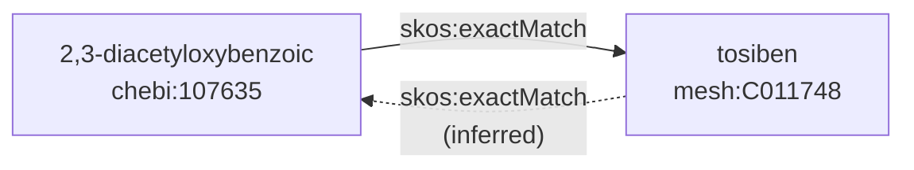
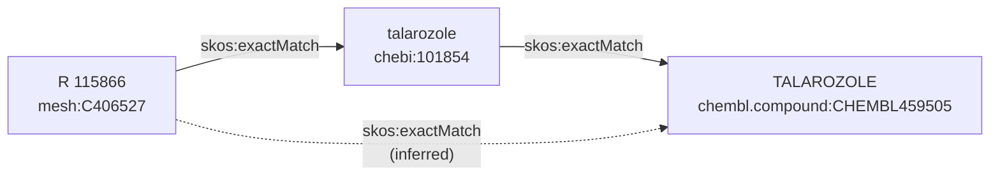
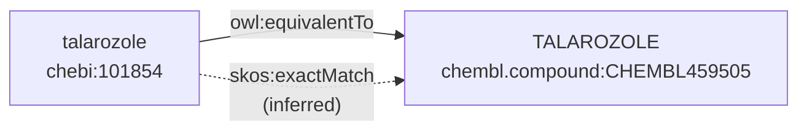
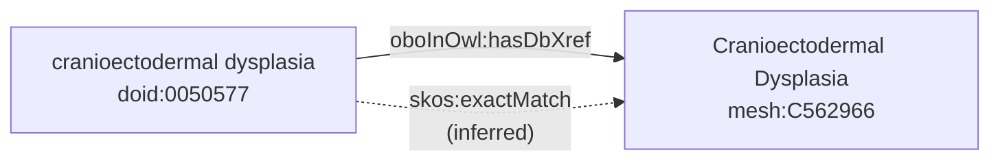

Assembling and inferring missing semantic mappings is a timely problem in biomedical
data and knowledge integration. I've been developing the [Semantic Mapping Assembler and Reasoner (SeMRA)](https://github.com/biopragmatics/semra)
as a generic toolkit for this. In this blog post, I highlight its inference capabilities.

SeMRA implements the chaining and inference rules described in the
[SSSOM](https://mapping-commons.github.io/sssom/chaining-rules/) specification.
The first rule is
[inversions](https://mapping-commons.github.io/sssom/chaining-rules/#inverse-rules):

```python
from semra import Mapping, EXACT_MATCH, Reference
from semra.inference import infer_reversible

r1 = Reference(prefix="chebi", identifier="107635", name="2,3-diacetyloxybenzoic")
r2 = Reference(prefix="mesh", identifier="C011748", name="tosiben")

mapping = Mapping(s=r1, p=EXACT_MATCH, o=r2)

mappings = infer_reversible([mapping])
```



The second rule is about
[transitivity](https://mapping-commons.github.io/sssom/chaining-rules/#transitivity-rule).
This means some predicates apply over chains. SeMRA further implements
configuration for two-length chains and could be extended to arbitrary chains.

```python
from semra import Reference, Mapping, EXACT_MATCH
from semra.inference import infer_chains

r1 = Reference.from_curie("mesh:C406527", name="R 115866")
r2 = Reference.from_curie("chebi:101854", name="talarozole")
r3 = Reference.from_curie("chembl.compound:CHEMBL459505", name="TALAROZOLE")

m1 = Mapping(s=r1, p=EXACT_MATCH, o=r2)
m2 = Mapping(s=r2, p=EXACT_MATCH, o=r3)

# infers r1 -> exact match -> r3
mappings = infer_chains([m1, m2])
```



The third rule is
[generalization](https://mapping-commons.github.io/sssom/chaining-rules/#generalisation-rules),
which means that a more strict predicate can be relaxed to a less specific
predicate, like `owl:equivalentTo` to `skos:exactMatch`.

```python
from semra import Reference, Mapping, EXACT_MATCH, EQUIVALENT_TO
from semra.inference import infer_generalizations

r1 = Reference.from_curie("chebi:101854", name="talarozole")
r2 = Reference.from_curie("chembl.compound:CHEMBL459505", name="TALAROZOLE")

m1 = Mapping(s=r1, p=EXACT_MATCH, o=r2)

mappings = infer_generalizations([m1])
```



The third rule can actually be generalized to any kinds of mutation of one
predicate to another, given some domain knowledge. For example, some resources
curate `oboInOwl:hasDbXref` predicates when it's implied that they mean
`skos:exactMatch` because the resource is curated in the OBO flat file format.

```python
from semra import Reference, Mapping, DB_XREF
from semra.inference import infer_dbxref_mutations

r1 = Reference.from_curie("doid:0050577", name="cranioectodermal dysplasia")
r2 = Reference.from_curie("mesh:C562966", name="Cranioectodermal Dysplasia")
m1 = Mapping(s=r1, p=DB_XREF, o=r2)

# we're 99% confident doid-mesh dbxrefs actually are exact matches
mappings = infer_dbxref_mutations([m1], {("doid", "mesh"): 0.99})
```


