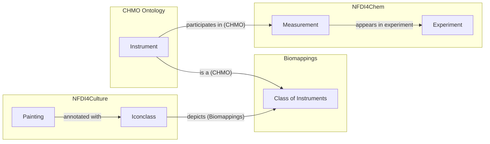

At the sixth NFDI4Chem consortium meeting,
[Torsten Schrade](https://www.adwmainz.de/personen/mitarbeiterinnen/profil/torsten-schrade.html)
from the NFDI4Culture consortium gave a lovely and whimsical talk entitled [_A
Data Alchemist's Journey through NFDI_](https://zenodo.org/records/17127336) which explored ways that we might
federate and jointly query both consortia's knowledge via their respective
SPARQL endpoints. He proposed a toy example in which he linked paintings
depicting alchemists trying to make gold to compounds containing gold. This post
is about the steps I took to automate his toy example and extend it arbitrarily
to any chemicals or compounds represented in Iconclass.

## Part 1: The Semantic Lay of the Land

### Operationalizing Iconclass

[Iconclass](https://iconclass.org) is a controlled vocabulary used to annotate
parts of images with what they depict. For example,
[`iconclass:49E3911`](https://bioregistry.io/iconclass:49E3911) is used to
annotate a part of an image depicting an _alchemist trying to make gold_.
Iconclass identifiers implicitly contain the hierarchy:

- [`iconclass:49E391`](https://bioregistry.io/iconclass:49E391) is used to
  annotate an _alchemist at work_
- [`iconclass:49E39`](https://bioregistry.io/iconclass:49E39) is used to
  annotate _alchemy_
- [`iconclass:49E3`](https://bioregistry.io/iconclass:49E3) is used to annotate
  _chemistry_
- [`iconclass:49E`](https://bioregistry.io/iconclass:49E) is used to annotate
  _science and technology_
- [`iconclass:49`](https://bioregistry.io/iconclass:49) is used to annotate
  _education, science, and learning_
- [`iconclass:4`](https://bioregistry.io/iconclass:4) is used to annotate
  _Society, Civilization, Culture_

Note that unlike an ontology, the hierarchy implied by Iconclass is merely
organizational and isn't (formally) logical.

[](https://bioregistry.io/iconclass:49E391)

I added a source to PyOBO to ingest Iconclass in
[biopragmatics/pyobo#433](https://github.com/biopragmatics/pyobo/pull/433). This
enables it to generate ontology-like artifacts in the OWL and OBO formats, as
well as gives access to the text mining utilities built on top of PyOBO.

Along the way, I found that Iconclass has a lot more weird and irregular
identifiers than I had earlier assumed. I was able to make an additional pull
request to the Bioregistry in
[biopragmatics/bioregistry#1686](https://github.com/biopragmatics/bioregistry/pull/1686)
to update the underlying regular expression pattern and add extra examples to
demonstrate the weirdness. This is important because PyOBO uses the Bioregistry
for regular expression validation of identifiers internally, and without this
update, the Iconclass source doesn't work!

The following SPARQL query

```sparql
PREFIX cto:      <https://nfdi4culture.de/ontology#>
PREFIX iconclass:<https://iconclass.org/>
PREFIX rdfs:     <http://www.w3.org/2000/01/rdf-schema#>

SELECT ?concept ?resource (SAMPLE(?lbl) AS ?resourceLabel)
WHERE {
  ?resource cto:subjectConcept ?concept .
  FILTER strstarts(str(?concept),str(iconclass:))
  OPTIONAL { ?resource rdfs:label ?lbl }
}
LIMIT 15
```

I would like to see a bit more ontologization of Iconclass in the graph -
first, to have labels for all Iconclass entities. Second, some instance
definitions, so I could do something more idiomatic than filtering by IRI
prefix.

## Part 2: Bridging the Semantic Gap

The next goal was to identify entries in Iconclass correspond to elements,
compounds, laboratory equipment, or other terms relevant in the chemistry
domain, and create mappings that can serve as a "semantic bridge" between
disciplines.

### First attempt: lexical matching

The [Biomappings](github.com/biopragmatics/biomappings) project provides tools
for predicting semantic mappings using lexical matching. It can quickly be used
to spin up a workflow for matching any two vocabularies available through PyOBO
with a few lines. I gave it a try to match Iconclass to the
[Chemical Methods Ontology (CHMO)](https://bioregistry.io/chmo):

```python
from biomappings.lexical import lexical_prediction_cli

if __name__ == "__main__":
    lexical_prediction_cli(__file__, "iconclass", "chmo")
```

This usually works well for matching entities in resources curated as
ontologies, but because Iconclass's labels aren't typical, it wasn't able to
generate more than a handful of matches.

### Second attempt: language models and embedding similarity

This prompted me to take a different approach that relies on language models to
generate embeddings, which are better able to capture the subtle differences in
the way entities are labeled. This led me to making an improvement in

1. I added functionality to PyOBO to get a dataframe of embeddings for _all_
   entities in a given ontology or controlled vocabulary in
   [biopragmatics/pyobo#434](https://github.com/biopragmatics/pyobo/pull/434)
2. I extended the lexical prediction workflow in Biomappings to have a method
   that combines embedding generation in PyOBO with similarity calculation and
   finally the application of a similarity cutoff for calling mappings in
   [biopragmatics/biomappings#206](https://github.com/biopragmatics/biomappings/pull/206).

After this, I was able to update my workflow to look like this:

```python
from biomappings.lexical import lexical_prediction_cli

if __name__ == "__main__":
    lexical_prediction_cli(
        __file__,
        "iconclass",
        "chmo",
        method="embedding",
        cutoff=0.9
    )
```

### Third Attempt: NER

embedding didn't work for chebi, so back to NER

## Interlude: Understanding SPARQL

### Querying NFDI4Culture


### Querying NFDI4Chem

The NFDI4Chem Consortium makes its knowledge graph queryable from SPARQL here:
[https://search.nfdi4chem.de/sparql](https://search.nfdi4chem.de/sparql). I started
with the following query to investigate which measurement processes from CHMO appear
like NMR, mass spectrometry, X-ray diffraction, and microscopy.

```sparql
PREFIX schema: <http://schema.org/>
PREFIX rdfs: <http://www.w3.org/2000/01/rdf-schema#>

SELECT ?o ?label (COUNT(?o) as ?count)
WHERE {
  ?s ?p ?o .
  OPTIONAL { ?o schema:name ?label }
  FILTER(STRSTARTS(STR(?o), "http://purl.obolibrary.org/obo/CHMO_"))
}
GROUP BY ?o ?label
ORDER BY DESC(?count)
```

While most of the
techniques currently appearing in the NFDI4Chem knowledge graph are a bit too modern to be of (wide) interest in the cultural heritage
world, the term for
[scanning electron microscopy (CHMO:0000073)](http://purl.obolibrary.org/obo/CHMO_0000073)
is a descendant of [microscopy (CHMO:0000067)](http://purl.obolibrary.org/obo/CHMO_0000067),
and this is something that has a corresponding Iconclass (49E2512) for the depiction of a microscope which I curated
earlier using
Biomappings. You'd be correct in saying that I made a bit of a hop from the physical instrument of
a [microscope (CHMO:0000953)](http://purl.obolibrary.org/obo/CHMO_0000953)
and the process of [microscopy (CHMO:0000067)](http://purl.obolibrary.org/obo/CHMO_0000067), but please give me a bit of
wiggle room, since we're trying to thread a very tricky needle to bridge culture and chemistry. Ontologically speaking,
CHMO defines the process of microscopy as having a microscope as a [participant (BFO:0000057)](http://purl.obolibrary.org/obo/BFO_0000057).

After a bit of exploring, I was able to construct a query that returns all datas

```sparql
PREFIX prov: <http://www.w3.org/ns/prov#>
PREFIX rdf: <http://www.w3.org/1999/02/22-rdf-syntax-ns#>
PREFIX rdfs: <http://www.w3.org/2000/01/rdf-schema#>
SELECT * WHERE {
  ?dataset prov:wasGeneratedBy/prov:used ?experiment .
  ?experiment prov:wasGeneratedBy/rdf:type <http://purl.obolibrary.org/obo/CHMO_0000073> .
}
```

- **dataset**: https://doi.org/10.14272/YJAIWVDPLYJOFU-UHFFFAOYSA-B/CHMO0000073
- **experiment**: https://doi.org/10.14272/YJAIWVDPLYJOFU-UHFFFAOYSA-B/CHMO0000073/spectrum

## Part 3: Asking Multidisciplinary Questions

Finally, you've arrived at the big conclusion. What can do by bridging the chemistry knowledge graph and
culture knowledge graph? We can pull in nice pictures to Chemotion representing the experimental methods in a given
electronic lab notebook!

Is this the most practical query? No. But it's cool, and most importantly, it demonstrates
that several different parts can be constructed to answer a question.




- automate turning SSSOM into RDF
- Making a federated query 3 ways between chem, culture, and the bridge that
  finds links between culture objects tagged with icon classes mapped to
  chemicals mapped to notebooks.

use https://nfdi4culture.de/go/kg-query-iconclass-chemistry and

