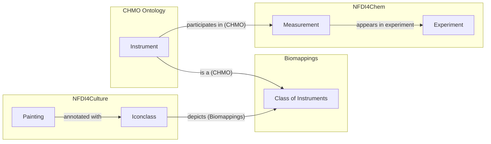

At the sixth NFDI4Chem consortium meeting,
[Torsten Schrade](https://www.adwmainz.de/personen/mitarbeiterinnen/profil/torsten-schrade.html)
from the NFDI4Culture consortium gave a lovely and whimsical talk entitled
[_A Data Alchemist's Journey through NFDI_](https://zenodo.org/records/17127336)
which explored ways that we might federate and jointly query both consortia's
knowledge via their respective SPARQL endpoints. He proposed a toy example in
which he linked paintings depicting alchemists trying to make gold to compounds
containing gold. This post is about the steps I took to automate his toy example
and extend it arbitrarily to any chemicals or compounds represented in
Iconclass.

## Part 1: The Semantic Lay of the Land

My primary goal is to perform a federated SPARQL query across the respective
NFDI4Culture and NFDI4Chem knowledge graphs. This requires an understanding of
the landscape ontologies, controlled vocabularies, and databases whose entities
are referenced in the SPARQL query and the content of the knowledge graph(s). It
also requires an understanding of the syntaxes used to reference these entities,
namely the uniform resource identifier (URI) syntax (e.g.,
`http://purl.obolibrary.org/obo/CHMO_0000073`) or compact uniform resource
identifier (CURIE) syntax (e.g., `CHMO:0000073`). I wrote more about URIs and
CURIEs in [a different post]().

For example, the following SPARQL query against the NFDI4Chem knowledge graph
uses SPARQL's `PREFIX` syntax to abbreviate long URIs and write a compact query.

```sparql
PREFIX prov: <http://www.w3.org/ns/prov#>
PREFIX rdf: <http://www.w3.org/1999/02/22-rdf-syntax-ns#>
PREFIX CHMO: <http://purl.obolibrary.org/obo/CHMO_>
PREFIX nfdi4chem.doi: <https://doi.org/10.14272/>

SELECT * WHERE {
  ?dataset prov:wasGeneratedBy/prov:used ?experiment .
  ?experiment prov:wasGeneratedBy/rdf:type CHMO:0000073 .
}
```

When executed, this query returns the experiments containing an artifact
generated by scanning electron microscopy (`CHMO:0000073`) and the datasets that
they are part of:

| dataset                                               | experiment                                                     |
| ----------------------------------------------------- | -------------------------------------------------------------- |
| nfdi4chem.doi:YJAIWVDPLYJOFU-UHFFFAOYSA-B/CHMO0000073 | nfdi4chem.doi:YJAIWVDPLYJOFU-UHFFFAOYSA-B/CHMO0000073/spectrum |
| nfdi4chem.doi:YJAIWVDPLYJOFU-UHFFFAOYSA-B/CHMO0000073 | nfdi4chem.doi:YJAIWVDPLYJOFU-UHFFFAOYSA-B/CHMO0000073/spectrum |
| nfdi4chem.doi:ABCUGETYYULVMM-UHFFFAOYSA-N/CHMO0000073 | nfdi4chem.doi:ABCUGETYYULVMM-UHFFFAOYSA-N/CHMO0000073/spectrum |
| nfdi4chem.doi:ABCUGETYYULVMM-UHFFFAOYSA-N/CHMO0000073 | nfdi4chem.doi:ABCUGETYYULVMM-UHFFFAOYSA-N/CHMO0000073/spectrum |
| nfdi4chem.doi:UHTPHSRMILZXCX-UHFFFAOYSA-N/CHMO0000073 | nfdi4chem.doi:UHTPHSRMILZXCX-UHFFFAOYSA-N/CHMO0000073/spectrum |
| nfdi4chem.doi:UHTPHSRMILZXCX-UHFFFAOYSA-N/CHMO0000073 | nfdi4chem.doi:UHTPHSRMILZXCX-UHFFFAOYSA-N/CHMO0000073/spectrum |
| nfdi4chem.doi:ABCUGETYYULVMM-UHFFFAOYSA-N/CHMO0000073 | nfdi4chem.doi:ABCUGETYYULVMM-UHFFFAOYSA-N/CHMO0000073/spectrum |
| nfdi4chem.doi:ABCUGETYYULVMM-UHFFFAOYSA-N/CHMO0000073 | nfdi4chem.doi:ABCUGETYYULVMM-UHFFFAOYSA-N/CHMO0000073/spectrum |
| nfdi4chem.doi:YJAIWVDPLYJOFU-UHFFFAOYSA-B/CHMO0000073 | nfdi4chem.doi:YJAIWVDPLYJOFU-UHFFFAOYSA-B/CHMO0000073/spectrum |
| nfdi4chem.doi:YJAIWVDPLYJOFU-UHFFFAOYSA-B/CHMO0000073 | nfdi4chem.doi:YJAIWVDPLYJOFU-UHFFFAOYSA-B/CHMO0000073/spectrum |
| nfdi4chem.doi:UHTPHSRMILZXCX-UHFFFAOYSA-N/CHMO0000073 | nfdi4chem.doi:UHTPHSRMILZXCX-UHFFFAOYSA-N/CHMO0000073/spectrum |
| nfdi4chem.doi:UHTPHSRMILZXCX-UHFFFAOYSA-N/CHMO0000073 | nfdi4chem.doi:UHTPHSRMILZXCX-UHFFFAOYSA-N/CHMO0000073/spectrum |

This immediately leads to a few questions:

- What are `prov`, `rdf`, `CHMO` and `nfdi4chem.doi` that appear with in
  `PREFIX` lines of the SPARQL query and later in the results?
- Where do they come from?
- How do I know the correct URI prefix to use with the CURIe prefix (e.g.,
  `http://www.w3.org/ns/prov#` goes with `prov`)?
- How do I know which prefixes are relevant in my domain (e.g., chemistry)?
- How do I know which prefixes to use when writing a SPARQL query? (I'm going to
  gloss over this question, since the best answer is usually for the knowledge
  graph maintainers to write more/better documentation)

### You have to start with the Bioregistry

- what are the semantic spaces in the domain we care about?
  - for culture, we already know this is Iconclass
  - for chemistry, we know CHMO, OBI, and ChEBI are important ontologies
  - how do we find more? The Bioregistry is a tool for discovering ontologies
    and o

- what is bioregistry
- using it to find relevant ontologies
- what ones did I choose?

### Finding Chemical Vocabularies

### Operationalizing Iconclass

[Iconclass](https://iconclass.org) is a controlled vocabulary used to annotate
parts of images with what they depict. For example,
[`iconclass:49E3911`](https://bioregistry.io/iconclass:49E3911) is used to
annotate a part of an image depicting an _alchemist trying to make gold_.
Iconclass identifiers implicitly contain the hierarchy:

- [`iconclass:49E391`](https://bioregistry.io/iconclass:49E391) is used to
  annotate an _alchemist at work_
- [`iconclass:49E39`](https://bioregistry.io/iconclass:49E39) is used to
  annotate _alchemy_
- [`iconclass:49E3`](https://bioregistry.io/iconclass:49E3) is used to annotate
  _chemistry_
- [`iconclass:49E`](https://bioregistry.io/iconclass:49E) is used to annotate
  _science and technology_
- [`iconclass:49`](https://bioregistry.io/iconclass:49) is used to annotate
  _education, science, and learning_
- [`iconclass:4`](https://bioregistry.io/iconclass:4) is used to annotate
  _Society, Civilization, Culture_

Here's how its web browser looks:

[](https://bioregistry.io/iconclass:49E391)

Iconclass doesn't appear to be curated like an ontology, so the hierarchy is
often confusing to follow. I found it easier to understand the logic behind the
hierarchy if you prepend "depiction of" or "depiction of something related to"
in front of each label. This also makes up for some of the illogical
hierarchical relations. Here's how I imagine the same hierarchy could be
clarified with better labels:

- [`iconclass:49E391`](https://bioregistry.io/iconclass:49E391) _depiction of an
  alchemist at work_
- [`iconclass:49E39`](https://bioregistry.io/iconclass:49E39) _depiction of
  alchemy_
- [`iconclass:49E3`](https://bioregistry.io/iconclass:49E3) _depiction of
  something related to chemistry_
- [`iconclass:49E`](https://bioregistry.io/iconclass:49E) _depiction of
  something related to science or technology_
- [`iconclass:49`](https://bioregistry.io/iconclass:49) _depiction of something
  related to education, science, or learning_
- [`iconclass:4`](https://bioregistry.io/iconclass:4) _depiction of something
  related to society, civilization, or culture_

Because Iconclass isn't curated as an ontology, there isn't an OWL or OBO file
that can be used with standard tooling. However, some of the source data is
available on GitHub at [iconclass/data](https://github.com/iconclass/data), so
it's possible to write custom code that wrangles it into an ontology-like shape.
I've actually done this for dozens of repositories already, and written
[ PyOBO](https://github.com/biopragmatics/pyobo), a library of reusable tooling
to support ingesting new resources across domains in an ontology-like shape.

Accordingly, I added a source to PyOBO to ingest Iconclass in
[biopragmatics/pyobo#433](https://github.com/biopragmatics/pyobo/pull/433). This
not only enables it to generate ontology-like artifacts in the OWL and OBO
formats, but also gives access to the text mining utilities built on top of
PyOBO.

Along the way, I found that Iconclass has a lot more weird and irregular
identifiers than I had earlier assumed. I was able to make an additional pull
request to the Bioregistry in
[biopragmatics/bioregistry#1686](https://github.com/biopragmatics/bioregistry/pull/1686)
to update the underlying regular expression pattern and add extra examples to
demonstrate the weirdness. This is important because PyOBO uses the Bioregistry
for regular expression validation of identifiers internally, and without this
update, the Iconclass source doesn't work!

I would like to see a bit more ontologization of Iconclass in the graph - first,
to have labels for all Iconclass entities. Second, some instance definitions, so
I could do something more idiomatic than filtering by IRI prefix.

## Part 2: Bridging the Semantic Gap

The next goal was to identify entries in Iconclass correspond to elements,
compounds, laboratory equipment, or other terms relevant in the chemistry
domain, and create mappings that can serve as a "semantic bridge" between
disciplines.

### First attempt: lexical matching

The [Biomappings](github.com/biopragmatics/biomappings) project provides tools
for predicting semantic mappings using lexical matching. It can quickly be used
to spin up a workflow for matching any two vocabularies available through PyOBO
with a few lines. I gave it a try to match Iconclass to the
[Chemical Methods Ontology (CHMO)](https://bioregistry.io/chmo):

```python
from biomappings.lexical import lexical_prediction_cli

if __name__ == "__main__":
    lexical_prediction_cli(__file__, "iconclass", "chmo")
```

This usually works well for matching entities in resources curated as
ontologies, but because Iconclass's labels aren't typical, it wasn't able to
generate more than a handful of matches.

### Second attempt: language models and embedding similarity

This prompted me to take a different approach that relies on language models to
generate embeddings, which are better able to capture the subtle differences in
the way entities are labeled. This led me to making an improvement in

1. I added functionality to PyOBO to get a dataframe of embeddings for _all_
   entities in a given ontology or controlled vocabulary in
   [biopragmatics/pyobo#434](https://github.com/biopragmatics/pyobo/pull/434)
2. I extended the lexical prediction workflow in Biomappings to have a method
   that combines embedding generation in PyOBO with similarity calculation and
   finally the application of a similarity cutoff for calling mappings in
   [biopragmatics/biomappings#206](https://github.com/biopragmatics/biomappings/pull/206).

After this, I was able to update my workflow to look like this:

```python
from biomappings.lexical import lexical_prediction_cli

if __name__ == "__main__":
    lexical_prediction_cli(
        __file__,
        "iconclass",
        "chmo",
        method="embedding",
        cutoff=0.9
    )
```

### Third Attempt: NER

embedding didn't work for chebi, so back to NER

## Interlude 1: Exploring New SPARQL Endpoints

Before diving in fully federated queries across multiple sources, I want to warm
up by making self-contained queries over the respective NFDI4Culture and
NFDI4Chem knowledge graphs. Unfortunately, neither of them are well documented
for what I want to do, so put on your pith helmet and get ready for some digital
archaeology.

### Querying NFDI4Culture

The NFDI4Culture Consortium makes its knowledge graph queryable from SPARQL
here:
[https://nfdi4culture.de/resources/knowledge-graph.html](https://nfdi4culture.de/resources/knowledge-graph.html).
Using the [example](https://nfdi4culture.de/go/kg-query-iconclass-chemistry)
from Thorsten's talk as a starting point, and I wrote the following SPARQL query
for Iconclasses, objects they are annotated to, and URLs for digital depictions
of those objects.

```sparql
PREFIX cto: <https://nfdi4culture.de/ontology#>
PREFIX iconclass: <https://iconclass.org/>
PREFIX rdfs: <http://www.w3.org/2000/01/rdf-schema#>
PREFIX schema: <http://schema.org/image>

SELECT ?resource ?resourceLabel ?imageURL ?iconclass
WHERE {
  ?resource cto:subjectConcept ?iconclass ;
            schema:image ?imageURL .
  FILTER STRSTARTS(STR(?iconclass), STR(iconclass:))
  OPTIONAL { ?resource rdfs:label ?resourceLabel }
}
LIMIT 50
```

One record that was returned was
[Bildnis Professor Hoffmann (bildindex:obj00003367)](https://www.bildindex.de/document/obj00003367)
from the [BildIndex der Kunst & Architektur](https://www.bildindex.de). Notably,
this image depicts the eponymous professor with his
[microscope (iconclass:49E2512)](https://bioregistry.io/iconclass:49E2512).
BildIndex didn't give enough context for me to figure out who Professor Hoffman
was (e.g., by connecting to Wikidata or other external resources that describe
notable people), but it did say that the painting is in Bonn! Maybe I will go
track it down in person to bring this blog post full circle.


#### Minor Criticisms

I immediately identified two issues with the NFDI4Culture knowledge graph:
first, there are no English labels for resources. This is understandable given
this is a German project and unlike in science, there isn't a huge pressure for
internationalization, but it does reduce the value of the resource for anyone
outside the Germanophone world. Second, even worse, there are no labels for
Iconclass in German, English, nor any other language. Because I produced
ontology artifacts for Iconclass (as described earlier in this post), I can get
these labels in RDF by federating over my own OWL files, but I think that this
would be an important addition to the NFDI4Culture knowledge graph to improve
its own usability.

### Querying NFDI4Chem

The NFDI4Chem Consortium makes its knowledge graph queryable from SPARQL here:
[https://search.nfdi4chem.de/sparql](https://search.nfdi4chem.de/sparql). I
started with the following query to investigate which measurement processes from
CHMO appear like NMR, mass spectrometry, X-ray diffraction, and microscopy.

```sparql
PREFIX schema: <http://schema.org/>
PREFIX rdfs: <http://www.w3.org/2000/01/rdf-schema#>

SELECT ?o ?label (COUNT(?o) as ?count)
WHERE {
  ?s ?p ?o .
  OPTIONAL { ?o schema:name ?label }
  FILTER(STRSTARTS(STR(?o), "http://purl.obolibrary.org/obo/CHMO_"))
}
GROUP BY ?o ?label
ORDER BY DESC(?count)
```

While most of the techniques currently appearing in the NFDI4Chem knowledge
graph are a bit too modern to be of (wide) interest in the cultural heritage
world, the term for
[scanning electron microscopy (CHMO:0000073)](http://purl.obolibrary.org/obo/CHMO_0000073)
is a descendant of
[microscopy (CHMO:0000067)](http://purl.obolibrary.org/obo/CHMO_0000067), and
this is something that has a corresponding Iconclass (49E2512) for the depiction
of a microscope which I curated earlier using Biomappings.

#### On the Impedance between Processes and Material Entities

You'd be correct in saying that I made a bit of a hop from the physical
instrument of a
[microscope (CHMO:0000953)](http://purl.obolibrary.org/obo/CHMO_0000953) to the
process of
[microscopy (CHMO:0000067)](http://purl.obolibrary.org/obo/CHMO_0000067). Please
give me a bit of wiggle room, since it's already hard enough to thread the
needle between culture and chemistry. Luckily, CHMO uses a logical axiom on the
definition of microscopy to denote that all microsopy has a microscope as a
[participant (BFO:0000057)](http://purl.obolibrary.org/obo/BFO_0000057).

While we'll need this axiom later to construct a more sophisticated SPARQL query
that can resolve the impedance between the sense that I curated in the mappings
and what appears in experimental data, it doesn't appear that the NFDI4Chem
knowledge graph imports a reasoned version of CHMO that materializes this axiom
as a triple `<CHMO:0000067, BFO:0000057, CHMO:0000953>`. This means that we'll
have to inject this triple ourselves via federation later.

#### Exploring Microscopy in NFDI4Chem

After a bit of exploring, I was able to construct a query that returns all
experimental results (`?experiment`) that were generated by microscopy, and the
dataset/record where they were recorded. From my perspective, it was pretty
difficult to navigate this, especially without examples and schematic diagrams.

```sparql
PREFIX prov: <http://www.w3.org/ns/prov#>
PREFIX rdf: <http://www.w3.org/1999/02/22-rdf-syntax-ns#>
PREFIX CHMO: <http://purl.obolibrary.org/obo/CHMO_>

SELECT * WHERE {
  ?dataset prov:wasGeneratedBy/prov:used ?experiment .
  ?experiment prov:wasGeneratedBy/rdf:type CHMO:0000073 .
}
```

One of the twelve records (as of September 18<sup>th</sup>, 2025) returned by
this query was a scanning electron microscopy (SEM) dataset performed on a
zirconium-containing inorganic molecule. The URI for the experiment,
`https://doi.org/10.14272/YJAIWVDPLYJOFU-UHFFFAOYSA-B/CHMO0000073/spectrum`,
does not resolve, but the dataset at
[https://doi.org/10.14272/YJAIWVDPLYJOFU-UHFFFAOYSA-B/CHMO0000073](https://doi.org/10.14272/YJAIWVDPLYJOFU-UHFFFAOYSA-B/CHMO0000073)
does. These URIs make me want to cry - they do not follow any best practices for
how identifiers should look as prescribed by Julie McMurry _et al._ (2017) in
[Identifiers for the 21<sup>st</sup> century](https://doi.org/10.1371/journal.pbio.2001414).
Despite my grumblings, they can still be used as URIs and function well enough
for SPARQL queries.

Ultimately, here's the image from the SEM in the experiment in question, though
I wasn't able to construct a SPARQL query that returned it:

![](data:image/png;base64,/9j/4AAQSkZJRgABAQIASwBLAAD/2wBDAAgGBgcGBQgHBwcJCQgKDBQNDAsLDBkSEw8UHRofHh0aHBwgJC4nICIsIxwcKDcpLDAxNDQ0Hyc5PTgyPC4zNDL/wAALCACAAIABAREA/8QAHAAAAgMBAQEBAAAAAAAAAAAAAAQCAwUBBgcI/8QAOBAAAgEDAwIFAgQDBwUAAAAAAQIDAAQRBRIhMVEGEyJBYRRxMoGh0RWxwSMkQpGT4fAHUlWy8f/aAAgBAQAAPwD7/RRRRRRRRRRRRRRRRRRRRRRRRRRRRRRRXxkf9R9SuIQhuHiuGIVduNv55HWtuy8Razq2lyx211JHcQgsspC5kwMkYPHbpScureLbO2FzfXc8EHHrKoevTgVlnxl4gLHbqcpBPp9C/tWjY+I9XlQTah4ga0gY+j0KzNz7DFX3viDWSHNpqcytEMyKwVhgnhgQOnSuxeLbm9hkkTWpLaSNcbXQFHIHJHBOehrHbxprygn+Jy49vSv7U+PGGv6bHHHfXLGdn3AFVPox7469fypC/wDHmsT6lDDZXs8UTAB8hD6u446U43iXxEkHkfxhfNR8MSq7z198YxVNj4v164ZidTYqnJ3bR/SoXHi7xAZZZo9WYQF/QoCHC574pufxnrLTSLHeOiKBwu1mx3yB1pMeNdfa4iiS/JilBWNyV3ZI4LDFXaL4w1+68Q/STaluSKZUkidQpbnHGB0rxn05dlAALEgAYzW1azJZPE8k0XlIhVY2BGMZJORULXUJp7ScOr3Bdg4yu4gDpx2q3TNaGi3FvMscZnmkwx2hsLjoB7VXqeq3XiAyQMzOySkkOeFXJOR8Y7V3TL3znmCSytHAhSVXIUfYZ605dSC6txPbbFeSJSiSKEwQcZGevHX71Q9pZNayRGffdRjc8jjABA5UAdRWXNNK+1ycS9CSARj/AJikGgLbQpOSw6da1Jr2EyMsMRRRGUJc5IY9T811J9loJ3QylVPoXPqP/aKyrqVbyVGRDAjKWKElsEfrWxpcrO00Vs0gkiO+WRc8nHGe3+9RR/qr1b2GHKjDeTnay4HPAru2S38aaZKIiiXlwrAgY6MPSSewqdnY3zQPepZSNbRqcyspCgfBrtqwk0szpFHKYCC8YUH3+evFUyaklqblbWGNLlZcI4B4Q9R/Kkje3kkm8GMSucltnt2H5ZpYs0moF4X8pnGNwzggDmvSRyRzi3LuluhAEjRL6mOOMk/rWPfPLqDxyLO0qxnamW5UA56Vp6UYZYVkluma5UsSjDjjoCc9DUL2JY7h9q7Yyx2jdnFV21pNNHJPBHu8vv078/lWeE83ybhlUAlsEHH5/an/AA3NdwXc6sVRHYlTKpZMY6rkc+/HzXoZTbtYzfQWlnNeF8LKCFyCeuDggj71nXjrpM5ktoHSZX2zmVgyv2PHTHeqDMt7fSXgBt5JE2yJHgbxjBYEdCeODT2heXHcWsd5N9fNBMgtlDY2+vJJ/wA6mmuX4ie0t5Glt4lCASkbSpJyD80hdzE6E0lujQuZQpKr1HOTn8qxwikbjkk8kn3owSwIAyp4+KiFLiUF1GOhPJHfFWRTCOzEoBkmHpUZ6juR39quFjubdZqvlqMsryD0k/rUIwbe7jmwgQPl2bkAfPenLSaGB41ZVeHcQyyMfUDwOacgvI7eCaOykMUZkdfKLF8MOMke4P8ASkb27aWI2zi3EuBIWjjA2Dodo9xSV7dKs5WCQRXEa7o0duOmeasja6ulW8UDdEFLKGx6u2D160prkuq6rbtfWc8KCKMLJbSHlmBxlSPfn3qGkTXh09PqkRJpMAMeCB75r0vhmSG+1yLzJWMYlQRlWxtIPyOckVmN9Pbq2x3heMhpgDnePkH4zWiVm1HSfqbeLbbRnhRgEjn1EdayhGCSFNBXHHX7e9W2gSKc+YIj5i4BZd23P9alb2lijyC8lZTIpAEC5wfY84xRdWttCDCssUsMRU/2bEHJ5OTxzVc8M1o4LIymTLK2ziRDxSzx7oZQqERg9Ceo7ikPLnhZBAB5pPGByeeKa1N5rEx7lPqjH9qvqCMeoPb7UhcW/wBRbmSAmOSQ8NjceO9Rh1C6VorHHnvkKx3YGe9MXUV/EsJlbIYH8P4c/l1poXkttLGLeQiUIX3Mnpyen51f4cinj1qxkjYCATpujI4yXAJNbLaRZSK96Ip1nJAZA+0N2z7HvWUHudOvhbSMilmxuTleffP581pyX/o2oiG5VQC0iYyucZz7mrJbsaXbmxa3ZDLJvYA5A7errjBFYkkltJKyqrRklQUJOB8g1N0RTNuheUO5Cyb8AKewFKxeVDetNDbPIc5LEk/lTl1fm7kHmB82qn178bgfYD4xVVuitdRSMCqOoEivlgvycU7po0sakxkcL5StkgEktjjHP51VqV3b205SCcmCT1OjDcWI6H496yYfqmvIWaLzUdshwPSq/Ncu7SePUpHkW2cMQwaPjjtnvWrDHYXcqWkSzeZA3pYyEhyw5BHSk7u6CXbqIJE2nALjr1wRWnp0EaazpskTMwaZNxHAzuB6Uvb3U0d+AbvMDBfMEcZ7+xrW+l0+JY7xInIRyjK8mdox+P5+1YM6TGQyIz54VcHIP2HenFinMJ86dSQnl+YzeoN7fypRw6ypZxgTBpMOUQksa1YrG11HIgtlSUhkRHlKrv8AjP8AWs+300rbbllRnhkYMFJH3HbqKLe3Yagt0YQFTLlWGVJ6cd+aVuhJFFM8LIyO+WTrx2x9q5HIl0CIkYHbyvTk8DP+VWPp0UNkqyHDwg8g/jyf55p1Ll9PsI5UtfSzFSJSCVHsPzFZMcyPqMhkCrDIckY4XHzTodYJyUj3OfwvgAP2OfzqdzqF0kCXVzCqqwyyA45HGRjrW1oCrcahaSLnzDNGYw/A25yQfmsc+XFaJhAMMrMxPuR+nWpLBKsM08cckiW6HzQBtxn/ABfPX9K4JFPlq8YKYWTcGAGcdSKVvhDdTu0TSbFA/F7kdamLo2+0W/omxkyBTxnj+tSt7lrq9EN06Qqpys5Y8HH86Zsn06wt0ieZZ5JAVeTd75Ixt+e9Xzy2sSXCBm80eoKuMYz7VkvGju2zO3PGRVBhkV8RglyRjaOc07b6eiQXE12iyXBORGz+kcdSO9X+XYzW4095o4HVfMSRslRx+HPz/WlJbC0gKhZTdEsodFXAK55A5ovp4rNvLwZNqny1THoPQA0tb3jeQPqYEkTO6JSM7T81r6eLd9Y0tjcusqzJuD8AHcOg+elYv8Zun1Lz5I1SEkjy4xgAe2B04xxWi+sw3VqI5JJGuZZMzSH0hh1AquXhUBdAB0EbZ4PPNVdM7V/cVbuE1uhncIkTYLMcfPP/AD2q+cQabay3Qt2ZFYsGVciXJHQkc9qTvD9TJDNHAYXm4Zl5G7rnHamEuvNmV4twCINwAzkj3H7VfLCqRLdNJthYnfjgg/aonVksbARW5jfO5gwUZYnuaxobya4khjmdQVyecAE/c96aa3dbsyqgWJl3yDBIDD261o6QmnTzGWaby3X0qHPAPfHt3zSN5LBeXdzcQylkDbUVhjKjjP8AzvWeAYHcrkhugDYwe4rX0hHfWLQyF2la5iB3DGcMuP5Cs7ywePeuiP07eMfpVqYAKgjFSJILY9Q6cDmtmUWUUaRS2QeHAJE3IY44JHHf9anHrTPFa28djtgQbFWUZXHPBHt0zWfdo/1Injb+zd9iKegwOciiRYNouoCpKHDxDr8/bvilbvYxIVmdsltzHpn2FL+XvA5HT2qiSBGZXYggcgEZyftV8twyJLFCSd4ADsuMd+KqDyvbqshywIJYDk+1ciUqu0j3zkiuncMkHBHQ1oaTO7azpgkRW/vMfqPXO4c0sy469RQAuAD/AJ1MrhucYPSmmtHt4hNK7QEeuPcMb/tVdzq9lO4WS1laNFJUI3Jb2BJ6is4avcGKcXAdkfGMHkDPTNash+qtolR5CyAsWJAwP9sU5pxhvIks7ySO2UuXabbySAeDVGo2EVhchI7uK4jZN6SRggHP3rNI2sMZ2nt7VWFHOeg6GuOnBK849j7ULnbtPpx3rvIPqbAqBYDjHHQU7pCka5p+eguI/wD2Fa1zorfR27Q2N2ZyRv3RNzx/i44/KqV0i73E/wAPkA6Y8uT9qnaaRfAyZtpY2JKhjHIMAjr06UDSNRkkMVzDJMkeSHaOTBPHTjP/AMqkeGbuWMgwFG3kbzFJkjn46VGHw9do22S0eQMuRmKQBf061CXR9YhTcsNw+/qscbnH34ql9P1qTO+zvmz1zC37Ufw3V8DOn3hPTPkt+1c/hmq/+NvP9F6YGhakcf3aXnvG/wC1TfQb0oMWcqt7nZIc/pS0ujalGQBYXL8ZJWF+P0qB0rVD10y7/wBF6idI1MnjTbsDt5LftTukaTqY1uwaSwuwouIySYWwBuHxX6Jooooooooooooooooooooooooooooooor/2Q==)

### Querying

## Interlude 2: Man, I'm Feeling Sanderson

Or, "what the Wind Waker official strategy guide said before doing the last two
dungeons before going to fight Ganondorf underwater", but that's too long. The
point is,

There are a few other random things I think are worth giving as context before
getting to the end of the story.

### Unpacking Axioms in an Ontology

It's easy to get confused in the semantic web, ontologies, and RDF world.
Ontologies are typically encoded using the OWL schema, which can be serialized
to XML and RDF. However, this doesn't mean that it is RDF that represents the
graph you might expect an ontology induces. For example, the existential
restriction that all microscopy has a microscope as a participant is encoded in
OWL like this:

```turtle
CHMO:0000067 rdf:type owl:Class ;
    rdfs:subClassOf OBI:0000185 ,
        [ rdf:type owl:Restriction ;
          owl:onProperty BFO:0000057 ;
          owl:someValuesFrom CHMO:0000953 .
        ] .
```

This means if you want to get the aforementioned triple
`<CHMO:0000067, BFO:0000057, CHMO:0000953>`, you'll need the following SPARQL:

```sparql
SELECT ?s ?p ?o WHERE {
    ?s rdfs:subClassOf [
        rdf:type owl:Restriction;
        owl:onProperty ?p ;
        owl:someValuesFrom ?o .
    ] .
}
```

It could be worse!

### SSSOM, RDF, and SPARQL

```
sssom serve
```

## Part 3: Asking Multidisciplinary Questions

Finally, you've arrived at the big conclusion. What can do by bridging the
chemistry knowledge graph and culture knowledge graph? We can pull in nice
pictures to Chemotion representing the experimental methods in a given
electronic lab notebook!

Is this the most practical query? No. But it's cool, and most importantly, it
demonstrates that several different parts can be constructed to answer a
question.



- Making a federated query 3 ways between chem, culture, and the bridge that
  finds links between culture objects tagged with icon classes mapped to
  chemicals mapped to notebooks.

use https://nfdi4culture.de/go/kg-query-iconclass-chemistry and
