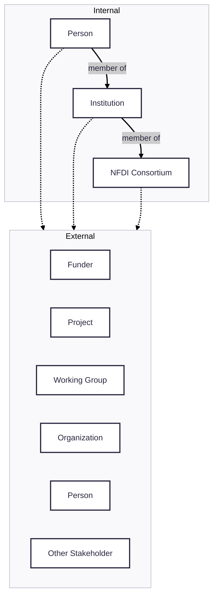

## Landscaping Key Questions

Reporting materials for NFDI stakeholders and new NFDI consortium members will answer key questions such as:

1. Are there gaps in our external activities?
2. How do we prioritize contributing to existing activities and creating new ones?
3. How can we communicate the importance of external interaction besides through the lens of funding? For example, what are the scientific, philosophical, and societal impacts of external interactions?

Plan for reporting materials to cover the following:

1. An interaction matrix between NFDI consortia and external entities
2. A whitepaper that highlights key existing and aspirational interactions, such as with EOSC and RDA
3. A knowledge graph that can be federated and queried with other NFDI knowledge graphs, in collaboration with the Base4NFDI service KGI4NFDI
4. A website that can be explored interactively to communicate such results
