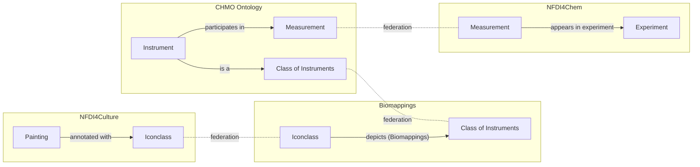

At the sixth NFDI4Chem consortium meeting,
[Torsten Schrade](https://www.adwmainz.de/personen/mitarbeiterinnen/profil/torsten-schrade.html)
from the NFDI4Culture consortium gave a lovely and whimsical talk entitled
[_A Data Alchemist's Journey through NFDI_](https://zenodo.org/records/17127336)
which explored ways that we might federate and jointly query both consortia's
knowledge via their respective SPARQL endpoints. He proposed a toy example in
which he linked paintings depicting alchemists trying to make gold to compounds
containing gold. This post is about the steps I took to automate his toy example
and extend it to not only chemicals or compounds represented in Iconclass, but
also equipment and devices.

## Part 1: The Semantic Lay of the Land

The first step in effectively integrating data and writing federated SPARQL
queries is to understand the landscape ontologies, controlled vocabularies
(CVs), and databases whose entities will be referenced in SPARQL queries and
will appear in the knowledge graph(s). It also requires an understanding of the
syntaxes used to reference these entities, namely the uniform resource
identifier (URI) syntax (e.g., `http://purl.obolibrary.org/obo/CHMO_0000073`) or
compact uniform resource identifier (CURIE) syntax (e.g., `CHMO:0000073`). For
more information on URIs and CURIEs, see [my previous
post]().

For example, the following SPARQL query against the NFDI4Chem knowledge graph
uses SPARQL's `PREFIX` syntax to abbreviate long URIs and write a compact query.

```sparql
PREFIX prov: <http://www.w3.org/ns/prov#>
PREFIX rdf: <http://www.w3.org/1999/02/22-rdf-syntax-ns#>
PREFIX CHMO: <http://purl.obolibrary.org/obo/CHMO_>
PREFIX nfdi4chem.doi: <https://doi.org/10.14272/>

SELECT * WHERE {
  ?dataset prov:wasGeneratedBy/prov:used ?experiment .
  ?experiment prov:wasGeneratedBy/rdf:type CHMO:0000073 .
}
LIMIT 4
```

When executed, this query returns the experiments containing an artifact
generated by scanning electron microscopy (`CHMO:0000073`) and the datasets that
they are part of:

| dataset                                                                                                                   | experiment                                                     |
| ------------------------------------------------------------------------------------------------------------------------- | -------------------------------------------------------------- |
| [nfdi4chem.doi:YJAIWVDPLYJOFU-UHFFFAOYSA-B/CHMO0000073](https://doi.org/10.14272/YJAIWVDPLYJOFU-UHFFFAOYSA-B/CHMO0000073) | nfdi4chem.doi:YJAIWVDPLYJOFU-UHFFFAOYSA-B/CHMO0000073/spectrum |
| [nfdi4chem.doi:YJAIWVDPLYJOFU-UHFFFAOYSA-B/CHMO0000073](https://doi.org/10.14272/YJAIWVDPLYJOFU-UHFFFAOYSA-B/CHMO0000073) | nfdi4chem.doi:YJAIWVDPLYJOFU-UHFFFAOYSA-B/CHMO0000073/spectrum |
| [nfdi4chem.doi:ABCUGETYYULVMM-UHFFFAOYSA-N/CHMO0000073](https://doi.org/10.14272/ABCUGETYYULVMM-UHFFFAOYSA-N/CHMO0000073) | nfdi4chem.doi:ABCUGETYYULVMM-UHFFFAOYSA-N/CHMO0000073/spectrum |
| [nfdi4chem.doi:ABCUGETYYULVMM-UHFFFAOYSA-N/CHMO0000073](https://doi.org/10.14272/ABCUGETYYULVMM-UHFFFAOYSA-N/CHMO0000073) | nfdi4chem.doi:ABCUGETYYULVMM-UHFFFAOYSA-N/CHMO0000073/spectrum |

This immediately leads to a few questions:

- What are `prov`, `rdf`, `CHMO` and `nfdi4chem.doi` that appear with in
  `PREFIX` lines of the SPARQL query and later in the results?
- Where do they come from?
- How do I know the correct URI prefix to use with the CURIE prefix (e.g.,
  `http://www.w3.org/ns/prov#` goes with `prov`)?
- How do I know which prefixes are relevant in my domain (e.g., chemistry)?
- How do I know which prefixes to use when writing a SPARQL query? (I'm going to
  gloss over this question, since the best answer is usually for the knowledge
  graph maintainers to write more/better documentation)

Besides the last question, the answer is the
[Bioregistry](https://bioregistry.io): an open source, community-curated
database of prefixes for ontologies, CVs, databases, and other resources that
mint identifiers that might appear in SPARQL queries or in knowledge graphs. In
the next few sections of this post, I'll explain how the Bioregistry answers
these questions.

Caveat: despite its name, the Bioregistry is cross-disciplinary, and we're
currently working on rebranding it to better reflect this.

### Resolving prefixes, CURIEs, and URIs with the Bioregistry

The Bioregistry can be used interactively from its web interface to search for
prefixes either quickly from [the homepage](https://bioregistry.io) or in more
detail from the [catalog page](https://bioregistry.io/registry).

If you already know the prefix, you can construct a URL by adding it to the end
of `https://bioregistry.io` like
[https://bioregistry.io/CHMO](https://bioregistry.io/chmo). These lead to pages
that describe the resource, say what is the URI prefix that should appear in
your SPARQL queries. Alternatively, entries in the Bioregistry have textual
descriptions, keywords, and tags that can be searched to find ontologies, CVs,
and databases relevant for your domain.

If you have a CURIE, you can use the Bioregistry to automatically link to a
webpage by adding it to the end of `https://bioregistry.io` like
[https://bioregistry.io/CHMO:0000073](https://bioregistry.io/CHMO:0000073).

### Extending the Bioregistry

When a prefix is missing from the Bioregistry, anyone can make a suggestion to
add a new one, even if it's not for your resource
([video tutorial](https://www.youtube.com/watch?v=e-I6rcV2_BE&)). When
maintainers suggest a prefix for their own resource, it's also a valuable
opportunity to get feedback on if the prefix and URI schema
[follow best practices](https://doi.org/10.1371/journal.pbio.2001414).

`rdfs`, `prov`, and `CHMO` are already in the Bioregistry, but there's nothing
that reflects `nfdi4chem.doi`. This means there's an opportunity here to add a
new prefix! I already chatted with the Chemotion team about this at the
NFDI4Chem meeting and am keen to help them adopt
[best practices in minting identifiers](https://doi.org/10.1371/journal.pbio.2001414),
then get their resources registered in the Bioregistry.

## Part 2: Operationalization of Resources

After we have found the relevant prefixes, CURIEs, and URIs using the
Bioregistry, we also want to make sure that we can download the associated
ontologies, CVs, or databases. For ontologies, there are explicit fields in the
Bioregistry to link to OWL, OBO, or SKOS artifacts (when available).

However, for databases, each typically needs its own custom adapter into an
ontology-like format. This section focuses on doing this for Iconclass.

### Iconclass

[Iconclass](https://iconclass.org) is a controlled vocabulary used to annotate
parts of images with what they depict. For example,
[`iconclass:49E3911`](https://bioregistry.io/iconclass:49E3911) is used to
annotate a part of an image depicting an _alchemist trying to make gold_.
Iconclass identifiers implicitly contain the hierarchy:

- [`iconclass:49E391`](https://bioregistry.io/iconclass:49E391) is used to
  annotate an _alchemist at work_
- [`iconclass:49E39`](https://bioregistry.io/iconclass:49E39) is used to
  annotate _alchemy_
- [`iconclass:49E3`](https://bioregistry.io/iconclass:49E3) is used to annotate
  _chemistry_
- [`iconclass:49E`](https://bioregistry.io/iconclass:49E) is used to annotate
  _science and technology_
- [`iconclass:49`](https://bioregistry.io/iconclass:49) is used to annotate
  _education, science, and learning_
- [`iconclass:4`](https://bioregistry.io/iconclass:4) is used to annotate
  _Society, Civilization, Culture_

Here's how its web browser looks:

[](https://bioregistry.io/iconclass:49E391)

Iconclass doesn't appear to be curated like an ontology, so the hierarchy is
often confusing to follow. I found it easier to understand the logic behind the
hierarchy if you prepend "depiction of" or "depiction of something related to"
in front of each label. This also makes up for some of the illogical
hierarchical relations. Here's how I imagine the same hierarchy could be
clarified with better labels:

- [`iconclass:49E391`](https://bioregistry.io/iconclass:49E391) _depiction of an
  alchemist at work_
- [`iconclass:49E39`](https://bioregistry.io/iconclass:49E39) _depiction of
  alchemy_
- [`iconclass:49E3`](https://bioregistry.io/iconclass:49E3) _depiction of
  something related to chemistry_
- [`iconclass:49E`](https://bioregistry.io/iconclass:49E) _depiction of
  something related to science or technology_
- [`iconclass:49`](https://bioregistry.io/iconclass:49) _depiction of something
  related to education, science, or learning_
- [`iconclass:4`](https://bioregistry.io/iconclass:4) _depiction of something
  related to society, civilization, or culture_

Because Iconclass isn't curated as an ontology, there isn't an OWL or OBO file
that can be used with standard tooling. However, some of the source data is
available on GitHub at [iconclass/data](https://github.com/iconclass/data), so
it's possible to write custom code that wrangles it into an ontology-like shape.
I've actually done this for dozens of repositories already, and written
[ PyOBO](https://github.com/biopragmatics/pyobo), a library of reusable tooling
to support ingesting new resources across domains in an ontology-like shape.

Accordingly, I added a source to PyOBO to ingest Iconclass in
[biopragmatics/pyobo#433](https://github.com/biopragmatics/pyobo/pull/433). This
not only enables it to generate ontology-like artifacts in the OWL and OBO
formats, but also gives access to the
[text mining and FAIR mapping tools built on top of PyOBO](https://academic.oup.com/bioinformatics/article/39/4/btad130/7077133).

Along the way, I found that Iconclass has a lot more weird and irregular
identifiers than I had earlier assumed. I was able to make an additional pull
request to the Bioregistry in
[biopragmatics/bioregistry#1686](https://github.com/biopragmatics/bioregistry/pull/1686)
to update the underlying regular expression pattern and add extra examples to
demonstrate the weirdness. This is important because PyOBO uses the Bioregistry
for regular expression validation of identifiers internally, and without this
update, the Iconclass source doesn't work!

## Part 3: Bridging the Semantic Gap

The next goal was to identify entries in Iconclass correspond to elements,
compounds, laboratory equipment, or other terms relevant in the chemistry
domain, and create semantic mappings that can serve as a "semantic bridge"
between disciplines.

This makes use of
[Simple Standard for Sharing Ontological Mappings (SSSOM)](https://mapping-commons.github.io/sssom/)
as a community standard for storing semantic mappings and giving access to
standardized tooling for accessing, querying, and applying them.

### First attempt: lexical matching

The [Biomappings](https://github.com/biopragmatics/biomappings) project provides
tools for predicting semantic mappings using lexical matching in SSSOM. Much
like the Bioregistry, this has a bit of a nomenclature issue and is actually
cross-disciplinary. Anyway, it can quickly be used to spin up a workflow for
matching any two vocabularies available through PyOBO with a few lines. I gave
it a try to match Iconclass to the
[Chemical Methods Ontology (CHMO)](https://bioregistry.io/chmo):

```python
from biomappings.lexical import lexical_prediction_cli

if __name__ == "__main__":
    lexical_prediction_cli(__file__, "iconclass", "chmo")
```

This usually works well for matching entities in resources curated as
ontologies, but because Iconclass's labels aren't typical, it wasn't able to
generate more than a handful of matches.

### Second attempt: language models and embedding similarity

This prompted me to take a different approach that relies on (medium) language
models to generate embeddings, which are better able to capture the subtle
differences in the way entities are labeled. This led to the following
improvements:

1. I added functionality to PyOBO to get a dataframe of embeddings for _all_
   entities in a given ontology or controlled vocabulary in
   [biopragmatics/pyobo#434](https://github.com/biopragmatics/pyobo/pull/434)
2. I extended the lexical prediction workflow in Biomappings to have a method
   that combines embedding generation in PyOBO with similarity calculation and
   finally the application of a similarity cutoff for calling mappings in
   [biopragmatics/biomappings#206](https://github.com/biopragmatics/biomappings/pull/206).

After this, I was able to update my workflow to look like this:

```python
from biomappings.lexical import lexical_prediction_cli

if __name__ == "__main__":
    lexical_prediction_cli(
        __file__,
        "iconclass",
        "chmo",
        method="embedding",
        cutoff=0.9
    )
```

### Third Attempt: NER

Embedding similarity worked well enough for mapping Iconclass records to CHMO
and the
[Ontology for Biomedical investigations (OBI)](https://bioregistry.io/registry/obi)
(another ontology containing experimental equipment), but it didn't work at all
for ChEBI because Iconclass records that mention chemicals typically have a
large amount of other text.

This led me to reformulate mapping as a named entity recognition (NER) task, for
which I implemented yet another new workflow in Biomappings:
[biopragmatics/biomappings#209](https://github.com/biopragmatics/biomappings/pull/209)

```python
from biomappings.lexical import lexical_prediction_cli

if __name__ == "__main__":
    lexical_prediction_cli(
        __file__,
        "iconclass",
        "chebi",
        method="ner",
    )
```

After all of this, I added a first set of curations to the Biomappings project
in
[biopragmatics/biomappings#205](https://github.com/biopragmatics/biomappings/pull/205)
which are stored in SSSOM within the GitHub repository. Normally, I commit all
predictions, but they are so noisy and numerous, that I only committed the
curations since I focused on a small set that will support the bigger story
here, and larger scale curation can be done for Iconclass to chemistry (and
other domains) in a follow-up.

## Interlude 1: Exploring New SPARQL Endpoints

Before diving in fully federated queries across multiple sources, I want to warm
up by making self-contained queries over the respective NFDI4Culture and
NFDI4Chem knowledge graphs. Unfortunately, neither of them are well documented
for what I want to do, so put on your pith helmet and get ready for some digital
archaeology.

### Querying NFDI4Culture

The NFDI4Culture Consortium makes its knowledge graph queryable from SPARQL
here:
[https://nfdi4culture.de/resources/knowledge-graph.html](https://nfdi4culture.de/resources/knowledge-graph.html).
Using the [example](https://nfdi4culture.de/go/kg-query-iconclass-chemistry)
from Thorsten's talk as a starting point, and I wrote the following SPARQL query
for Iconclasses, objects they are annotated to, and URLs for digital depictions
of those objects.

```sparql
PREFIX cto: <https://nfdi4culture.de/ontology#>
PREFIX iconclass: <https://iconclass.org/>
PREFIX rdfs: <http://www.w3.org/2000/01/rdf-schema#>
PREFIX schema: <http://schema.org/image>

SELECT ?resource ?resourceLabel ?imageURL ?iconclass
WHERE {
  ?resource cto:subjectConcept ?iconclass ;
            schema:image ?imageURL .
  FILTER STRSTARTS(STR(?iconclass), STR(iconclass:))
  OPTIONAL { ?resource rdfs:label ?resourceLabel }
}
LIMIT 50
```

One record that was returned was
[Bildnis Professor Hoffmann (bildindex:obj00003367)](https://www.bildindex.de/document/obj00003367)
from the [BildIndex der Kunst & Architektur](https://www.bildindex.de). Notably,
this image depicts the eponymous professor with his
[microscope (iconclass:49E2512)](https://bioregistry.io/iconclass:49E2512).
BildIndex didn't give enough context for me to figure out who Professor Hoffman
was (e.g., by connecting to Wikidata or other external resources that describe
notable people), but it did say that the painting is in Bonn! Maybe I will go
track it down in person to bring this blog post full circle.


#### Minor Criticisms

I immediately identified two issues with the NFDI4Culture knowledge graph:
first, there are no English labels for resources. This is understandable given
this is a German project and unlike in science, there isn't a huge pressure for
internationalization, but it does reduce the value of the resource for anyone
outside the Germanophone world. Second, even worse, there are no labels for
Iconclass in German, English, nor any other language. Because I produced
ontology artifacts for Iconclass (as described earlier in this post), I can get
these labels in RDF by federating over my own OWL files, but I think that this
would be an important addition to the NFDI4Culture knowledge graph to improve
its own usability.

### Querying NFDI4Chem

Time to switch domains! The NFDI4Chem Consortium makes its knowledge graph
queryable from SPARQL here:
[https://search.nfdi4chem.de/sparql](https://search.nfdi4chem.de/sparql). I
started with the following SPARQL query to investigate which measurement
processes from CHMO appear like NMR, mass spectrometry, X-ray diffraction, and
microscopy.

```sparql
PREFIX schema: <http://schema.org/>
PREFIX rdfs: <http://www.w3.org/2000/01/rdf-schema#>

SELECT ?o ?label (COUNT(?o) as ?count)
WHERE {
  ?s ?p ?o .
  OPTIONAL { ?o schema:name ?label }
  FILTER(STRSTARTS(STR(?o), "http://purl.obolibrary.org/obo/CHMO_"))
}
GROUP BY ?o ?label
ORDER BY DESC(?count)
```

While most of the techniques currently appearing in the NFDI4Chem knowledge
graph are a bit too modern to be of (wide) interest in the cultural heritage
world, the term for
[scanning electron microscopy (CHMO:0000073)](http://purl.obolibrary.org/obo/CHMO_0000073)
is a descendant of
[microscopy (CHMO:0000067)](http://purl.obolibrary.org/obo/CHMO_0000067), and
this is something that has a corresponding Iconclass (49E2512) for the depiction
of a microscope which I curated earlier using Biomappings.

#### On the Impedance between Processes and Material Entities

You'd be correct in saying that I made a bit of a hop from the physical
instrument of a
[microscope (CHMO:0000953)](http://purl.obolibrary.org/obo/CHMO_0000953) to the
process of
[microscopy (CHMO:0000067)](http://purl.obolibrary.org/obo/CHMO_0000067). Please
give me a bit of wiggle room, since it's already hard enough to thread the
needle between culture and chemistry. Luckily, CHMO uses a logical axiom on the
definition of microscopy to denote that all microscopy has a microscope as a
[participant (BFO:0000057)](http://purl.obolibrary.org/obo/BFO_0000057).

While we'll need this axiom later to construct a more sophisticated SPARQL query
that can resolve the impedance between the sense that I curated in the mappings
and what appears in experimental data, it doesn't appear that the NFDI4Chem
knowledge graph imports a reasoned version of CHMO that materializes this axiom
as a triple `<CHMO:0000067, BFO:0000057, CHMO:0000953>`. This means that we'll
have to inject this triple ourselves via federation later.

It's easy to get confused in the semantic web, ontologies, and RDF world.
Ontologies are typically encoded using the OWL schema, which can be serialized
to XML and RDF. However, this doesn't mean that it is RDF that represents the
graph you might expect an ontology induces. For example, the existential
restriction that all microscopy has a microscope as a participant is encoded in
OWL like this:

```turtle
CHMO:0000067 rdf:type owl:Class ;
    rdfs:subClassOf OBI:0000185 ,
        [ rdf:type owl:Restriction ;
          owl:onProperty BFO:0000057 ;
          owl:someValuesFrom CHMO:0000953 .
        ] .
```

This means if you want to get the aforementioned triple
`<CHMO:0000067, BFO:0000057, CHMO:0000953>`, you'll need the following SPARQL:

```sparql
SELECT ?s ?p ?o WHERE {
    ?s rdfs:subClassOf [
        rdf:type owl:Restriction;
        owl:onProperty ?p ;
        owl:someValuesFrom ?o
    ] .
}
```

The NFDI4Chem knowledge graph doesn't actually import CHMO (nor any other
ontologies at the moment) so in order to incorporate this into a larger query,
we'd have to federate once again!

#### Exploring Microscopy in NFDI4Chem

After a bit of exploring, I was able to construct a query (which you may
remember from earlier in this post) that returns all experimental results
(`?experiment`) that were generated by microscopy, and the dataset/record where
they were recorded.

```sparql
PREFIX prov: <http://www.w3.org/ns/prov#>
PREFIX rdf: <http://www.w3.org/1999/02/22-rdf-syntax-ns#>
PREFIX CHMO: <http://purl.obolibrary.org/obo/CHMO_>

SELECT * WHERE {
  ?dataset prov:wasGeneratedBy/prov:used ?experiment .
  ?experiment prov:wasGeneratedBy/rdf:type CHMO:0000073 .
}
```

One of the twelve records (as of September 18<sup>th</sup>, 2025) returned by
this query was a scanning electron microscopy (SEM) dataset performed on a
zirconium-containing inorganic molecule. The URI for the experiment,
`https://doi.org/10.14272/YJAIWVDPLYJOFU-UHFFFAOYSA-B/CHMO0000073/spectrum`,
does not resolve, but the dataset at
[https://doi.org/10.14272/YJAIWVDPLYJOFU-UHFFFAOYSA-B/CHMO0000073](https://doi.org/10.14272/YJAIWVDPLYJOFU-UHFFFAOYSA-B/CHMO0000073)
does. These URIs make me want to cry - they do not follow any best practices for
how identifiers should look as prescribed by Julie McMurry _et al._ (2017) in
[Identifiers for the 21<sup>st</sup> century](https://doi.org/10.1371/journal.pbio.2001414).
Despite my grumblings, they can still be used as URIs and function well enough
for SPARQL queries.

Ultimately, here's the image from the SEM in the experiment in question, though
I wasn't able to construct a SPARQL query that returned it:

![](data:image/png;base64,/9j/4AAQSkZJRgABAQIASwBLAAD/2wBDAAgGBgcGBQgHBwcJCQgKDBQNDAsLDBkSEw8UHRofHh0aHBwgJC4nICIsIxwcKDcpLDAxNDQ0Hyc5PTgyPC4zNDL/wAALCACAAIABAREA/8QAHAAAAgMBAQEBAAAAAAAAAAAAAAQCAwUBBgcI/8QAOBAAAgEDAwIFAgQDBwUAAAAAAQIDAAQRBRIhMVEGEyJBYRRxMoGh0RWxwSMkQpGT4fAHUlWy8f/aAAgBAQAAPwD7/RRRRRRRRRRRRRRRRRRRRRRRRRRRRRRRXxkf9R9SuIQhuHiuGIVduNv55HWtuy8Razq2lyx211JHcQgsspC5kwMkYPHbpScureLbO2FzfXc8EHHrKoevTgVlnxl4gLHbqcpBPp9C/tWjY+I9XlQTah4ga0gY+j0KzNz7DFX3viDWSHNpqcytEMyKwVhgnhgQOnSuxeLbm9hkkTWpLaSNcbXQFHIHJHBOehrHbxprygn+Jy49vSv7U+PGGv6bHHHfXLGdn3AFVPox7469fypC/wDHmsT6lDDZXs8UTAB8hD6u446U43iXxEkHkfxhfNR8MSq7z198YxVNj4v164ZidTYqnJ3bR/SoXHi7xAZZZo9WYQF/QoCHC574pufxnrLTSLHeOiKBwu1mx3yB1pMeNdfa4iiS/JilBWNyV3ZI4LDFXaL4w1+68Q/STaluSKZUkidQpbnHGB0rxn05dlAALEgAYzW1azJZPE8k0XlIhVY2BGMZJORULXUJp7ScOr3Bdg4yu4gDpx2q3TNaGi3FvMscZnmkwx2hsLjoB7VXqeq3XiAyQMzOySkkOeFXJOR8Y7V3TL3znmCSytHAhSVXIUfYZ605dSC6txPbbFeSJSiSKEwQcZGevHX71Q9pZNayRGffdRjc8jjABA5UAdRWXNNK+1ycS9CSARj/AJikGgLbQpOSw6da1Jr2EyMsMRRRGUJc5IY9T811J9loJ3QylVPoXPqP/aKyrqVbyVGRDAjKWKElsEfrWxpcrO00Vs0gkiO+WRc8nHGe3+9RR/qr1b2GHKjDeTnay4HPAru2S38aaZKIiiXlwrAgY6MPSSewqdnY3zQPepZSNbRqcyspCgfBrtqwk0szpFHKYCC8YUH3+evFUyaklqblbWGNLlZcI4B4Q9R/Kkje3kkm8GMSucltnt2H5ZpYs0moF4X8pnGNwzggDmvSRyRzi3LuluhAEjRL6mOOMk/rWPfPLqDxyLO0qxnamW5UA56Vp6UYZYVkluma5UsSjDjjoCc9DUL2JY7h9q7Yyx2jdnFV21pNNHJPBHu8vv078/lWeE83ybhlUAlsEHH5/an/AA3NdwXc6sVRHYlTKpZMY6rkc+/HzXoZTbtYzfQWlnNeF8LKCFyCeuDggj71nXjrpM5ktoHSZX2zmVgyv2PHTHeqDMt7fSXgBt5JE2yJHgbxjBYEdCeODT2heXHcWsd5N9fNBMgtlDY2+vJJ/wA6mmuX4ie0t5Glt4lCASkbSpJyD80hdzE6E0lujQuZQpKr1HOTn8qxwikbjkk8kn3owSwIAyp4+KiFLiUF1GOhPJHfFWRTCOzEoBkmHpUZ6juR39quFjubdZqvlqMsryD0k/rUIwbe7jmwgQPl2bkAfPenLSaGB41ZVeHcQyyMfUDwOacgvI7eCaOykMUZkdfKLF8MOMke4P8ASkb27aWI2zi3EuBIWjjA2Dodo9xSV7dKs5WCQRXEa7o0duOmeasja6ulW8UDdEFLKGx6u2D160prkuq6rbtfWc8KCKMLJbSHlmBxlSPfn3qGkTXh09PqkRJpMAMeCB75r0vhmSG+1yLzJWMYlQRlWxtIPyOckVmN9Pbq2x3heMhpgDnePkH4zWiVm1HSfqbeLbbRnhRgEjn1EdayhGCSFNBXHHX7e9W2gSKc+YIj5i4BZd23P9alb2lijyC8lZTIpAEC5wfY84xRdWttCDCssUsMRU/2bEHJ5OTxzVc8M1o4LIymTLK2ziRDxSzx7oZQqERg9Ceo7ikPLnhZBAB5pPGByeeKa1N5rEx7lPqjH9qvqCMeoPb7UhcW/wBRbmSAmOSQ8NjceO9Rh1C6VorHHnvkKx3YGe9MXUV/EsJlbIYH8P4c/l1poXkttLGLeQiUIX3Mnpyen51f4cinj1qxkjYCATpujI4yXAJNbLaRZSK96Ip1nJAZA+0N2z7HvWUHudOvhbSMilmxuTleffP581pyX/o2oiG5VQC0iYyucZz7mrJbsaXbmxa3ZDLJvYA5A7errjBFYkkltJKyqrRklQUJOB8g1N0RTNuheUO5Cyb8AKewFKxeVDetNDbPIc5LEk/lTl1fm7kHmB82qn178bgfYD4xVVuitdRSMCqOoEivlgvycU7po0sakxkcL5StkgEktjjHP51VqV3b205SCcmCT1OjDcWI6H496yYfqmvIWaLzUdshwPSq/Ncu7SePUpHkW2cMQwaPjjtnvWrDHYXcqWkSzeZA3pYyEhyw5BHSk7u6CXbqIJE2nALjr1wRWnp0EaazpskTMwaZNxHAzuB6Uvb3U0d+AbvMDBfMEcZ7+xrW+l0+JY7xInIRyjK8mdox+P5+1YM6TGQyIz54VcHIP2HenFinMJ86dSQnl+YzeoN7fypRw6ypZxgTBpMOUQksa1YrG11HIgtlSUhkRHlKrv8AjP8AWs+300rbbllRnhkYMFJH3HbqKLe3Yagt0YQFTLlWGVJ6cd+aVuhJFFM8LIyO+WTrx2x9q5HIl0CIkYHbyvTk8DP+VWPp0UNkqyHDwg8g/jyf55p1Ll9PsI5UtfSzFSJSCVHsPzFZMcyPqMhkCrDIckY4XHzTodYJyUj3OfwvgAP2OfzqdzqF0kCXVzCqqwyyA45HGRjrW1oCrcahaSLnzDNGYw/A25yQfmsc+XFaJhAMMrMxPuR+nWpLBKsM08cckiW6HzQBtxn/ABfPX9K4JFPlq8YKYWTcGAGcdSKVvhDdTu0TSbFA/F7kdamLo2+0W/omxkyBTxnj+tSt7lrq9EN06Qqpys5Y8HH86Zsn06wt0ieZZ5JAVeTd75Ixt+e9Xzy2sSXCBm80eoKuMYz7VkvGju2zO3PGRVBhkV8RglyRjaOc07b6eiQXE12iyXBORGz+kcdSO9X+XYzW4095o4HVfMSRslRx+HPz/WlJbC0gKhZTdEsodFXAK55A5ovp4rNvLwZNqny1THoPQA0tb3jeQPqYEkTO6JSM7T81r6eLd9Y0tjcusqzJuD8AHcOg+elYv8Zun1Lz5I1SEkjy4xgAe2B04xxWi+sw3VqI5JJGuZZMzSH0hh1AquXhUBdAB0EbZ4PPNVdM7V/cVbuE1uhncIkTYLMcfPP/AD2q+cQabay3Qt2ZFYsGVciXJHQkc9qTvD9TJDNHAYXm4Zl5G7rnHamEuvNmV4twCINwAzkj3H7VfLCqRLdNJthYnfjgg/aonVksbARW5jfO5gwUZYnuaxobya4khjmdQVyecAE/c96aa3dbsyqgWJl3yDBIDD261o6QmnTzGWaby3X0qHPAPfHt3zSN5LBeXdzcQylkDbUVhjKjjP8AzvWeAYHcrkhugDYwe4rX0hHfWLQyF2la5iB3DGcMuP5Cs7ywePeuiP07eMfpVqYAKgjFSJILY9Q6cDmtmUWUUaRS2QeHAJE3IY44JHHf9anHrTPFa28djtgQbFWUZXHPBHt0zWfdo/1Injb+zd9iKegwOciiRYNouoCpKHDxDr8/bvilbvYxIVmdsltzHpn2FL+XvA5HT2qiSBGZXYggcgEZyftV8twyJLFCSd4ADsuMd+KqDyvbqshywIJYDk+1ciUqu0j3zkiuncMkHBHQ1oaTO7azpgkRW/vMfqPXO4c0sy469RQAuAD/AJ1MrhucYPSmmtHt4hNK7QEeuPcMb/tVdzq9lO4WS1laNFJUI3Jb2BJ6is4avcGKcXAdkfGMHkDPTNash+qtolR5CyAsWJAwP9sU5pxhvIks7ySO2UuXabbySAeDVGo2EVhchI7uK4jZN6SRggHP3rNI2sMZ2nt7VWFHOeg6GuOnBK849j7ULnbtPpx3rvIPqbAqBYDjHHQU7pCka5p+eguI/wD2Fa1zorfR27Q2N2ZyRv3RNzx/i44/KqV0i73E/wAPkA6Y8uT9qnaaRfAyZtpY2JKhjHIMAjr06UDSNRkkMVzDJMkeSHaOTBPHTjP/AMqkeGbuWMgwFG3kbzFJkjn46VGHw9do22S0eQMuRmKQBf061CXR9YhTcsNw+/qscbnH34ql9P1qTO+zvmz1zC37Ufw3V8DOn3hPTPkt+1c/hmq/+NvP9F6YGhakcf3aXnvG/wC1TfQb0oMWcqt7nZIc/pS0ujalGQBYXL8ZJWF+P0qB0rVD10y7/wBF6idI1MnjTbsDt5LftTukaTqY1uwaSwuwouIySYWwBuHxX6Jooooooooooooooooooooooooooooooor/2Q==)

#### Minor Criticisms

Given that the NFDI4Chem knowledge graph was only deployed in earnest a few
weeks ago and one of its first demos was at the NFDI4Chem Consortium 6.0
Meeting, it's still lacking in documentation, examples, schematic diagrams, and
other training materials to support people like me who want to navigate the
knowledge graph and construct SPARQL queries - I have high hopes that this will
be forthcoming.

### Querying Mappings

While SSSOM is usually stored in TSV, it has a specification for converting to
RDF, which means that mappings encoded in SSSOM can be leveraged in SPARQL
queries through federation.

However, there wasn't already a CLI tool for spinning up a lightweight SPARQL
endpoint based on SSSOM, so I contributed one to
[sssom-py](github.com/mapping-commons/sssom-py), the first-party SSSOM Python
package, in
[mapping-commons/sssom-py#619](https://github.com/mapping-commons/sssom-py/pull/619).
It works by combining the built-in functionality to create an in-memory RDF
cache using [RDFlib](https://github.com/RDFLib/rdflib) with Vincent Emonet's
package [rdflib-endpoint](https://github.com/vemonet/rdflib-endpoint), which
serves a web application based on [FastAPI](https://fastapi.tiangolo.com/) that
has a SPARQL endpoint for an RDFlib graph and a user interface via
[YASGUI](https://github.com/TriplyDB/Yasgui).

Here's a one-liner to deploy the mappings from the Biomappings project,
including the Iconclass mappings described earlier:

```console
$ uv pip install sssom
$ sssom serve-rdf https://w3id.org/biopragmatics/biomappings/sssom/biomappings.sssom.tsv
```

Here's an example query that finds mappings using Iconclasses:

```sparql
PREFIX skos: <http://www.w3.org/2004/02/skos/core#>
PREFIX owl: <http://www.w3.org/2002/07/owl#>
PREFIX sssom: <https://w3id.org/sssom/>

SELECT ?iconclass ?o ?justification
WHERE {
    ?iconclass skos:relatedMatch ?o .
    FILTER STARTSWITH(?iconclass, "https://iconclass.org/")
}
```

It can also be expanded to use reifed information, like the mapping
justification:

```sparql
PREFIX skos: <http://www.w3.org/2004/02/skos/core#>
PREFIX owl: <http://www.w3.org/2002/07/owl#>
PREFIX sssom: <https://w3id.org/sssom/>

SELECT ?iconclass ?o ?justification
WHERE {
    [] a owl:Axiom ;
        owl:annotatedSource ?iconclass ;
        owl:annotatedProperty skos:relatedMatch ;
        owl:annotatedTarget ?o ;
        sssom:mapping_justification ?justification .

    FILTER STARTSWITH(?iconclass, "https://iconclass.org/")
}
```

These were some big interludes! Now would be a great time for making a joke
about either Brandon Sanderson books or the official Wind Waker strategy guide
that said there's actually a lot of stuff to do before going to fight Ganondorf
underwater. But, let's push forward.

## Part 4: Asking Multidisciplinary Questions

Finally, you've arrived at the big conclusion. What can do by bridging the
chemistry knowledge graph and culture knowledge graph? We can connect datasets
in Chemotion electronic laboratory notebooks (ELNs) that annotate the instrument
used for generation with depictions of those instruments in cultural heritage
objects like paintings.

Is this the most practical query? No. But it's cool, and more importantly, it
demonstrates a few things:

1. Even a mundane question might require federating many different resources
2. NFDI has successfully built many detailed resources that support these
   questions
3. We're almost at the point where these questions can be operationalized
4. Where the NFDI's semantic stack has gaps, I am ready to contribute my own
   technologies. I'm very excited to have recently joined NFDI during summer
   2026, and I'm looking forward to helping shape its semantics roadmap

Here's an architectural diagram of the resources that are required for making
the query I described, which highlights the boundaries between resources and the
relationships that connect across them.



Finally, to tie up the whole post, here's what I imagine the SPARQL that would
encode this query would look like. I say this in the conjunctive because this
SPARQL won't actually run - it relies on the existence of two services that
don't yet exist:

1. An endpoint that serves semantic mappings, like I described above
2. An endpoint that serves ontologies.

I got creative here, and imagined that we might have a Base4NFDI service for
mappings in the future. We could also extend the
[Ubergraph](https://github.com/INCATools/ubergraph) to include CHMO to make this
query work, or potentially incorporate an extension of this service into the
Terminologies for NFDI (TS4NFDI).

Without further ado, here's the query. There are notes inside it explaining what
it's doing.

```sparql
PREFIX prov: <http://www.w3.org/ns/prov#>
PREFIX rdf: <http://www.w3.org/1999/02/22-rdf-syntax-ns#>
PREFIX owl: <http://www.w3.org/2002/07/owl#>
PREFIX BFO: <http://purl.obolibrary.org/obo/BFO_>
PREFIX skos: <http://www.w3.org/2004/02/skos/core#>
PREFIX cto: <https://nfdi4culture.de/ontology#>
PREFIX schema: <http://schema.org/image>
PREFIX iconclass: <https://iconclass.org/>
PREFIX rdfs: <http://www.w3.org/2000/01/rdf-schema#>
PREFIX CHMO: <http://purl.obolibrary.org/obo/CHMO_>

SELECT ?dataset ?experiment ?instrument ?painting ?paintingLabel ?paintingURL
WHERE {
    # This subquery connects datasets, experiments, and the
    # measurement processes using the NFDI4Chem knowledge graph
    SERVICE <https://search.nfdi4chem.de/sparql> {
        ?dataset prov:wasGeneratedBy/prov:used ?experiment .
        ?experiment prov:wasGeneratedBy/rdf:type ?measurmentProcess .
    }

    # This subquery connects measurement processes to the instruments
    # that participate (BFO:0000057) in them. It fictionally uses
    # Ubergraph as a service, but this won't work because it doesn't
    # yet incorporate CHMO
    SERVICE <https://ubergraph.apps.renci.org/sparql> {
        # this could be extended further to do variable
        # hierchical traversal of measurement processes'
        # and instruments' subclassess, but skipped for
        # brevity
        ?measurmentProcess rdfs:subClassOf [
            rdf:type owl:Restriction;
            owl:onProperty BFO:0000057 ;
            owl:someValuesFrom ?instrument
        ] .
    }

    # This subquery uses SSSOM from Biomappings to look up relationships
    # between iconclasses and instruments. It fictionally imagines a
    # Base4NFDI service that serves semantic mappings via SPARQL.
    SERVICE <https://mappings.services.base4nfdi.de/sparql> {
        ?iconclass skos:relatedMatch ?instrument .
    }

    # Missing: variable-length hierarchical traversal of the
    # iconclasses

    # The final subquery connects iconclasses to paintings
    # and their corresponding URLs for depiction via the
    # NFDI4Culture knowledge graph
    SERVICE <https://nfdi4culture.de/sparql> {
        ?painting cto:subjectConcept ?iconclass ;
                  schema:image ?paintingURL .
        FILTER STRSTARTS(STR(?iconclass), STR(iconclass:))
        OPTIONAL { ?painting rdfs:label ?paintingLabel }
    }
}
```

---

Like many of my favorite blog posts, this one was also something of a
misadventure. After hearing Thorsten's talk, I whispered to Philip, who was
sitting next to me, something like, _neat! I bet we could code that up tonight
in an evening hacking session_.

We didn't quite get around to that because the consortium meeting was also a
great opportunity to socialize with our excellent colleagues who are typically
scattered throughout Germany. I did give it a shot after the nightly activities
were over and made a [screencast](https://www.youtube.com/watch?v=WMWaryo3w4s)
of the steps in preparing Iconclass for PyOBO. Maybe you'll find it interesting
watching me code - it's a relatively quiet video with no narration except the
occasional expletive (you've been warned). I got as far as the first attempt at
generating semantic mappings from Iconclass to CHMO, OBI, and ChEBI.

As you might have guessed from reading, it actually ended up taking several
weeks to make improvements to different pieces of software, to curate new data,
and to write it all up. And, it's not even working yet. So it goes!

---

Double post-script, wow! If you're in the NFDI sphere and have ideas for other
cross-disciplinary queries, please let me know. I am excited to extend this
demonstration, especially to something more practical.
