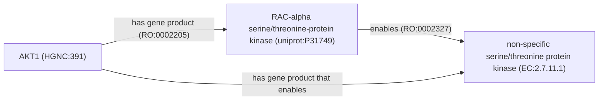
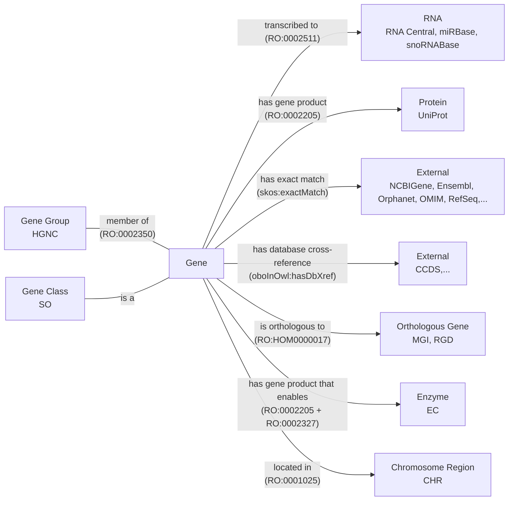

This is the second of a two-part post about encoding databases as ontologies. In
the [first
part](), I gave a
background on how I started working on this problem and the software stack I
developed along the way. In this post, I explain the philosophy and design about
how I encoded the
[HGNC (HUGO Gene Nomenclature Committee)](http://www.genenames.org) database as
an ontology using [PyOBO](https://github.com/biopragmatics/pyobo).

While the previous post used
[CRediT (Contributor Roles Taxonomy)](https://bioregistry.io/registry/credit) to
demonstrate encoding as an ontology a simple resource that only contains names
and descriptions for its identifiers, the goal of this post is to describe the
design decisions take to ontologize a more complex resource: the
[HGNC (HUGO Gene Nomenclature Committee) database](http://www.genenames.org).

The HGNC assigns names, symbols, and numeric identifiers to human genes. Gene
symbols like
[AKT1](https://genenames.org/data/gene-symbol-report/#!/hgnc_id/HGNC:391) are
the primary names referenced in the biomedical literature (which are sometimes
[misunderstood by Microsoft Excel](https://genomebiology.biomedcentral.com/articles/10.1186/s13059-016-1044-7)).
HGNC identifiers are used to unambiguously reference human genes in biocuration
efforts like
[DECIPHER](https://www.deciphergenomics.org/gene/AKT1/overview/clinical-info),
[MedlinePlus](https://vsearch.nlm.nih.gov/vivisimo/cgi-bin/query-meta?v%3Aproject=medlineplus&query=AKT1),
[GeneCards](http://www.genecards.org/cgi-bin/carddisp.pl?id_type=hgnc&id=391),
and the
[Alliance of Genome Resources](https://www.alliancegenome.org/gene/HGNC:391).
They are also the targets of grounding human genes in manual literature curation
workflows (like for BEL, BioPAX, SBML) and text mining workflows (like
[INDRA](https://discovery.indra.bio)).

I see the following three major benefits in ontologizing HGNC:

1. To support the standardized reuse of HGNC terms within semantic web
   applications and ontologies. While databases can create fields with
   well-defined semantics where they place either numeric HGNC identifiers or
   references to HGNC gene symbols, semantic web applications often require the
   use of (consistent) URIs and ontologies further require consistent as
   classes/individuals with the appropriate axioms. For example, the
   [MONDO Disease Ontology](https://bioregistry.io/mondo) annotates genes'
   relationships to disease (such as being a disease driver), but they are
   forced to use workarounds to reference HGNC records, since they are not
   encoded in an ontology.
2. To support the standardized distribution of HGNC. HGNC has its own _ad hoc_
   distribution formats (JSON, SQL, TSV). Ontologizing HGNC enables standard
   tooling to consume and reuse the database.
3. To support the standardized interpretation of HGNC. The content of HGNC does
   not have formally defined semantics - for example, if you download the JSON
   dump, how does one know what the `mane_select` key means, or what
   `virus integration site` means in the `locus_type` field? Ontologizing HGNC
   enables for a single person or small group to do the hard work of
   understanding the meaning of the fields and values used in the source data,
   then encode their hard-earned domain knowledge with formal semantics such
   that everyone can understand it. I'll use the `locus_type` and `locus_group`
   fields as an example to illustrate this.

I don't want to bury the lede, so here's a link to the
[PyOBO source script for HGNC](https://github.com/biopragmatics/pyobo/blob/main/src/pyobo/sources/hgnc/hgnc.py)
that implements everything I'm about to describe. Actionable feedback and pull
requests are welcome if you have concrete ideas for improvement.

## Lexicalization of a Gene

Each record contains up to five lexical components (i.e., name, description,
synonyms), which are mapped to the ontology as follows:

| Key               | Cardinality  | Predicate                  | Synonym Type                         |
| ----------------- | ------------ | -------------------------- | ------------------------------------ |
| `symbol`          | one          | `rdfs:label`               | N/A                                  |
| `name`            | one          | `dcterms:description`      | N/A                                  |
| `alias symbol`    | zero or more | `oboInOwl:hasExactSynonym` | `OMO:0003016` (gene symbol synonym)  |
| `alias_name`      | zero or more | `oboInOwl:hasExactSynonym` | `OMO:0003008` (previous name)        |
| `previous_symbol` | zero or more | `oboInOwl:hasExactSynonym` | `OMO:0003015` (previous gene symbol) |

The dichotomy of gene symbols (short form) and gene names (long form) requires a
making the important design decision of which to use as the label. I chose to
use the gene symbol because of its ubiquitous use, see discussion
[here](https://github.com/information-artifact-ontology/ontology-metadata/pull/197#discussion_r2428235955).
An alternative to this lexicalization could be to mark the `name` as the primary
label with `rdfs:label` and to use the `symbol` as an exact synonym with type
[abbreviation `OMO:0003000`](https://bioregistry.io/OMO:0003000). However, using
the gene symbol as the primary label is so ubiquitous that this seemed
appropriate. Further, HGNC does not provide dedicated textual descriptions, and
in their place, the name is often a reasonable alternative.

Here's an example record in OBO flat file format to illustrate:

```
[Term]
id: hgnc:100
name: ASIC1
def: "acid sensing ion channel subunit 1"
synonym: "ACCN2" RELATED OMO:0003015 []
synonym: "BNaC2" RELATED OMO:0003016 []
synonym: "acid sensing (proton gated) ion channel 1" RELATED OMO:0003008 []
synonym: "acid-sensing (proton-gated) ion channel 1" RELATED OMO:0003008 []
synonym: "amiloride-sensitive cation channel 2, neuronal" RELATED OMO:0003008 []
synonym: "hBNaC2" RELATED OMO:0003016 []
```

As an aside: the classes and properties needed to curate an ontology, or
ontologize a database, aren't always available from the start. In many
situations, this leads to making _ad hoc_ classes or properties to get the job
done - I am not above this. Initially, I had created _ad hoc_ synonym types for
gene symbol synonyms and previous gene symbols. Later, I
[requested two new synonym types](https://github.com/information-artifact-ontology/ontology-metadata/pull/197)
in the [OBO Metadata Ontology (OMO)](https://bioregistry.io/omo) to cover these
use cases. This is actually a difficult step, because it requires justifying to
the community why they are useful. In this case, I think it's clear, since all
model organism databases (MODs) make these kinds of synonyms, and I was able to
give a good justification based on the fact that I also made similar _ad hoc_
synonym types for the PyOBO source for the Rat Genome Database (RGD). After
doing the design work and making the pull request, I updated both the HGNC and
RGD sources in PyOBO to reuse these terms in
[biopragmatics/pyobo#447](https://github.com/biopragmatics/pyobo/pull/447).

## Classification of a Gene by Locus Type

Each gene is annotated with a locus group and locus type. These correspond to a
classification, which translates into an ontology as parent-child relationships
between classes, mediated by the `rdfs:subClassOf` relationship (often
abbreviated by _is a_). Here's a count summary of all locus groups at the time
of writing:

| Locus Type          | Frequency |
| ------------------- | --------: |
| protein-coding gene |    19,297 |
| pseudogene          |    14,602 |
| non-coding RNA      |     9,634 |
| other               |     1,004 |

Here's a count summary of all locus types at the time of writing. It's clear
that the locus type is more granular than locus group and completely subsumes
it. Therefore, I'll throw away the locus group and only discuss the locus type
here. Looking ahead, I've included my manual mapping from each _ad hoc_ values
used in HGNC to formal terms in the
[Sequence Ontology (SO)](https://bioregistry.io/so).

| Locus Type                 | Frequency | Sequence Ontology                                                                      |
| -------------------------- | --------: | -------------------------------------------------------------------------------------- |
| gene with protein product  |    19,297 | SO:0001217                                                                             |
| pseudogene                 |    14,361 | SO:0000336                                                                             |
| RNA, long non-coding       |     6,296 | SO:0002127                                                                             |
| RNA, micro                 |     1,912 | SO:0001265                                                                             |
| RNA, transfer              |       591 | SO:0001272                                                                             |
| RNA, small nucleolar       |       568 | SO:0001267                                                                             |
| immunoglobulin gene        |       230 | SO:0002122                                                                             |
| T cell receptor gene       |       205 | SO:0002133                                                                             |
| immunoglobulin pseudogene  |       203 | SO:0002098                                                                             |
| readthrough                |       151 | SO:0000697                                                                             |
| RNA, cluster               |       119 | SO:0003001 (see [PR](https://github.com/The-Sequence-Ontology/SO-Ontologies/pull/667)) |
| fragile site               |       116 | SO:0002349                                                                             |
| endogenous retrovirus      |       110 | SO:0000100                                                                             |
| unknown                    |        69 | SO:0000704 (mapped to top-level gene)                                                  |
| complex locus constituent  |        69 | SO:0000997                                                                             |
| RNA, ribosomal             |        60 | SO:0001637                                                                             |
| RNA, small nuclear         |        51 | SO:0001268                                                                             |
| region                     |        46 | SO:0001411                                                                             |
| T cell receptor pseudogene |        38 | SO:0002099                                                                             |
| RNA, misc                  |        29 | SO:0001266                                                                             |
| virus integration site     |         8 | SO:0003002 (see [PR](https://github.com/The-Sequence-Ontology/SO-Ontologies/pull/668)) |
| RNA, Y                     |         4 | SO:0002359                                                                             |
| RNA, vault                 |         4 | SO:0002358                                                                             |

I created [this issue](https://github.com/biopragmatics/pyobo/issues/118) on the
PyOBO tracker when I started preparing this mapping, since there were a few
already available in the info box for the locus type on a given gene page on the
HGNC website. However, several were incorrect and most were missing. Therefore,
I had to manually map several to terms in the Sequence Ontology. Many mappings
were easy, but several required discussion with the HGNC and Sequence Ontology
teams (as you can see on the issue). HGNC was proactive and incorporated my
mappings into their front-end.

There were several cases where there was no appropriate term in the Sequence
Ontology. For some, the maintainers created new terms. Unfortunately, for some,
the maintainers were unresponsive, so I had to make my own PRs to the repository
which probably won't get accepted in a timely fashion. However, I was able to
use the placeholder identifiers in the PyOBO source module even though they
haven't yet been merged and released.

As an aside: annotating locus types is not just a human gene problem, but all
model organism databases (MODs) need to work on. I already have a
[thread](https://github.com/biopragmatics/pyobo/issues/165) for taking a similar
approach for FlyBase, but it would be great to do the same for MGI (mouse), RGD
(rat), and other MODs for which PyOBO encodes a source. In general, it would be
great to see the Alliance of Genome Resources (AGR) push their members towards
adopting more shared semantics in the way they curate, especially for locus
types.

## Chromosomal Locations

The `location` field connects a gene to its chromosomal location by encoding the
location as a string. Initially, I had created an _ad hoc_ relation to encode
this string field (`obo:hgnc#has_location`). In
[biopragmatics/pyobo#451](https://github.com/biopragmatics/pyobo/pull/451), I
adapted this to map the chromosomal location strings to classes in the
[Chromosome Ontology (CHR)](https://bioregistry.io/chr) and use a combination of
well-established relations, based on the apparent values for the chromosomes.
Note that this is a first attempt at ontologization, and the relations might
need updating.

### Single Point Annotations

[RO:0001025 (located in)](https://bioregistry.io/RO:0001025) is used for single
point annotations, such as in [hgnc:10080](https://bioregistry.io/hgnc:10080).

```
[Term]
id: hgnc:10080
name: RNPS1
is_a: SO:0001217 ! protein_coding_gene
relationship: RO:0001025 CHR:9606-chr16p13.3 ! located in 16p13.3 (Human)
```

### Pairs of Points

Multiple [RO:0001025 (located in)](https://bioregistry.io/RO:0001025) is used
for pairs of point annotations, e.g., when written like `Xq28 and chrYq12`, like
in [hgnc:38513](https://bioregistry.io/hgnc:38513):

```
id: hgnc:38513
name: WASIR1
is_a: SO:0002127 ! lncRNA_gene
relationship: RO:0001025 CHR:9606-chrXq28 ! located in Xq28 (Human)
relationship: RO:0001025 CHR:9606-chrYq12 ! located in Yq12 (Human)
```

There's also a single example of a location containing an "or" in
[hgnc:3829](https://bioregistry.io/hgnc:3829) which looks like
`10q23.3 or 10q24.2`. There are more sophisticated ways of represent "or" logic
in OWL, but not serializable directly in the OBO flat file format.

### Ranges

[RO:0002223 (starts)](https://bioregistry.io/RO:0002223) and
[RO:0002229 (ends)](https://bioregistry.io/RO:0002229) are used for ranges of
chromosomes, e.g., when written like `8q11.23-q12.1`, like in
[hgnc:10263](https://bioregistry.io/hgnc:10263):

```
[Term]
id: hgnc:10263
name: RP1
is_a: SO:0001217 ! protein_coding_gene
relationship: RO:0002223 CHR:9606-chr8q11.23 ! starts 8q11.23 (Human)
relationship: RO:0002229 CHR:9606-chr8q12.1 ! ends 8q12.1 (Human)
```

### Special case: Mitochondria

Genes that are mapped to the mitochondrial chromosome get mapped to the
[Gene Ontology (GO)](https://bioregistry.io) term
[GO:0000262](https://bioregistry.io/GO:0000262) instead of a Chromosome Ontology
term, like in [hgnc:50279](https://bioregistry.io/hgnc:50279):

```
[Term]
id: hgnc:50279
name: MT-LIPCAR
is_a: SO:0002127 ! lncRNA_gene
relationship: RO:0001025 GO:0000262 ! located in mitochondrial chromosome
```

### Qualified Annotations

Some annotations that end with a qualifier "not on reference assembly",
"unplaced", or "alternate reference locus" get them annotated as comment axioms.

```
[Term]
id: hgnc:10082
name: RNR1
is_a: SO:0003001
relationship: RO:0001025 CHR:9606-chr13p12 {rdfs:comment="not on reference assembly -named gene is not annotated on the current version of the Genome Reference Consortium human reference assembly; may have been annotated on previous assembly versions or on a non-reference human assembly"} ! located in 13p12 (Human)
```

### Unprocessable Locations

After processing HGNC, there were several locations that could not be mapped to
CHR. I
[made an issue](https://github.com/monarch-initiative/monochrom/issues/34) on
the Chromosome Ontology's issue tracker noting all the locations that were not
mappable. However, several of these could be errors on the side of HGNC as well,
and requires checking each manually.

| unhandled location        | count | appears in                                      |
| ------------------------- | ----- | ----------------------------------------------- |
| 10q23.3 or 10q24.2        | 1     | [hgnc:3829](https://bioregistry.io/hgnc:3829)   |
| Yp13.3                    | 1     | [hgnc:6012](https://bioregistry.io/hgnc:6012)   |
| 17qter                    | 1     | [hgnc:8841](https://bioregistry.io/hgnc:8841)   |
| 13cen, GRCh38 novel patch | 1     | [hgnc:15732](https://bioregistry.io/hgnc:15732) |
| Xp22.22                   | 1     | [hgnc:10199](https://bioregistry.io/hgnc:10199) |
| 1p36.13q41                | 1     | [hgnc:36026](https://bioregistry.io/hgnc:36026) |
| 12q22.32                  | 1     | [hgnc:58534](https://bioregistry.io/hgnc:58534) |
| 1q13.1                    | 1     | [hgnc:32558](https://bioregistry.io/hgnc:32558) |
| 3q25.22                   | 1     | [hgnc:32563](https://bioregistry.io/hgnc:32563) |
| 7p36.1                    | 1     | [hgnc:34871](https://bioregistry.io/hgnc:34871) |
| 11p11.2                   | 1     | [hgnc:58650](https://bioregistry.io/hgnc:58650) |
| 22pter                    | 1     | [hgnc:1838](https://bioregistry.io/hgnc:1838)   |
| 18p22.3                   | 1     | [hgnc:58557](https://bioregistry.io/hgnc:58557) |
| Xp11.32                   | 1     | [hgnc:37114](https://bioregistry.io/hgnc:37114) |
| 17q12b                    | 1     | [hgnc:49316](https://bioregistry.io/hgnc:49316) |

Here's a few observations I had on this:

- the `ter` seems to be an annotation related to trisomy
- `13cen, GRCh38 novel patch` is a weird outlier
- `1p36.13q41` might be a typo
- the "or" entry probably should be processed and not actually get a term, but
  keeping here for completeness
- some of them might have typos between "p" and "q"

In general, these kinds of unmapped items are not blockers towards ontologizing
a resource. It's generally valuable to include logging in a PyOBO source when
there is content that is unhandled, since this can be valuable feedback for the
upstream resources themselves.

### Membership in Gene Groups

HGNC has a secondary categorization of genes into gene groups (formerly called
gene families). There's a variety of purposes for gene groups which themselves
have a hierarchical classification. However, based on the contents of gene
groups, I don't think that it's appropriate to use `rdfs:subClassOf` for
relations between genes and gene sets. Instead, I have opted to use
[RO:0002350 (member of)](https://bioregistry.io/RO:0002350), which is defined as
a mereological relation (i.e., a part-of relation) between an item and a
collection.

## Genes and Enzymes

HGNC annotates genes with [Enzyme Commission (EC)](https://bioregistry.io/ec)
codes. There's spirited discussion in the ontology world about how we should
ontologize enzymes. For example, the Gene Ontology ( GO)
[models them as catalytic activities](https://github.com/oborel/obo-relations/issues/783#issuecomment-2706828739)
within GO's molecular function branch.

We typically classify proteins based on their catalytic activities, which means
that to model the relationship between a gene and an enzyme, we need to use a
property chain connecting the gene to the protein it encodes (RO:0002205), and
the catalytic activity that the protein enables (RO:0002327).



This property chain doesn't yet exist in RO, so I made a
[new term request](https://github.com/oborel/obo-relations/issues/873) and
associated [pull request](https://github.com/oborel/obo-relations/pull/874) to
proactively mint a new identifier for use in PyOBO. I have a pull request to
PyOBO
([biopragmatics/pyobo#455](https://github.com/biopragmatics/pyobo/pull/455))
waiting to reflect this change depending on feedback. Otherwise, the old
ontologization uses a property chain of _gene product of_ and _member of_, to
consider an EC class as a more general classification class.

I'm still undecided on what's the best modeling choice. I am keen to fill out
the following chart in a more satisfying way, that captures a bit more nuance in
the fact that enzymes are a classification that implies the ability to carry out
an activity, but when going against the historical choices of a resource as
large as go, I am punching outside my ontological weight class 🤷.


## Remaining Logical Axioms and Semantic Mappings

As I come to a close, the only remaining content to ontologize are the many
database cross-references. A first and simple approach is to use
`oboInOwl:hasDbXref`, but this is a missed opportunity to encode domain
knowledge about each of the resources. The following chart gives an overview of
the remaining logical axioms and semantic mapping types:



To briefly summarize this diagram:

1. References to other model organism databases are modeled as orthology
   relationships
2. References to UniProt (_the_ protein database) are modeled as has gene
   product (i.e., a broader relationship than translation)
3. References to RNA databases are modeled as transcription
4. References to databases that are nomenclature resources for genes are modeled
   as exact matches
5. References to databases that can have potentially multiple experimental
   measurements for a given gene are modeled with database cross-references
6. I already mentioned in more detail above how enzymes, gene groups, and
   locations are annotated.

The implementation of this logic can be found in the
[PyOBO source module for HGNC](https://github.com/biopragmatics/pyobo/blob/main/src/pyobo/sources/hgnc/hgnc.py).

## What Was Skipped

There are many extra fields in HGNC that I throw away which effectively
duplicate the HGNC identifier or gene symbol, such as `agr` (which reuses the
HGNC identifier) and `lncrnadb` (which reuses the HGNC gene symbol).

Rather than representing the fact that the external database provides
information about this term, a better solution is to add additional providers to
the Bioregistry, such that a given HGNC identifier can be used to create a link
to the database itself. This isn't a perfect solution, because some databases
only cover a subset of genes. There's more discussion about this on
[this issue](https://github.com/information-artifact-ontology/ontology-metadata/issues/165)
on OMO issue tracker, specifically in
[this comment](https://github.com/information-artifact-ontology/ontology-metadata/issues/165#issuecomment-3397905640).

While I don't offer an isomorphic (i.e., covers everything that's there)
solution for ontologization of this part of the content, I do believe that the
rest of my choices address the three big benefits I mentioned at the start.

---

Wow, this is my first ever double blog post. It took me a full day to write it,
not to mention the years of work that went into the software ecosystem itself
and the time put into improving the HGNC PyOBO source module in preparation for
writing it. I am very happy to be reporting on this, and to see how it will
positively impact the community.

If you made it this far and are interested in collaborating to make your own
resource accessible through PyOBO, please get in touch using my contact
information at the bottom of the page or by opening an issue on the
[PyOBO issue tracker](https://github.com/biopragmatics/pyobo/issues).

I'm also open to collaboration through grant writing or contract/consulting work
via my current employer (RWTH Aachen University) for extending and applying
PyOBO and the wider [Biopragmatics Stack](https://biopragmatics.github.io) in
new domains. This has been very successful in the
[DARPA ASKEM](https://www.darpa.mil/research/programs/automating-scientific-knowledge-extraction-modeling)
project,
[DTRA RAPTER](https://www.lanl.gov/media/publications/1663/0125-ai-vaccines-drugs)
project, and now in several DFG-funded German NFDI consortia.
