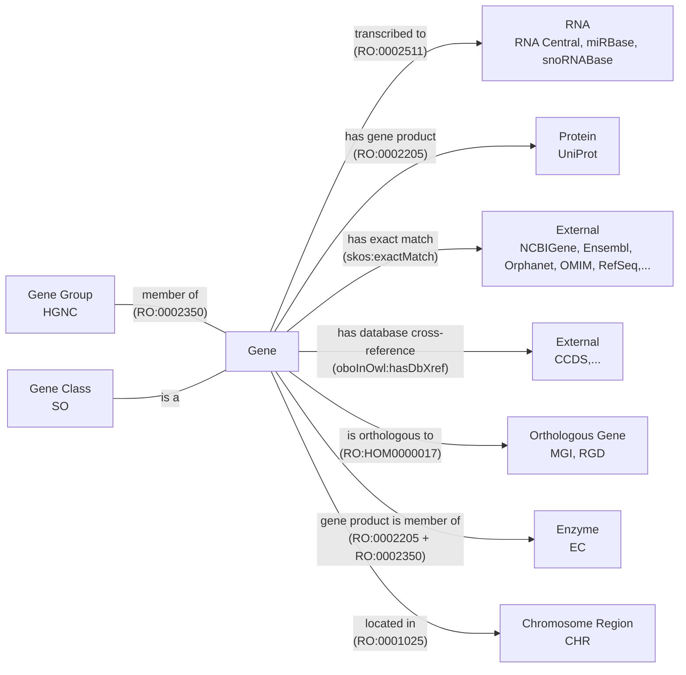
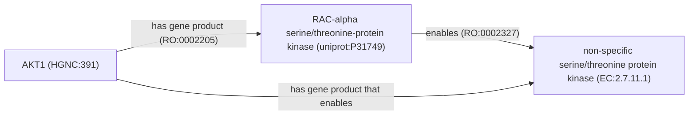

This is a post about how I converted HGNC to OWL

## Prior Art

### Motivation for PyOBO

During my graduate studies, I was working with the
[Biological Expression Language (BEL)](https://biological-expression-language.github.io),
which curated causal, correlative, and associative relationships between
chemicals, proteins, diseases, and other biological entities. At the time, BEL
used a syntax similar to [CURIEs]() for
referencing entities that had a (pseudo-)prefix and a string label for an
entity, which pointed to a BEL namespace file. Selventa had produced several
namespace files in 2015 (e.g., for GO, DO, HGNC) before [going out of
business](), but, because the namespace
files relied on names instead of identifiers, they quickly became out of date.
Naturally, I wanted to renew the existing BEL namespace files and also create
new ones for additional ontologies to support the curation I was doing.

With Selventa's
[_ad hoc_ scripts](https://github.com/OpenBEL/resource-generator) as
inspiration, I set out on developing
[PyOBO](https://github.com/biopragmatics/pyobo) to make unified access to both
ontologies and ontology-like resources (e.g., databases), both for the purposes
of making new BEL namespaces, but also for creating simple, unified access to
their contents. Initially, PyOBO wrapped Daniel Himmelstein's
[obonet](https://github.com/dhimmel/obonet) to read ontologies in the OBO flat
file format and constructed caches for efficient querying of fields like the
names, synonyms, and descriptions.

```python
import pyobo

>> > pyobo.get_name("credit:software")
"Software"
```

Since, PyOBO has grown to have more detailed and opinionated processing
workflows to handle the messy content curated across many ontologies, to be able
to handle additional formats (despite OBO being the most approachable ontology
format for outsiders, it also has the most issues associated with its
serialization and parsing), and to implement an internal domain-specific
language (DSL) for representing ontologies such that ontology-like resources
could be converted into ontology files.

### Databases as Ontologies

The conversion of ontology-like resources into ontologies became increasingly
more interesting to me, especially because of my parallel interests in automatic
construction of knowledge graphs. I found that ontologies were a convenient
target for standardizing relationships, e.g., using the
[Relation Ontology (RO)](https://bioregistry.io/ro). Others were working on
similar problems in parallel, such as the OBO community's
[converter for the NCBI Taxonomy Database](https://github.com/obophenotype/ncbitaxon/).
Notably, Chris Mungall gave a talk in 2021 entitled
[Limits of ontologies: How should databases be represented in OBO?](https://doi.org/10.5281/zenodo.14661500)
which organized thoughts and ongoing challenges, most of which are still
relevant!

PyOBO now contains a suite of 60+
[sources](https://github.com/biopragmatics/pyobo/tree/main/src/pyobo/sources)
for resources covering chemistry, biology, medicine, cultural heritage, the
semantic web, and other disciplines. Each source implements automated,
version-aware download and caching of data files from the resource and
transformation of the downloaded data into an OWL ontology within a concrete
instance of an
[abstract base class](https://pyobo.readthedocs.io/en/latest/api/pyobo.Obo.html)
provided by PyOBO. Typically, resources make available tabular data in which
each row corresponds to a record in the resource that can either be transformed
into a [class](https://www.w3.org/TR/owl-ref/#Class) or
[named individual](https://www.w3.org/TR/owl-ref/#Individual) within an OWL
ontology. The remaining columns can often be mapped into other annotation
properties (i.e., metadata) or object properties (i.e., part of the logical
definition). For example, the label can be mapped to an annotation property
using `rdfs:label` and the species (if applicable) can be mapped to an object
property using [`RO:0002162`](https://bioregistry.io/RO:0002162) (in taxon).

Below is a demonstration of a minimal implementation of a PyOBO source for the
[CRediT (Contributor Roles Taxonomy)](https://bioregistry.io/credit), an
informally constructed controlled vocabulary for describing how authors
contributed to creative works. Note that the following is a relatively simple
PyOBO source that only uses a subset of PyOBO's DSL for encoding ontology
components. The full version of this script is available in the PyOBO repository
[here](https://github.com/biopragmatics/pyobo/blob/main/src/pyobo/sources/credit.py).

```python
from more_itertools import chunked
from pyobo.struct import Obo, Term
from pyobo.utils.path import ensure_json, ensure_open

PREFIX = "credit"
URI_PREFIX = "https://credit.niso.org/contributor-roles/"
DATA_URL = "https://api.github.com/repos/CASRAI-CRedIT/Dictionary/contents/Picklists/Contributor%20Roles"
ROOT_TERM = Term.from_triple(prefix="cro", identifier="0000000")


class CreditGetter(Obo):
    ontology = PREFIX
    static_version = "2022"
    root_terms = [ROOT_TERM.reference]

    def iter_terms(self, force: bool = False):
        yield ROOT_TERM
        for records in ensure_json(PREFIX, url=DATA_URL, name="picklist-api.json", force=force):
            with ensure_open(PREFIX, "picklist", url=records["download_url"], backend="requests", force=force) as file:
                header, *rest = file.read().splitlines()
                data = {key.removeprefix("## "): value for key, value in chunked(rest, 2)}
                term = Term.from_triple(
                    prefix=PREFIX,
                    identifier=data["Canonical URL"].removeprefix(URI_PREFIX).rstrip("/"),
                    name=header.removeprefix("# Contributor Roles/"),
                    definition=data["Short definition"],
                )
                term.append_parent(ROOT_TERM)
                yield term
```

Each PyOBO source inherits a fully automated workflow for converting resources
into ontologies in the
[OBO flat file format](https://owlcollab.github.io/oboformat/doc/GO.format.obo-1_4.html)
and
[OWL functional-style syntax (OFN)](https://www.w3.org/TR/owl2-syntax/#Class_Expressions).
Through OFN, PyOBO wraps [OWLAPI](https://github.com/owlcs/owlapi) to enable
conversion to OWL/XML, RDF/XML,
[OBO Graph JSON](https://github.com/geneontology/obographs/) and any other
supported format. As an aside: it's a goal of mine to reimplement key parts of
OWLAPI in Python (or Rust) since it's written in Java, which due to the
language's waning popularity, poses a risk for OWLAPI's further maintenance and
development.

```python
from pyobo.sources.credit import CreditGetter

ontology = CreditGetter()
ontology.write_ofn("credit.ofn")
ontology.write_obo("credit.obo")
ontology.write_owl("credit.owl")  # enabled by OWLAPI
```

Here's what the (abridged to only show a single term) OBO export looks like.
Full exports of CRediT in all formats (e.g., OFN, OBO, OWL/XML) can be found
[here](https://github.com/biopragmatics/obo-db-ingest/tree/main/export/credit#readme).

```
data-version: 2022
idspace: credit https://credit.niso.org/contributor-roles/ "Contributor Roles Taxonomy"
idspace: dcterms http://purl.org/dc/terms/ "Dublin Core Metadata Initiative Terms"
idspace: doap http://usefulinc.com/ns/doap# "Description of a Project"
idspace: foaf http://xmlns.com/foaf/0.1/ "Friend of a Friend"
idspace: orcid https://orcid.org/ "Open Researcher and Contributor"
ontology: credit
property_value: dcterms:title "Contributor Roles Taxonomy" xsd:string
property_value: dcterms:license "CC-BY-4.0" xsd:string
property_value: foaf:homepage "https\://credit.niso.org/" xsd:anyURI
property_value: doap:maintainer orcid:0000-0002-9298-3168
property_value: IAO:0000700 CRO:0000000

[Term]
id: credit:conceptualization
name: Conceptualization
def: "Ideas; formulation or evolution of overarching research goals and aims."
is_a: CRO:0000000
```

PyOBO implements several use case-specific exporters, such as exporting semantic
mappings in the
[Simple Standard for Sharing Ontological Mappings (SSSOM)](https://mapping-commons.github.io/sssom/),
exporting synonyms and literal mappings in the
[Simple Standard for Sharing Literal Mappings](https://github.com/cthoyt/ssslm),
and nodes and edges files for import into the Neo4j graph database. It also
implements high-level workflows to support
[named entity recognition (NER) and named entity normalization (NEN)](https://pyobo.readthedocs.io/en/latest/ner.html),
and embedding entities using
[(medium) language models](https://pyobo.readthedocs.io/en/latest/api/pyobo.get_text_embeddings_df.html#pyobo.get_text_embeddings_df)
or
[graph machine learning](https://pyobo.readthedocs.io/en/latest/api/pyobo.get_graph_embeddings_df.html#pyobo.get_graph_embeddings_df).

PyOBO has a deep integration with
[the Bioregistry](https://github.com/biopragmatics/bioregistry) in order to
achieve consistent identifier standards. As such, it's required that all sources
in PyOBO have a corresponding record in the Bioregistry, which covers key
metadata including the name, description, homepage, license, URI prefix, and
contact person for the resource. These fields are automatically propagated from
the Bioregistry into ontology metadata using appropriate annotation properties,
making ontologies produced by PyOBO much more transparent and understandable.

Because PyOBO is free and open source
[on GitHub](https://github.com/biopragmatics/pyobo), anyone can contribute
additional sources to the upstream repository. Alternatively, PyOBO has a plugin
system based on Python's
[entry points](https://packaging.python.org/en/latest/specifications/entry-points/)
such that additional sources can be implemented without making an upstream
contribution. This supports use cases such as when the resource is not publicly
available or when the code should not become publicly available (e.g., in the
context of a company). For example, some pharmaceutical companies use the plugin
system to implement sources for their compound registration system and internal
ontology system.

### OBO Database Ingest

Back in 2017, I started a project for converting biomedical databases into BEL,
Bio2BEL. I made a big fuss about how the workflows were reusable and that anyone
could run them. This was recieved relatively poorly.

On the other hand, Daniel Himmelstein published Hetionet, which was effectively
the first biomedical knowledge graph that integrated multiple different sources.
He was very careful to use data that he was licensed to redistribute, and he
made sure that there were many different artifacts of the final build available
for reuse in a variety of places. Bio2BEL was never accepted, after years of
review, and I had to give up and move on to new things.

I didn't make that mistake again - the databases for almost all PyOBO sources
are permissively licensed such that the data can be redistributed.

The OBO Database Ingest (`obo-db-ingest`) is a
[GitHub repository](https://github.com/biopragmatics/obo-db-ingest) is a
repository that runs the scripts for each PyOBO source whose data are
permissively licensd, and stores the OBO, OWL, OFN, OBO Graph JSON, SSSOM,
SSSLM, and Neo4j files. It has a single Python script containing
[PEP 723-compliant](https://peps.python.org/pep-0723/) inline script metadata
such that it is fully-self contained and can be run with `uv run`, assuming a
Java runtime is available for ROBOT and OWLAPI.

In theory, this script can be run on a chronological basis using GitHub Actions
to keep the outputs up-to-date. However, in practice, usually one or more
resources fail due to a combination of unreliable services (on the database's
side) or issues where updates to the underlying data cause the scripts to fail.
I'm still working on making this script and PyOBO's sources themselves more
resilient to such failures! One stop-gap could be to have smaller workflows
running on the most important resources that are updated frequently (e.g., HGNC
updates monthly) versus other resources which are updated infrequently (e.g.,
MeSH updates yearly). As an alternative, I often run this script locally, which
usually takes less than an hour because PyOBO cleverly caches versions, and the
script avoids duplicate work for data that hasn't been updated.

The repository is structured such that there's a consistent location for the
latest output of each PyOBO source as well as version-specific outputs. This
method indeed has its limits, since `git` is not really meant to be a file
storage system, especially for big files.

Because of its simple structure, it's possible to assign persistent URLs (PURLs)
to each resource, which abstracts away the physical infrastructure that's
required for storing and serving files. PURLs are an often-requested feature by
ontologies that would like to import and incorporate PyOBO sources. They also
enable the ontologies to be incorporated into tools like the EBI's Ontology
Lookup Service (OLS), for example, I've already done this for
[MeSH](https://www.ebi.ac.uk/ols4/ontologies/mesh). The PURLs are all configured
centrally in the
[W3ID](https://github.com/perma-id/w3id.org/tree/master/biopragmatics) system.
Here's what a few versioned PURLs look like:

| Resource      | Version Type | Example Versioned PURL                                                         |
| ------------- | ------------ | ------------------------------------------------------------------------------ |
| Reactome      | Sequential   | https://w3id.org/biopragmatics/resources/reactome/83/reactome.obo              |
| Interpro      | Major/Minor  | https://w3id.org/biopragmatics/resources/interpro/92.0/interpro.obo            |
| DrugBank Salt | Semantic     | https://w3id.org/biopragmatics/resources/drugbank.salt/5.1.9/drugbank.salt.obo |
| MeSH          | Year         | https://w3id.org/biopragmatics/resources/mesh/2023/mesh.obo.gz                 |
| UniProt       | Year/Month   | https://w3id.org/biopragmatics/resources/uniprot/2022_05/uniprot.obo.gz        |
| HGNC          | Date         | https://w3id.org/biopragmatics/resources/hgnc/2023-02-01/hgnc.obo              |
| CGNC          | unversioned  | https://w3id.org/biopragmatics/resources/cgnc/cgnc.obo                         |

The script also outputs a
[full manifest](https://github.com/biopragmatics/obo-db-ingest/raw/refs/heads/main/docs/_data/manifest.yml)
that can be consumed by downstream resources that want to consume all content in
the repository, such as the [KG Registry](https://kghub.org/kg-registry).

## Ontologizing HGNC

The HGNC (HUGO Gene Nomenclature Committee) assigns names and symbols to human
genes

While CRediT constituted a simple example that only contained names and
descriptions, t

- why do we care about HGNC? it's ubiquitous in the literature and is therefore
  the target for many biocuration efforts, such as in BEL, OmniPath, etc.
- why do we want HGNC as OWL? to get access to other ontology tooling and to
  make things work properly when referencing HGNC in existing ontologies. Also,
  a lot of knowledge is already formulatable using RO, so take advantage of that
  so it can be easily turned into KGs through ontologies as a common
  intermediate.

Every resource requires some thought in converting.

https://github.com/biopragmatics/pyobo/blob/main/src/pyobo/sources/hgnc/hgnc.py

### Lexicalization

Related discussions:

- https://github.com/information-artifact-ontology/ontology-metadata/pull/197#discussion_r2428235955

### Logical Axioms



The relationship between a gene and its group is also unclear.

The relationship between a gene and an enzyme is currently mediated by a
property chain. In order to define it properly, we have to figure out how this
diagram should look - and more concretely, define what is the correct
relationship to use between a protein and an enzyme class.




https://github.com/oborel/obo-relations/issues/873

Related discussions:

- https://github.com/oborel/obo-relations/issues/783
