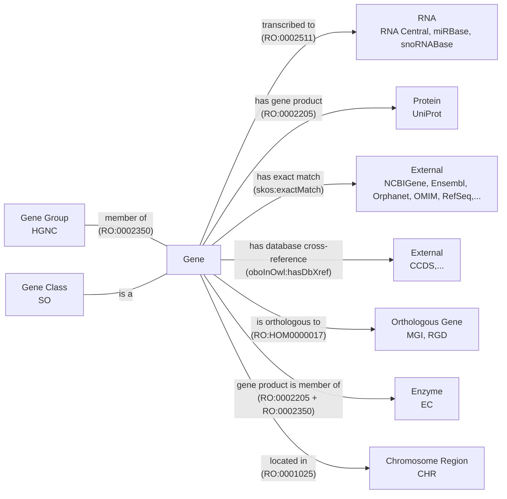

This is a post about how I converted HGNC to OWL

## PyOBO

1. original motivation
2. code examples, what does PyOBO get you
3. formats, need to move beyond OWLAPI/ROBOT since development is not accessible outside java world, want to reuse
   parsers (similar to OAK)

## Lexicalization

Related discussions:

- https://github.com/information-artifact-ontology/ontology-metadata/pull/197#discussion_r2428235955

## Logical Axioms

The relationship between a gene and its group is also unclear.

The relationship between a gene and an enzyme is currently mediated by
a property chain. In order to define it properly, we have to figure out how this diagram
should look - and more concretely, define what is the correct relationship to use between a protein
and an enzyme class.

Related discussions:

- https://github.com/oborel/obo-relations/issues/783