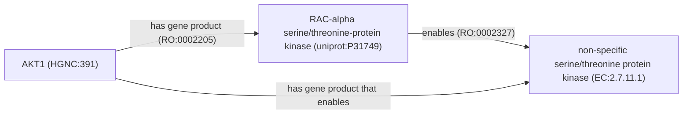
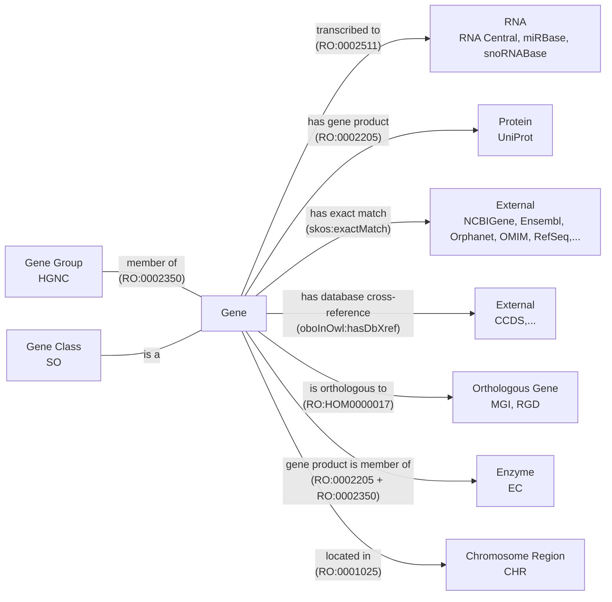

This post gives background on PyOBO, software I wrote that supports converting
databases into ontologies, and the application to HGNC, the nomenclature of
human genes.

## Prior Art

### Motivation for PyOBO

During my graduate studies, I was working with the
[Biological Expression Language (BEL)](https://biological-expression-language.github.io),
which curated causal, correlative, and associative relationships between
chemicals, proteins, diseases, and other biological entities. At the time, BEL
used a syntax similar to [CURIEs]() for
referencing entities that had a (pseudo-)prefix and a string label for an
entity, which pointed to a BEL namespace file. Selventa had produced several
namespace files in 2015 (e.g., for GO, DO, HGNC) before [going out of
business](), but, because the namespace
files relied on names instead of identifiers, they quickly became out of date.
Naturally, I wanted to renew the existing BEL namespace files and also create
new ones for additional ontologies to support the curation I was doing.

With Selventa's
[_ad hoc_ scripts](https://github.com/OpenBEL/resource-generator) as
inspiration, I set out on developing
[PyOBO](https://github.com/biopragmatics/pyobo) to make unified access to both
ontologies and ontology-like resources (e.g., databases), both for the purposes
of making new BEL namespaces, but also for creating simple, unified access to
their contents. Initially, PyOBO wrapped Daniel Himmelstein's
[obonet](https://github.com/dhimmel/obonet) to read ontologies in the OBO flat
file format and constructed caches for efficient querying of fields like the
names, synonyms, and descriptions.

```python
import pyobo

>> > pyobo.get_name("credit:software")
"Software"
```

Since, PyOBO has grown to have more detailed and opinionated processing
workflows to handle the messy content curated across many ontologies, to be able
to handle additional formats (despite OBO being the most approachable ontology
format for outsiders, it also has the most issues associated with its
serialization and parsing), and to implement an internal domain-specific
language (DSL) for representing ontologies such that ontology-like resources
could be converted into ontology files.

### Databases as Ontologies

The conversion of ontology-like resources into ontologies became increasingly
more interesting to me, especially because of my parallel interests in automatic
construction of knowledge graphs. I found that ontologies were a convenient
target for standardizing relationships, e.g., using the
[Relation Ontology (RO)](https://bioregistry.io/ro). Others were working on
similar problems in parallel, such as the OBO community's
[converter for the NCBI Taxonomy Database](https://github.com/obophenotype/ncbitaxon/).
Notably, Chris Mungall gave a talk in 2021 entitled
[Limits of ontologies: How should databases be represented in OBO?](https://doi.org/10.5281/zenodo.14661500)
which organized thoughts and ongoing challenges, most of which are still
relevant!

PyOBO now contains a suite of 60+
[sources](https://github.com/biopragmatics/pyobo/tree/main/src/pyobo/sources)
for resources covering chemistry, biology, medicine, cultural heritage, the
semantic web, and other disciplines. Each source implements automated,
version-aware download and caching of data files from the resource and
transformation of the downloaded data into an OWL ontology within a concrete
instance of an
[abstract base class](https://pyobo.readthedocs.io/en/latest/api/pyobo.Obo.html)
provided by PyOBO. Typically, resources make available tabular data in which
each row corresponds to a record in the resource that can either be transformed
into a [class](https://www.w3.org/TR/owl-ref/#Class) or
[named individual](https://www.w3.org/TR/owl-ref/#Individual) within an OWL
ontology. The remaining columns can often be mapped into other annotation
properties (i.e., metadata) or object properties (i.e., part of the logical
definition). For example, the label can be mapped to an annotation property
using `rdfs:label` and the species (if applicable) can be mapped to an object
property using [`RO:0002162`](https://bioregistry.io/RO:0002162) (in taxon).

Below is a demonstration of a minimal implementation of a PyOBO source for the
[CRediT (Contributor Roles Taxonomy)](https://bioregistry.io/credit), an
informally constructed controlled vocabulary for describing how authors
contributed to creative works. Note that the following is a relatively simple
PyOBO source that only uses a subset of PyOBO's DSL for encoding ontology
components. The full version of this script is available in the PyOBO repository
[here](https://github.com/biopragmatics/pyobo/blob/main/src/pyobo/sources/credit.py).

```python
from more_itertools import chunked
from pyobo.struct import Obo, Term
from pyobo.utils.path import ensure_json, ensure_open

PREFIX = "credit"
URI_PREFIX = "https://credit.niso.org/contributor-roles/"
DATA_URL = "https://api.github.com/repos/CASRAI-CRedIT/Dictionary/contents/Picklists/Contributor%20Roles"
ROOT_TERM = Term.from_triple(prefix="cro", identifier="0000000")


class CreditGetter(Obo):
    ontology = PREFIX
    static_version = "2022"
    root_terms = [ROOT_TERM.reference]

    def iter_terms(self, force: bool = False):
        yield ROOT_TERM
        for records in ensure_json(PREFIX, url=DATA_URL, name="picklist-api.json", force=force):
            with ensure_open(PREFIX, "picklist", url=records["download_url"], backend="requests", force=force) as file:
                header, *rest = file.read().splitlines()
                data = {key.removeprefix("## "): value for key, value in chunked(rest, 2)}
                term = Term.from_triple(
                    prefix=PREFIX,
                    identifier=data["Canonical URL"].removeprefix(URI_PREFIX).rstrip("/"),
                    name=header.removeprefix("# Contributor Roles/"),
                    definition=data["Short definition"],
                )
                term.append_parent(ROOT_TERM)
                yield term
```

Each PyOBO source inherits a fully automated workflow for converting resources
into ontologies in the
[OBO flat file format](https://owlcollab.github.io/oboformat/doc/GO.format.obo-1_4.html)
and
[OWL functional-style syntax (OFN)](https://www.w3.org/TR/owl2-syntax/#Class_Expressions).
Through OFN, PyOBO wraps [OWLAPI](https://github.com/owlcs/owlapi) to enable
conversion to OWL/XML, RDF/XML,
[OBO Graph JSON](https://github.com/geneontology/obographs/) and any other
supported format. As an aside: it's a goal of mine to reimplement key parts of
OWLAPI in Python (or Rust) since it's written in Java, which due to the
language's waning popularity, poses a risk for OWLAPI's further maintenance and
development.

```python
from pyobo.sources.credit import CreditGetter

ontology = CreditGetter()
ontology.write_ofn("credit.ofn")
ontology.write_obo("credit.obo")
ontology.write_owl("credit.owl")  # enabled by OWLAPI
```

Here's what the (abridged to only show a single term) OBO export looks like.
Full exports of CRediT in all formats (e.g., OFN, OBO, OWL/XML) can be found
[here](https://github.com/biopragmatics/obo-db-ingest/tree/main/export/credit#readme).

```
data-version: 2022
idspace: credit https://credit.niso.org/contributor-roles/ "Contributor Roles Taxonomy"
idspace: dcterms http://purl.org/dc/terms/ "Dublin Core Metadata Initiative Terms"
idspace: doap http://usefulinc.com/ns/doap# "Description of a Project"
idspace: foaf http://xmlns.com/foaf/0.1/ "Friend of a Friend"
idspace: orcid https://orcid.org/ "Open Researcher and Contributor"
ontology: credit
property_value: dcterms:title "Contributor Roles Taxonomy" xsd:string
property_value: dcterms:license "CC-BY-4.0" xsd:string
property_value: foaf:homepage "https\://credit.niso.org/" xsd:anyURI
property_value: doap:maintainer orcid:0000-0002-9298-3168
property_value: IAO:0000700 CRO:0000000

[Term]
id: credit:conceptualization
name: Conceptualization
def: "Ideas; formulation or evolution of overarching research goals and aims."
is_a: CRO:0000000
```

PyOBO implements several use case-specific exporters, such as exporting semantic
mappings in the
[Simple Standard for Sharing Ontological Mappings (SSSOM)](https://mapping-commons.github.io/sssom/),
exporting synonyms and literal mappings in the
[Simple Standard for Sharing Literal Mappings (SSSLM)](https://github.com/cthoyt/ssslm),
and nodes/edges files for import into the Neo4j graph database. It also
implements high-level workflows to support
[named entity recognition (NER) and named entity normalization (NEN)](https://pyobo.readthedocs.io/en/latest/ner.html),
and embedding entities using
[(medium) language models](https://pyobo.readthedocs.io/en/latest/api/pyobo.get_text_embeddings_df.html#pyobo.get_text_embeddings_df)
or
[graph machine learning](https://pyobo.readthedocs.io/en/latest/api/pyobo.get_graph_embeddings_df.html#pyobo.get_graph_embeddings_df).

PyOBO has a deep integration with
[the Bioregistry](https://github.com/biopragmatics/bioregistry) in order to
achieve consistent identifier standards. As such, it's required that all sources
in PyOBO have a corresponding record in the Bioregistry, which covers key
metadata including the name, description, homepage, license, URI prefix, and
contact person for the resource. These fields are automatically propagated from
the Bioregistry into ontology metadata using appropriate annotation properties,
making ontologies produced by PyOBO much more transparent and understandable.

Because PyOBO is free and open source
[on GitHub](https://github.com/biopragmatics/pyobo), anyone can contribute
additional sources to the upstream repository. Alternatively, PyOBO has a plugin
system based on Python's
[entry points](https://packaging.python.org/en/latest/specifications/entry-points/)
such that additional sources can be implemented without making an upstream
contribution. This supports use cases such as when the resource is not publicly
available or when the code should not become publicly available (e.g., in the
context of a company). For example, some pharmaceutical companies use the plugin
system to implement sources for their compound registration system and internal
ontology system.

### OBO Database Ingest

The OBO Database Ingest (`obo-db-ingest`) is a
[GitHub repository](https://github.com/biopragmatics/obo-db-ingest) that runs
the scripts for a subset of PyOBO sources whose data are permissively licensed,
and stores the OBO, OWL, OFN, OBO Graph JSON, SSSOM, SSSLM, and Neo4j files
(e.g, see the folder for
[MeSH](https://github.com/biopragmatics/obo-db-ingest/tree/main/export/mesh#readme)).
It has a single Python script containing
[PEP 723-compliant](https://peps.python.org/pep-0723/) inline script metadata
such that it is fully-self contained and can be run with `uv run`, assuming a
Java runtime is available for ROBOT and OWLAPI.

In theory, this script can be run on a chronological basis using GitHub Actions
to keep the outputs up-to-date. However, in practice, usually one or more
resources fail due to a combination of unreliable services (on the database's
side) or issues where updates to the underlying data cause the scripts to fail.
I'm still working on making this script and PyOBO's sources themselves more
resilient to such failures! One stop-gap could be to have smaller workflows
running on the most important resources that are updated frequently (e.g., HGNC
updates monthly) versus other resources which are updated infrequently (e.g.,
MeSH updates yearly). As an alternative, I often run this script locally, which
usually takes less than an hour because PyOBO cleverly caches versions, and the
script avoids duplicate work for data that hasn't been updated.

The repository is structured such that there's a consistent location for the
latest output of each PyOBO source as well as version-specific outputs. This
method indeed has its limits, since `git` is not really meant to be a file
storage system, especially for big files.

Because of its simple structure, it's possible to assign persistent URLs (PURLs)
to each resource, configured by
[W3ID](https://github.com/perma-id/w3id.org/tree/master/biopragmatics). PURLs
abstract away the URL that points to a specific physical infrastructure required
for storing and serving files, making it possible to be changed later, and
therefore making resources more reliable to reference. As such, PURLs are an
often-requested feature by ontologies that would like to import and incorporate
PyOBO sources. They also enable the ontologies to be incorporated into tools
like the EBI's Ontology Lookup Service (OLS), for example, I've already done
this for [MeSH](https://www.ebi.ac.uk/ols4/ontologies/mesh).

Here's what a few PURLs look like for OBO files (replace the file extension with
`.ofn`, `.sssom.tsv`, etc. to get other resources):

| Resource                                                                       | Latest OBO PURL                                                          | Version Type | Example Versioned OBO PURL                                                     |
| ------------------------------------------------------------------------------ | ------------------------------------------------------------------------ | ------------ | ------------------------------------------------------------------------------ |
| [Reactome](https://w3id.org/biopragmatics/resources/reactome#readme)           | https://w3id.org/biopragmatics/resources/reactome/reactome.obo           | Sequential   | https://w3id.org/biopragmatics/resources/reactome/83/reactome.obo              |
| [Interpro](https://w3id.org/biopragmatics/resources/interpro#readme)           | https://w3id.org/biopragmatics/resources/interpro/interpro.obo           | Major/Minor  | https://w3id.org/biopragmatics/resources/interpro/92.0/interpro.obo            |
| [DrugBank Salt](https://w3id.org/biopragmatics/resources/drugbank.salt#readme) | https://w3id.org/biopragmatics/resources/drugbank.salt/drugbank.salt.obo | Semantic     | https://w3id.org/biopragmatics/resources/drugbank.salt/5.1.9/drugbank.salt.obo |
| [MeSH](https://w3id.org/biopragmatics/resources/mesh#readme)                   | https://w3id.org/biopragmatics/resources/mesh/mesh.obo.gz                | Year         | https://w3id.org/biopragmatics/resources/mesh/2023/mesh.obo.gz                 |
| [UniProt](https://w3id.org/biopragmatics/resources/uniprot#readme)             | https://w3id.org/biopragmatics/resources/uniprot/uniprot.obo.gz          | Year/Month   | https://w3id.org/biopragmatics/resources/uniprot/2022_05/uniprot.obo.gz        |
| [HGNC](https://w3id.org/biopragmatics/resources/hgnc#readme)                   | https://w3id.org/biopragmatics/resources/hgnc/hgnc.obo                   | Date         | https://w3id.org/biopragmatics/resources/hgnc/2023-02-01/hgnc.obo              |
| [CGNC](https://w3id.org/biopragmatics/resources/cgnc#readme)                   | https://w3id.org/biopragmatics/resources/cgnc/cgnc.obo                   | unversioned  | N/A                                                                            |

The script also outputs a
[full manifest](https://github.com/biopragmatics/obo-db-ingest/raw/refs/heads/main/docs/_data/manifest.yml)
that can be consumed by downstream resources that want to consume all content in
the repository, such as the [KG Registry](https://kghub.org/kg-registry).

## Ontologizing HGNC

While CRediT constituted a simple example that only contained names and
descriptions for its identifiers, the goal of this post was to describe the
design decisions take to ontologize a more complex resource: the
[HGNC (HUGO Gene Nomenclature Committee) database](http://www.genenames.org).

The HGNC assigns names, symbols, and numeric identifiers to human genes. Gene
symbols like
[AKT1](https://genenames.org/data/gene-symbol-report/#!/hgnc_id/HGNC:391) are
the primary names referenced in the biomedical literature (which are sometimes
[misunderstood by Microsoft Excel](https://genomebiology.biomedcentral.com/articles/10.1186/s13059-016-1044-7)).
HGNC identifiers are used to unambiguously reference human genes in biocuration
efforts like
[DECIPHER](https://www.deciphergenomics.org/gene/AKT1/overview/clinical-info),
[MedlinePlus](https://vsearch.nlm.nih.gov/vivisimo/cgi-bin/query-meta?v%3Aproject=medlineplus&query=AKT1),
[GeneCards](http://www.genecards.org/cgi-bin/carddisp.pl?id_type=hgnc&id=391),
and the
[Alliance of Genome Resources](https://www.alliancegenome.org/gene/HGNC:391).
They are also the targets of grounding human genes in manual literature curation
workflows (like for BEL, BioPAX, SBML) and text mining workflows (like
[INDRA](https://discovery.indra.bio)).

I see the following three major benefits in ontologizing HGNC:

1. To support the standardized reuse of HGNC terms within semantic web
   applications and ontologies. While databases can create fields with
   well-defined semantics where they place either numeric HGNC identifiers or
   references to HGNC gene symbols, semantic web applications often require the
   use of (consistent) URIs and ontologies further require consistent as
   classes/individuals with the appropriate axioms. For example, the
   [MONDO Disease Ontology](https://bioregistry.io/mondo) annotates genes'
   relationships to disease (such as being a disease driver), but they are
   forced to use workarounds to reference HGNC records, since they are not
   encoded in an ontology.
2. To support the standardized distribution of HGNC. HGNC has its own _ad hoc_
   distribution formats (JSON, SQL, TSV). Ontologizing HGNC enables standard
   tooling to consume and reuse the database.
3. To support the standardized interpretation of HGNC. The content of HGNC does
   not have formally defined semantics - for example, if you download the JSON
   dump, how does one know what the `mane_select` key means, or what
   `virus integration site` means in the `locus_type` field? Ontologizing HGNC
   enables for a single person or small group to do the hard work of
   understanding the meaning of the fields and values used in the source data,
   then encode their hard-earned domain knowledge with formal semantics such
   that everyone can understand it. I'll use the `locus_type` and `locus_group`
   fields as an example to illustrate this.

I don't want to bury the lede, so here's a link to the
[PyOBO source script for HGNC](https://github.com/biopragmatics/pyobo/blob/main/src/pyobo/sources/hgnc/hgnc.py)
that implements everything I'm about to describe.

### Lexicalization of a Gene

Each record contains up to five lexical components, which are mapped to the
ontology as follows:

| Key               | Cardinality  | Predicate                  | Synonym Type                         |
| ----------------- | ------------ | -------------------------- | ------------------------------------ |
| `symbol`          | one          | `rdfs:label`               | N/A                                  |
| `name`            | one          | `dcterms:description`      | N/A                                  |
| `alias symbol`    | zero or more | `oboInOwl:hasExactSynonym` | `OMO:0003016` (gene symbol synonym)  |
| `alias_name`      | zero or more | `oboInOwl:hasExactSynonym` | `OMO:0003008` (previous name)        |
| `previous_symbol` | zero or more | `oboInOwl:hasExactSynonym` | `OMO:0003015` (previous gene symbol) |

The dichotomy of gene symbols (short form) and gene names (long form) creates an
important design decision, see discussion
[here](https://github.com/information-artifact-ontology/ontology-metadata/pull/197#discussion_r2428235955).
An alternative to this lexicalization could be to mark the `name` as the primary
label with `rdfs:label` and to use the `symbol` as an exact synonym with type
[abbreviation `OMO:0003000`](https://bioregistry.io/OMO:0003000). However, using
the gene symbol as the primary label is so ubiquitous that this seemed
appropriate. Further, HGNC does not provide dedicated textual descriptions, and
in their place, the name is often a reasonable alternative.

Here's an example record in OBO flat file format to illustrate:

```
[Term]
id: hgnc:100
name: ASIC1
def: "acid sensing ion channel subunit 1"
synonym: "ACCN2" RELATED OMO:0003015 []
synonym: "BNaC2" RELATED OMO:0003016 []
synonym: "acid sensing (proton gated) ion channel 1" RELATED OMO:0003008 []
synonym: "acid-sensing (proton-gated) ion channel 1" RELATED OMO:0003008 []
synonym: "amiloride-sensitive cation channel 2, neuronal" RELATED OMO:0003008 []
synonym: "hBNaC2" RELATED OMO:0003016 []
```

As an aside: the classes and properties needed to curate an ontology, or
ontologize a database, aren't always available from the start. In many
situations, this leads to making _ad hoc_ classes or properties to get the job
done - I am not above this. Initially, I had created _ad hoc_ synonym types for
gene symbol synonyms and previous gene symbols. Later, I
[requested two new synonym types](https://github.com/information-artifact-ontology/ontology-metadata/pull/197)
in the [OBO Metadata Ontology (OMO)](https://bioregistry.io/omo) to cover these
use cases. This is actually a difficult step, because it requires justifying to
the community why they are useful. In this case, I think it's clear, since all
model organism databases (MODs) make these kinds of synonyms, and I was able to
give a good justification based on the fact that I also made similar _ad hoc_
synonym types for the PyOBO source for the Rat Genome Database (RGD). After
doing the design work and making the pull request, I updated both the HGNC and
RGD sources in PyOBO to reuse these terms in
[biopragmatics/pyobo#447](https://github.com/biopragmatics/pyobo/pull/447).

### Classification of a Gene by Locus Type

Each gene is annotated with a locus group and locus type. These correspond to a
classification, which translates into an ontology as parent-child relationships
between classes, mediated by the `rdfs:subClassOf` relationship (often
abbreviated by _is a_). Here's a count summary of all locus groups at the time
of writing:

| Locus Type          | Frequency |
| ------------------- | --------: |
| protein-coding gene |    19,297 |
| pseudogene          |    14,602 |
| non-coding RNA      |     9,634 |
| other               |     1,004 |

Here's a count summary of all locus types at the time of writing. It's clear
that the locus type is more granular than locus group and completely subsumes
it. Therefore, I'll throw away the locus group and only discuss the locus type
here. Looking ahead, I've included my manual mapping from each _ad hoc_ values
used in HGNC to formal terms in the
[Sequence Ontology (SO)](https://bioregistry.io/so).

| Locus Type                 | Frequency | Sequence Ontology                                                                      |
| -------------------------- | --------: | -------------------------------------------------------------------------------------- |
| gene with protein product  |    19,297 | SO:0001217                                                                             |
| pseudogene                 |    14,361 | SO:0000336                                                                             |
| RNA, long non-coding       |     6,296 | SO:0002127                                                                             |
| RNA, micro                 |     1,912 | SO:0001265                                                                             |
| RNA, transfer              |       591 | SO:0001272                                                                             |
| RNA, small nucleolar       |       568 | SO:0001267                                                                             |
| immunoglobulin gene        |       230 | SO:0002122                                                                             |
| T cell receptor gene       |       205 | SO:0002133                                                                             |
| immunoglobulin pseudogene  |       203 | SO:0002098                                                                             |
| readthrough                |       151 | SO:0000697                                                                             |
| RNA, cluster               |       119 | SO:0003001 (see [PR](https://github.com/The-Sequence-Ontology/SO-Ontologies/pull/667)) |
| fragile site               |       116 | SO:0002349                                                                             |
| endogenous retrovirus      |       110 | SO:0000100                                                                             |
| unknown                    |        69 | SO:0000704 (mapped to top-level gene)                                                  |
| complex locus constituent  |        69 | SO:0000997                                                                             |
| RNA, ribosomal             |        60 | SO:0001637                                                                             |
| RNA, small nuclear         |        51 | SO:0001268                                                                             |
| region                     |        46 | SO:0001411                                                                             |
| T cell receptor pseudogene |        38 | SO:0002099                                                                             |
| RNA, misc                  |        29 | SO:0001266                                                                             |
| virus integration site     |         8 | SO:0003002 (see [PR](https://github.com/The-Sequence-Ontology/SO-Ontologies/pull/668)) |
| RNA, Y                     |         4 | SO:0002359                                                                             |
| RNA, vault                 |         4 | SO:0002358                                                                             |

I created [this issue](https://github.com/biopragmatics/pyobo/issues/118) on the
PyOBO tracker when I started preparing this mapping, since there were a few
already available in the info box for the locus type on a given gene page on the
HGNC website. However, several were incorrect and most were missing. Therefore,
I had to manually map several to terms in the Sequence Ontology. Many mappings
were easy, but several required discussion with the HGNC and Sequence Ontology
teams (as you can see on the issue). HGNC was proactive and incorporated my
mappings into their front-end.

There were several cases where there was no appropriate term in the Sequence
Ontology. For some, the maintainers created new terms. Unfortunately, for some,
the maintainers were unresponsive, so I had to make my own PRs to the repository
which probably won't get accepted in a timely fashion. However, I was able to
use the placeholder identifiers in the PyOBO source module even though they
haven't yet been merged and released.

### Chromosomal Locations

The `location` field connects a gene to its chromosomal location by encoding the
location as a string. Initially, I had created an _ad hoc_ relation to encode
this string field (`obo:hgnc#has_location`). In
[biopragmatics/pyobo#451](https://github.com/biopragmatics/pyobo/pull/451), I
adapted this to map the chromosomal location strings to classes in the
[Chromosome Ontology (CHR)](https://bioregistry.io/chr) and use a combination of
relations, based on the apparent values for the chromosomes. Note that this is a
first attempt at ontologization, and the relations might need updating.

#### Single Point Annotations

[RO:0001025 (located in)](https://bioregistry.io/RO:0001025) is used for single
point annotations, such as in [hgnc:10080](https://bioregistry.io/hgnc:10080).

```
[Term]
id: hgnc:10080
name: RNPS1
is_a: SO:0001217 ! protein_coding_gene
relationship: RO:0001025 CHR:9606-chr16p13.3 ! located in 16p13.3 (Human)
```

#### Pairs of Points

Multiple [RO:0001025 (located in)](https://bioregistry.io/RO:0001025) is used
for pairs of point annotations, e.g., when written like `Xq28 and chrYq12`, like
in [hgnc:38513](https://bioregistry.io/hgnc:38513):

```
id: hgnc:38513
name: WASIR1
is_a: SO:0002127 ! lncRNA_gene
relationship: RO:0001025 CHR:9606-chrXq28 ! located in Xq28 (Human)
relationship: RO:0001025 CHR:9606-chrYq12 ! located in Yq12 (Human)
```

There's also a single example of a location containing an "or" in
[hgnc:3829](https://bioregistry.io/hgnc:3829) which looks like
`10q23.3 or 10q24.2`. There are more sophisticated ways of represent "or" logic
in OWL, but not serializable directly in the OBO flat file format.

#### Ranges

[RO:0002223 (starts)](https://bioregistry.io/RO:0002223) and
[RO:0002229 (ends)](https://bioregistry.io/RO:0002229) are used for ranges of
chromosomes, e.g., when written like `8q11.23-q12.1`, like in
[hgnc:10263](https://bioregistry.io/hgnc:10263):

```
[Term]
id: hgnc:10263
name: RP1
is_a: SO:0001217 ! protein_coding_gene
relationship: RO:0002223 CHR:9606-chr8q11.23 ! starts 8q11.23 (Human)
relationship: RO:0002229 CHR:9606-chr8q12.1 ! ends 8q12.1 (Human)
```

#### Special case: Mitochondria

Genes that are mapped to the mitochondrial chromosome get mapped to the
[Gene Ontology (GO)](https://bioregistry.io) term
[GO:0000262](https://bioregistry.io/GO:0000262) instead of a Chromosome Ontology
term, like in [hgnc:50279](https://bioregistry.io/hgnc:50279):

```
[Term]
id: hgnc:50279
name: MT-LIPCAR
is_a: SO:0002127 ! lncRNA_gene
relationship: RO:0001025 GO:0000262 ! located in mitochondrial chromosome
```

#### Qualified Annotations

Some annotations that end with a qualifier "not on reference assembly",
"unplaced", or "alternate reference locus" get them annotated as comment axioms.

```
[Term]
id: hgnc:10082
name: RNR1
is_a: SO:0003001
relationship: RO:0001025 CHR:9606-chr13p12 {rdfs:comment="not on reference assembly -named gene is not annotated on the current version of the Genome Reference Consortium human reference assembly; may have been annotated on previous assembly versions or on a non-reference human assembly"} ! located in 13p12 (Human)
```

#### Unprocessable Locations

After processing HGNC, there were several locations that could not be mapped to
CHR. I
[made an issue](https://github.com/monarch-initiative/monochrom/issues/34) on
the Chromosome Ontology's issue tracker noting all the locations that were not
mappable. However, several of these could be errors on the side of HGNC as well,
and requires checking each manually.

| unhandled location        | count | appears in                                      |
| ------------------------- | ----- | ----------------------------------------------- |
| 10q23.3 or 10q24.2        | 1     | [hgnc:3829](https://bioregistry.io/hgnc:3829)   |
| Yp13.3                    | 1     | [hgnc:6012](https://bioregistry.io/hgnc:6012)   |
| 17qter                    | 1     | [hgnc:8841](https://bioregistry.io/hgnc:8841)   |
| 13cen, GRCh38 novel patch | 1     | [hgnc:15732](https://bioregistry.io/hgnc:15732) |
| Xp22.22                   | 1     | [hgnc:10199](https://bioregistry.io/hgnc:10199) |
| 1p36.13q41                | 1     | [hgnc:36026](https://bioregistry.io/hgnc:36026) |
| 12q22.32                  | 1     | [hgnc:58534](https://bioregistry.io/hgnc:58534) |
| 1q13.1                    | 1     | [hgnc:32558](https://bioregistry.io/hgnc:32558) |
| 3q25.22                   | 1     | [hgnc:32563](https://bioregistry.io/hgnc:32563) |
| 7p36.1                    | 1     | [hgnc:34871](https://bioregistry.io/hgnc:34871) |
| 11p11.2                   | 1     | [hgnc:58650](https://bioregistry.io/hgnc:58650) |
| 22pter                    | 1     | [hgnc:1838](https://bioregistry.io/hgnc:1838)   |
| 18p22.3                   | 1     | [hgnc:58557](https://bioregistry.io/hgnc:58557) |
| Xp11.32                   | 1     | [hgnc:37114](https://bioregistry.io/hgnc:37114) |
| 17q12b                    | 1     | [hgnc:49316](https://bioregistry.io/hgnc:49316) |

Here's a few observations I had on this:

- the `ter` seems to be an annotation related to trisomy
- `13cen, GRCh38 novel patch` is a weird outlier
- `1p36.13q41` might be a typo
- the "or" entry probably should be processed and not actually get a term, but
  keeping here for completeness
- some of them might have typos between "p" and "q"

In general, these kinds of unmapped items are not blockers towards ontologizing
a resource. It's generally valuable to include logging in a PyOBO source when
there is content that is unhandled, since this can be upstreamed to the sources
themselves.

### Inclusion in Gene Groups

HGNC has a secondary categorization of genes into gene groups (formerly called
gene families). There's a variety of purposes for gene groups which themselves
have a hierarchical classification. However, based on the contents of gene
groups, I don't think that it's appropriate to use `rdfs:subClassOf` for
relations between genes and gene sets. Instead, I have opted to use
[RO:0002350 (member of)](https://bioregistry.io/RO:0002350), which is defined as
a mereological relation (i.e., a part-of relation) between an item and a
collection.

### Genes and EC Codes

HGNC annotates genes with [Enzyme Commission (EC)](https://bioregistry.io/ec)
codes. There's spirited discussion in the ontology world about how we should
ontologize enzymes. For example, the Gene Ontology ( GO)
[models them as catalytic activities](https://github.com/oborel/obo-relations/issues/783#issuecomment-2706828739)
within GO's molecular function branch.

We typically classify proteins based on their catalytic activities, which means
that to model the relationship between a gene and an enzyme, we need to use a
property chain connecting the gene to the protein it encodes (RO:0002205), and
the catalytic activity that the protein enables (RO:0002327).



This property chain doesn't yet exist in RO, so I made a
[new term request](https://github.com/oborel/obo-relations/issues/873) and
associated [pull request](https://github.com/oborel/obo-relations/pull/874) to
proactively mint a new identifier for use in PyOBO. I have a pull request to
PyOBO
([biopragmatics/pyobo#455](https://github.com/biopragmatics/pyobo/pull/455))
waiting to reflect this change depending on feedback. Otherwise, the old
ontologization uses a property chain of _gene product of_ and _member of_, to
consider an EC class as a more general classification class.

I'm still undecided on what's the best modeling choice. I am keen to fill out
the following chart in a more satisfying way, that captures a bit more nuance in
the fact that enzymes are a classification that implies the ability to carry out
an activity, but when going against the historical choices of a resource as
large as go, I am punching outside my ontological weight class 🤷.


### Remaining Logical Axioms and Semantic Mappings

As I come to a close, the only remaining content to ontologize are the many
database cross-references. A first and simple approach is to use
`oboInOwl:hasDbXref`, but this is a missed opportunity to encode domain
knowledge about each of the resources. The following chart gives an overview of
the remaining logical axioms and semantic mapping types:



Again as text:

1. References to other model organism databases are modeled as orthology
   relationships
2. References to UniProt (_the_ protein database) are modeled as has gene
   product (i.e., a broader relationship than translation)
3. References to RNA databases are modeled as transcription
4. References to databases that are nomenclature resources for genes are modeled
   as exact matches
5. References to databases that can have potentially multiple experimental
   measurements for a given gene are modeled with database cross-references
6. I already mentioned in more detail above how enzymes, gene groups, and
   locations are annotated.

### What Was Skipped

There are many extra fields in HGNC that I throw away which effectively
duplicate the HGNC identifier or gene symbol, such as `agr` (which reuses the
HGNC identifier) and `lncrnadb` (which reuses the HGNC gene symbol).

Rather than representing the fact that the external database provides
information about this term, a better solution is to add additional providers to
the Bioregistry, such that a given HGNC identifier can be used to create a link
to the database itself. This isn't a perfect solution, because some databases
only cover a subset of genes. There's more discussion about this on
[this issue](https://github.com/information-artifact-ontology/ontology-metadata/issues/165)
on OMO issue tracker, specifically in
[this comment](https://github.com/information-artifact-ontology/ontology-metadata/issues/165#issuecomment-3397905640).

While I don't offer an isomorphic (i.e., covers everything that's there)
solution for ontologization of this part of the content, I do believe that the
rest of my choices address the three big benefits I mentioned at the start.

## What's Next

Normally, I end posts with a `---` post script, but I had a lot to say here, so
here are a few parting thoughts.

Annotating locus types is not just a human gene problem, but all model organism
databases (MODs) need to work on. I already have a
[thread](https://github.com/biopragmatics/pyobo/issues/165) for taking a similar
approach for FlyBse, but it would be great to do the same for MGI (mouse), RGD
(rat), and other MODs in the Alliance of Genome Resources ( AGR) to agree to
doing this. In the meantime, maybe handing over ownership of SO to a steward who
can maintain it would be valuable to the community.
