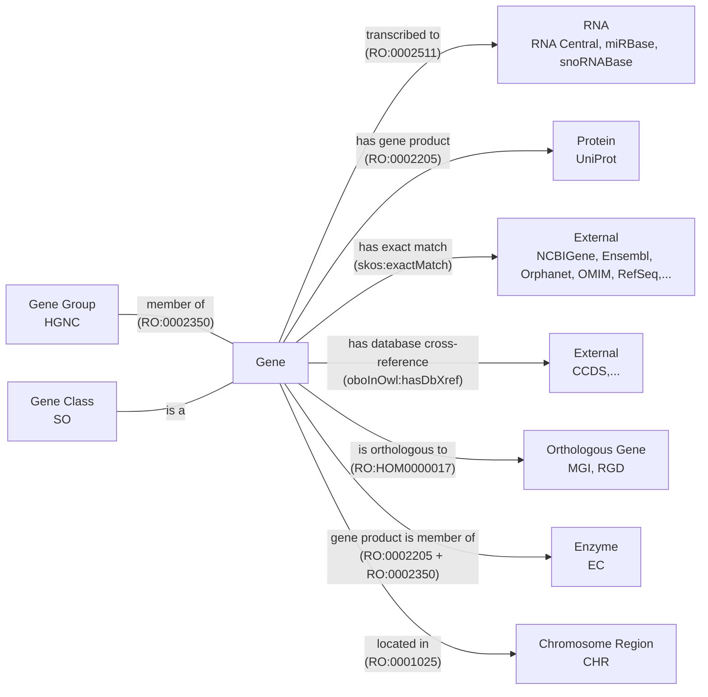
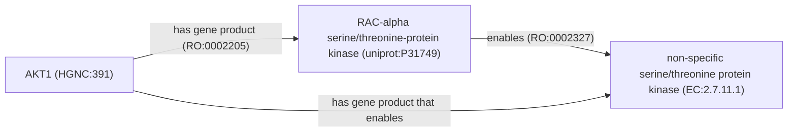

This is a post about how I converted HGNC to OWL

## Background

### PyOBO

1. original motivation was to make name lookup accessible as part of the PyBEL project, but now has much braoder use for
   automated acqusition and processing of ontologies and ontology-like data.
2. code examples, what does PyOBO get you
3. formats, need to move beyond OWLAPI/ROBOT since development is not accessible outside java world, want to reuse
   parsers (similar to OAK)

once you have ontology-format files, you get access to the tooling for ontologies, including the
OLS https://www.ebi.ac.uk/ols4/ontologies/hgnc

### OBO Database Ingest

OBO-db-ingest has the following:

- ontology and related artifacts from many resources
- can be rerun using a single command w/ uv, no messing around
- gives a full manifest that can be consumed by different resources, like https://kghub.org/kg-registry/
- ideally, would automate rerunning, but there's almost always something that breaks. maybe the monolithic build can be
  split up into smaller ones based on the frequency resources are updated / priority for having up-to-date
- assigns PURLs for latest and for each version, but would still like to better integrate with github releases or zenodo
  for archival, since git isn't great for storing big files nor their diff over time

https://github.com/biopragmatics/obo-db-ingest

## HGNC

- why do we care about HGNC? it's ubiquitous in the literature and is therefore the target for many biocuration efforts,
  such as in BEL, OmniPath, etc.
- why do we want HGNC as OWL? to get access to other ontology tooling and to make things work properly when referencing
  HGNC in existing ontologies. Also, a lot of knowledge is already formulatable using RO, so take advantage of that so
  it can be easily turned into KGs through ontologies as a common intermediate.

Every resource requires some thought in converting.

https://github.com/biopragmatics/pyobo/blob/main/src/pyobo/sources/hgnc/hgnc.py

### Lexicalization

Related discussions:

- https://github.com/information-artifact-ontology/ontology-metadata/pull/197#discussion_r2428235955

### Logical Axioms

The relationship between a gene and its group is also unclear.

The relationship between a gene and an enzyme is currently mediated by
a property chain. In order to define it properly, we have to figure out how this diagram
should look - and more concretely, define what is the correct relationship to use between a protein
and an enzyme class.

https://github.com/oborel/obo-relations/issues/873

Related discussions:

- https://github.com/oborel/obo-relations/issues/783