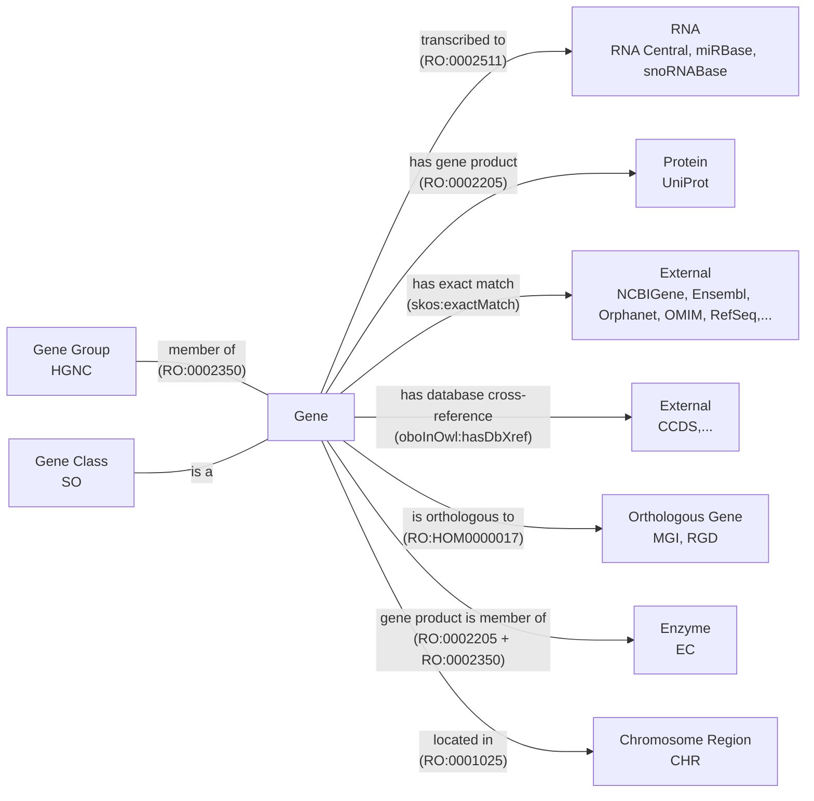
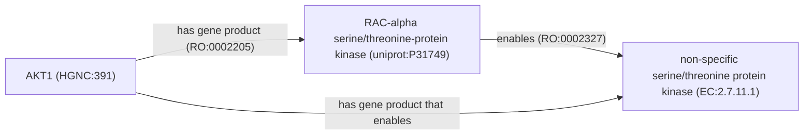

This is a post about how I converted HGNC to OWL

## Background

### PyOBO

3. formats, need to move beyond OWLAPI/ROBOT since development is not accessible
   outside java world, want to reuse parsers (similar to OAK)

What is PyOBO?

- original motivation was to make name lookup accessible as part of the PyBEL
  project, but now has much braoder use for automated acqusition and processing
  of ontologies and ontology-like data.
- simple access to ontologies and databases through unified format

PyOBO now contains a suite of 60+
[sources](https://github.com/biopragmatics/pyobo/tree/main/src/pyobo/sources)
for databases covering chemistry, biology, medicine, cultural heritage, the
semantic web, and other disciplines. Each source implements automated,
version-aware download and caching of data files from the database and
transformation of the downloaded data into an OWL ontology within a concrete
instance of an
[abstract base class](https://pyobo.readthedocs.io/en/latest/api/pyobo.Obo.html)
provided by PyOBO. Typically, resources make available tabular data in which
each row corresponds to a record in the database that can either be transformed
into a [class](https://www.w3.org/TR/owl-ref/#Class) or
[named individual](https://www.w3.org/TR/owl-ref/#Individual) within an OWL
ontology. The remaining columns can often be mapped into other annotation
properties (i.e., metadata) or object properties (i.e., part of the logical
definition). For example, the label can be mapped to an annotation property
using `rdfs:label` and the species (if applicable) can be mapped to an object
property using [`RO:0002162`](https://bioregistry.io/RO:0002162) (in taxon).

Below is a demonstration of a minimal implementation of a PyOBO source for the
[CRediT (Contributor Roles Taxonomy)](https://bioregistry.io/credit). Note that
this is a relatively simple source that only uses a subset of PyOBO's DSL for
encoding ontology components. The live version of this is in the PyOBO
repository
[here](https://github.com/biopragmatics/pyobo/blob/main/src/pyobo/sources/credit.py).

```python
from more_itertools import chunked
from pyobo.struct import Obo, Term
from pyobo.utils.path import ensure_json, ensure_open

PREFIX = "credit"
URI_PREFIX = "https://credit.niso.org/contributor-roles/"
DATA_URL = "https://api.github.com/repos/CASRAI-CRedIT/Dictionary/contents/Picklists/Contributor%20Roles"
ROOT_TERM = Term.from_triple(prefix="cro", identifier="0000000")


class CreditGetter(Obo):
    ontology = PREFIX
    static_version = "2022"
    root_terms = [ROOT_TERM.reference]

    def iter_terms(self, force: bool = False):
        yield ROOT_TERM
        for records in ensure_json(PREFIX, url=DATA_URL, name="picklist-api.json", force=force):
            with ensure_open(PREFIX, "picklist", url=records["download_url"], backend="requests", force=force) as file:
                header, *rest = file.read().splitlines()
                data = {key.removeprefix("## "): value for key, value in chunked(rest, 2)}
                term = Term.from_triple(
                    prefix=PREFIX,
                    identifier=data["Canonical URL"].removeprefix(URI_PREFIX).rstrip("/"),
                    name=header.removeprefix("# Contributor Roles/"),
                    definition=data["Short definition"],
                )
                term.append_parent(ROOT_TERM)
                yield term
```

Each source inherits a fully automated workflow for converting resources into
ontologies in the
[OBO flat file format](https://owlcollab.github.io/oboformat/doc/GO.format.obo-1_4.html)
and
[OWL functional-style syntax (OFN)](https://www.w3.org/TR/owl2-syntax/#Class_Expressions).
Through OFN, PyOBO wraps [OWLAPI](https://github.com/owlcs/owlapi) to enable
conversion to OWL/XML, RDF/XML,
[OBO Graph JSON](https://github.com/geneontology/obographs/) and any other
supported format.

<!--Sidebar: it's a goal of mine to reimplement key parts of OWLAPI in Python (or Rust)
since it's written in Java, which due to the language's waning popularity, poses a risk for OWLAPI's further
maintenance and development.-->

```python
from pyobo.sources.credit import CreditGetter

ontology = CreditGetter()
ontology.write_ofn("credit.ofn")
ontology.write_obo("credit.obo")
ontology.write_owl("credit.owl")  # enabled by OWLAPI
```

Here's what the (abridged to only show a single term) OBO export looks like.
Full exports in all formats can be found
[here](https://github.com/biopragmatics/obo-db-ingest/tree/main/export/credit#readme).

```
data-version: 2022
idspace: credit https://credit.niso.org/contributor-roles/ "Contributor Roles Taxonomy"
idspace: dcterms http://purl.org/dc/terms/ "Dublin Core Metadata Initiative Terms"
idspace: doap http://usefulinc.com/ns/doap# "Description of a Project"
idspace: foaf http://xmlns.com/foaf/0.1/ "Friend of a Friend"
idspace: orcid https://orcid.org/ "Open Researcher and Contributor"
ontology: credit
property_value: dcterms:title "Contributor Roles Taxonomy" xsd:string
property_value: dcterms:license "CC-BY-4.0" xsd:string
property_value: foaf:homepage "https\://credit.niso.org/" xsd:anyURI
property_value: doap:maintainer orcid:0000-0002-9298-3168
property_value: IAO:0000700 CRO:0000000

[Term]
id: credit:conceptualization
name: Conceptualization
def: "Ideas; formulation or evolution of overarching research goals and aims."
is_a: CRO:0000000
```

PyOBO also implements several use case-specific exporters, such as exporting
semantic mappings in the
[Simple Standard for Sharing Ontological Mappings (SSSOM)](https://mapping-commons.github.io/sssom/),
exporting synonyms and literal mappings in the
[Simple Standard for Sharing Literal Mappings](https://github.com/cthoyt/ssslm),
and nodes and edges files for import into the Neo4j graph database.

```python
import pyobo

>> > pyobo.get_name("credit:software")
"Software"

>> > text_embeddings_df = pyobo.get_text_embeddings_df("credit")
```

PyOBO has a unified Python API that includes utilities for property lookup for
entities (e.g., name, description),
[named entity recognition (NER) named entity normalization (NEN)](https://pyobo.readthedocs.io/en/latest/ner.html),
and embedding entities using
[(medium) language models](https://pyobo.readthedocs.io/en/latest/api/pyobo.get_text_embeddings_df.html#pyobo.get_text_embeddings_df),
or
[graph machine learning](https://pyobo.readthedocs.io/en/latest/api/pyobo.get_graph_embeddings_df.html#pyobo.get_graph_embeddings_df).

PyOBO has a deep integration with
[the Bioregistry](https://github.com/biopragmatics/bioregistry) in order to
achieve consistent identifier standards. As such, it's required that all sources
in PyOBO have a corresponding record in the Bioregistry, which covers key
metadata including the name, description, homepage, license, URI prefix, and
contact person for the resource. These fields are automatically propagated from
the Bioregistry into ontology metadata using appropriate annotation properties,
making ontologies produced by PyOBO much more transparent and understandable.

Because PyOBO is free and open source
[on GitHub](https://github.com/biopragmatics/pyobo), anyone can contribute
additional sources to the upstream repository. Alternatively, PyOBO has a plugin
system based on Python's
[entry points](https://packaging.python.org/en/latest/specifications/entry-points/)
such that additional sources can be implemented without making an upstream
contribution. This supports use cases such as when the resource is not publicly
available or when the code should not become publicly available (e.g., in the
context of a company). For example, some pharmaceutical companies use the plugin
system to implement sources for their compound registration system and internal
ontology system.

once you have ontology-format files, you get access to the tooling for
ontologies, including the OLS https://www.ebi.ac.uk/ols4/ontologies/hgnc

### OBO Database Ingest

OBO-db-ingest has the following:

- ontology and related artifacts from many resources
- can be rerun using a single command w/ uv, no messing around
- gives a full manifest that can be consumed by different resources, like
  https://kghub.org/kg-registry/
- ideally, would automate rerunning, but there's almost always something that
  breaks. maybe the monolithic build can be split up into smaller ones based on
  the frequency resources are updated / priority for having up-to-date
- assigns PURLs for latest and for each version, but would still like to better
  integrate with github releases or zenodo for archival, since git isn't great
  for storing big files nor their diff over time

https://github.com/biopragmatics/obo-db-ingest

## HGNC

- why do we care about HGNC? it's ubiquitous in the literature and is therefore
  the target for many biocuration efforts, such as in BEL, OmniPath, etc.
- why do we want HGNC as OWL? to get access to other ontology tooling and to
  make things work properly when referencing HGNC in existing ontologies. Also,
  a lot of knowledge is already formulatable using RO, so take advantage of that
  so it can be easily turned into KGs through ontologies as a common
  intermediate.

Every resource requires some thought in converting.

https://github.com/biopragmatics/pyobo/blob/main/src/pyobo/sources/hgnc/hgnc.py

### Lexicalization

Related discussions:

- https://github.com/information-artifact-ontology/ontology-metadata/pull/197#discussion_r2428235955

### Logical Axioms



The relationship between a gene and its group is also unclear.

The relationship between a gene and an enzyme is currently mediated by a
property chain. In order to define it properly, we have to figure out how this
diagram should look - and more concretely, define what is the correct
relationship to use between a protein and an enzyme class.




https://github.com/oborel/obo-relations/issues/873

Related discussions:

- https://github.com/oborel/obo-relations/issues/783
