I recently attended the
[4<sup>th</sup> BioHackathon Germany](https://www.denbi.de/de-nbi-events/1840-4th-biohackathon-germany)
hosted by the
[German Network for Bioinformatics Infrastructure (de.NBI)](https://www.denbi.de).
I participated in the project _On the Path to Machine-actionable Training
Materials_ in order to improve the interoperability between
[DALIA](https://search.dalia.education/basic),
[TeSS](https://tess.elixir-europe.org),
[mTeSS-X](https://elixirtess.github.io/mTeSS-X), and
[Schema.org](https://schema.org). This post gives a summary of the activities
leading up to the hackathon and the results of our happy hacking.

## Team


Our project,
[On the Path to Machine-actionable Training Materials](https://www.denbi.de/de-nbi-events/1939-4th-biohackathon-germany-on-the-path-to-machine-actionable-training-materials),
had the following active participants throughout the week:

- Nick Juty & Phil Reed (University of Manchester)
- Leyla Jael Castro & Roman Baum (Deutsche Zentralbibliothek für Medizin; ZB
  Med)
- Petra Steiner (University of Darmstadt)
- Oliver Knodel & Martin Voigt (Helmholtz-Zentrum Dresden-Rossendorf; HZDR)
- Dilfuza Djamalova (Forschungszentrum Jülich; FZJ)
- Jacobo Miranda (European Molecular Biology Laboratory; EMBL)

Nick and Petra were our team leaders and Phil acted as the project's _de facto_
secretary. On the first day of the hackathon, we were briefly joined by Alban
Gaignard (Nantes University), Dimitris Panouris (SciLifeLab), and Harshita Gupta
(SciLifeLab) to present their current related work. Similarly, Dominik Brilhaus
(Heinrich-Heine-Universität Düsseldorf) joined on the first day to share his
perspective from DataPLANT (the NFDI consortium for plants) as a training
materials creator. Finally, Helena Schnitzer (FZJ) participated in some
Schema.org discussions through the week.

## Goals

We categorized our work plan into three streams:

1. [**Training Material Interoperability**](#training-material-interoperability) -
   survey the landscape of relevant ontologies and schemas for annotating
   learning materials, curate mappings/crosswalks between existing data models,
   develop a programmatic toolbox, and begin federating between training
   material platforms
2. [**Training Material Analysis**](#training-material-analysis) - analyze
   training materials at scale to group similar training materials, reduce
   redundancy, and semi-automatically construct learning paths
3. [**Modeling Learning Paths**](#modeling-learning-paths) - collect use cases
   and develop a (meta)data model for learning paths

## Training Material Interoperability

Interoperability is third pillar of the
[FAIR data principles](https://www.nature.com/articles/sdata201618).

Metadata describing training materials may be captured and stored in one of
several data models including the DALIA Interchange Format (DIF) v1.3, the
format implicitly defined by the TeSS API, and the Schemas.org Learning Material
profile.

### Indexing Ontologies and Schemas

Our first concrete goal for training material interoperability at the hackathon
was to survey ontologies, controlled vocabularies, and other resources that mint
(persistent) identifiers that might appear in the metadata describing a learning
material. For example, TeSS uses the [EDAM Ontology](https://semantic.farm/edam)
to annotate topics onto training materials. For the same purpose, DALIA uses the
[Hochschulcampus Ressourcentypen](https://semantic.farm/kim.hcrt) (I'll say more
on how we deal with the conflicting resources in the section below on mappings).

Our second concrete goal was to survey schemas that are used in modeling open
educational resources and training materials, for example,
[Schema.org](https://semantic.farm/sdo),
[OERSchema](https://semantic.farm/oerschema), and
[MoDALIA](https://semantic.farm/modalia), which encodes the DALIA Interchange
Format (DIF) v1.3.

The Semantic Farm ([https://semantic.farm](https://semantic.farm)) is
comprehensive database of metadata about resources that mint (persistent)
identifiers (e.g., ontologies, controlled vocabularies, databases, schemas) such
as their preferred CURIE prefix for usage in SPARQL queries and other semantic
web applications. It imports and aligns with other databases like
[Identifiers.org](https://identifiers.org) (for the life sciences) and
[BARTOC](https://bartoc.org) (for the digital humanities) to support
interoperability and sustainability. It follows the
[open data, open code, and open infrastructure (O3)](https://www.nature.com/articles/s41597-024-03406-w)
guidelines and has well-defined governance to enable community maintenance and
support longevity.

It's the perfect place to index all the learning material and open educational
resource-related ontologies, controlled vocabularies, databases, and schemas.

I gave a tutorial on how to search the Semantic Farm for ontologies, controlled
vocabularies and other resources that mint (persistent) identifiers, and how to
contribute any that are missing. In short, they can be contributed by filling
out the
[new prefix request template](https://github.com/biopragmatics/bioregistry/issues/new?template=new-prefix.yml)
on GitHub. If you're interested to add a new entry, you can directly use the
form, read the
[contribution guidelines](https://github.com/biopragmatics/bioregistry/blob/main/docs/CONTRIBUTING.md#submitting-new-prefixes),
or watch a
[short YouTube tutorial](https://www.youtube.com/watch?v=e-I6rcV2_BE).

While I had done some significant preparatory work before the hackathon by
creating many new entries in the Semantic Farm, the team found and added several
new and important entries to the Semantic Farm during the hackathon too. Here
are two highlights:

[Martin Voigt](https://orcid.org/0000-0001-5556-838X) contributed the prefix
`amb` for the
[Allgemeines Metadatenprofil für Bildungsressourcen](https://dini-ag-kim.github.io/amb/20231019)
(General Metadata Profile for Educational Resources) in
[biopragmatics/bioregistry#1781](https://github.com/biopragmatics/bioregistry/pull/1781).
This is a metadata schema for learning materials produced by the
Kompetenzzentrum Interoperable Metadaten (KIM) within the Deutsche Initiative
für Netzwerkinformation e.V. that was heavily inspired by
[Schema.org](https://schema.org) and the Dublin Core
[Learning Resource Metadata Initiative (LRMI)](https://www.dublincore.org/about/lrmi/)

[Dilfuza Djamalova](https://orcid.org/0009-0004-7782-2894) and
[Jacobo Miranda](https://orcid.org/0009-0005-0673-021X) contributed the prefix
`gtn` for
[Galaxy Training Network](https://training.galaxyproject.org/training-material)
training materials in
[biopragmatics/bioregistry#1779](https://github.com/biopragmatics/bioregistry/pull/1779).
This resource contains multi- and cross-disciplinary training materials for
using the Galaxy workflow management system. Below, I describe how we ingested
transformed the training materials from GTN into a common format such they can
be represented according to the DALIA Interchange Format (DIF) v1.3, the
implicit data model expected by TeSS, and in Schema.org-compliant RDF.

Ultimately, we collated relevant ontologies, controlled vocabularies, schemas
and other resources that mint (persistent) identifiers in a
[collection](https://semantic.farm/collection/0000018) such that they can be
easily found and shared.

### Semantic Mappings and Crosswalks


I alluded to the different resources used by TeSS and DALIA to annotate
disciplines. The issue of partially overlapping ontologies, controlled
vocabularies, and database is quite widespread, and can manifest in a few
different ways. The figure above shows that redundancy can arise because of
different focus within a domain (i.e., the chemistry example), different
hierarchical specificity (i.e., the disease example), and due to massive generic
resources having overlap across many domains (e.g., like UMLS, MeSH, NCIT).

This is problematic when integrating learning materials from different sources,
e.g., TeSS and DALIA, because two learning materials may be annotated with
different terms describing the same discipline. Therefore, the solution is to
create semantic mappings between these terms.

I've worked for several years on the
[Simple Standard for Sharing Ontological Mappings (SSSOM)](https://mapping-commons.github.io/sssom/)
standard for storing semantic mappings, so this was naturally the target for our
work. Further, I have been working on a domain-agnostic workflow for predicting
semantic mappings with lexical matching and deploying a curation interface
called [SSSOM Curator](github.com/cthoyt/sssom-curator/). I gave a tutorial for
using SSSOM Curator to the team based on a previous tutorial I made (that can be
found on YouTube [here](https://www.youtube.com/watch?v=FkXkOhT8gdc&t=293s)). We
prepared predicted semantic mappings between several learning material-related
ontologies in
[biopragmatics/biomappings#204](https://github.com/biopragmatics/biomappings/pull/204),
but we didn't prioritize semantic mapping curation during the hackathon. Here's
what they look like in the SSSOM Curator interface for Biomappings:


Where curating correspondences between concepts in ontology, controlled
vocabularies, and databases is often called semantic mapping, curating
correspondences between schemas and properties therein is often called
crosswalks. We put a bigger emphasis on producing crosswalks between Schema.org
and MoDALIA. This is actually a more complex problem due to the fact that
correspondences between elements in schemas can be more sophisticated (e.g.,
mapping between two fields for first and last names to a single name field), but
there are at least a few places where properties can be mapped with SSSOM.


An interesting lesson learned is that some curators find using SKOS
relationships challenging because the narrow and broader relations have the
opposite direction than what they would expect. For example,
`X skos:narrowMatch Y` means that X is narrower than Y, not X has a narrow match
Y. Many vocabularies use a verb as part of the predicate to reduce this
confusion - I'm sure if it were `X skos:isNarrowMatchFor Y`, then this would not
have been a problem. Deep down, the real issue is that transparent identifiers
(i.e., human-readable ones) are bad, since they can't be changed over time. See
the excellent article,
[Identifiers for the 21<sup>st</sup> century](https://journals.plos.org/plosbiology/article?id=10.1371/journal.pbio.2001414),
by McMurry _et al._ (2017) for a more detailed discussion on what makes a good
identifier.

### Operationalizing Crosswalks

The next step was to translate the abstract crosswalks between DALIA, TeSS, and
Schema.org into a concrete implementation using a general purpose programming
language (i.e., Python).

#### The Scaling Problem

Given that we only focused on these three data models, it's not unrealistic to
produce a DALIA-TeSS crosswalk, TeSS-Schema.org crosswalk, and DALIA-Schema.org
crosswalk. However, this approach does not scale well - in general, it requires
curating and implementing ${N}\choose{2}$ crosswalks with $N$ being the number
of schemas.

An alternative is to use a hub-and-spoke model, in which one data model is
targeted as the intermediary used for interchange and storage. This reduces the
burden on curators of crosswalks, as they only have to curate a single crosswalk
for any given data model into the intermediary. Similarly, it reduces the burden
on code maintainers as only a single crosswalk has to be implemented.

The challenge with open educational resources and learning materials is that no
existing data model is sufficient to cover the (most important) aspects of all
other data models. This motivated us to implement a unified, generic data model
for learning materials to serve as the interoperability hub between DALIA, TeSS,
Schema.org, and other data models.


The famous XKCD comic, [Standards (https://xkcd.com/927)](https://xkcd.com/927),
proselytizes that any proposal of a unified standard that covers everyone's use
cases is doomed to be an $N+1$ competing standard. While I'm doing my best to
present the work done in preparation for the hackathon and at the hackathon in a
linear way, the truth is that most steps also included discussion, hacking,
trying, failing, and repeating. Therefore, I can confidently say that for
practical reasons, implementing a new _de facto_ standard was the only realistic
choice.

#### The OERbservatory Data Model


During the hackathon, we implemented the open source
[OERbservatory](https://github.com/data-literacy-alliance/oerbservatory) Python
package. I first want to talk about three major features that it includes:

1. a unified, generic
   [object model](https://github.com/data-literacy-alliance/oerbservatory/blob/main/src/oerbservatory/model.py)
   for open educational resources that's effectively the union of the best parts
   of DALIA, TeSS, Schema.org, and a few other data models we found
2. import and export to two open educational resource and learning materials
   data models - DALIA and TeSS. We didn't have time during the hackathon to
   implement import and export to Schema.org.
3. import from three external learning material repositories -
   [OERhub](https://oerhub.at), [OERSI](https://oersi.org), and the
   [Galaxy Training Network (GTN)](https://training.galaxyproject.org)

Here's an excerpt of the object model, implemented using
[Pydantic](https://github.com/pydantic/pydantic). Note that Pydantic uses a
combination of Python's type system and type annotations to express constraints
and rules, similarly to how SHACL does. However, we get the benefit of Python
type checking and the Python runtime to check that we've encoded this all
correctly. Finally, all Pydantic models can be serialized and deserialized from
JSON.

```python
class EducationalResource(BaseModel):
    """Represents an educational resource."""

    model_config = ConfigDict(arbitrary_types_allowed=True)

    reference: Reference | None = Field(
        None,
        description="The primary reference for this learning material",
        examples=[Reference(prefix="dalia", identifier="")]
    )
    title: InternationalizedStr = Field(..., description="The title of the learning material")
    authors: list[Author | Organization] = Field(
        default_factory=list,
        description="An ordered list of authors (i.e., persons or organizations) of the learning material",
        examples=[
            Author(name="Charles Tapley Hoyt", orcid="0000-0003-4423-4370"),
            Organization(name="NFDI", ror="05qj6w324"),
        ],
        min_len=1,
    )
    ...
```

<details>
<summary>Technology Comparison (content warning: programming culture wars)</summary>
<p>
DALIA and Schema.org built on top of semantic web principles. Records about
learning materials encoded in these data models are stored in RDF and queryable
via SPARQL. However, while powerful, SPARQL is a querying language that is
inherently limited in its expressibility and utility. A general purpose
programming language is more suited for building data science workflows, search
engines, APIs, web interfaces, and other tools on top of open educational
resource and learning material data. That's why we emphasized concretizing the
crosswalks between DALIA, TeSS, and Schema.org in a software implementation.
</p><p>
We chose Python as the target language because of its ubiquity and ease of use.
When the TeSS platform was initially developed in the early 2010s, the Ruby
programming language and the Ruby on Rails framework were a popular choice for
developing web applications. Unfortunately, the scientific Python stack and
machine learning ecosystem led Python to being a clear winner for academics and
scientists. This creates an issue that only a small number of academics are
skilled in Ruby and can participate in the development of TeSS.
</p><p>
It was also crucial that we used Python such that our implementation was
reusable. For example, the DALIA 1.0 platform was implemented using Django,
which made it effectively impossible to reuse any of the underlying code
outside, e.g., in a data science workflow. The same issue is also true for the
TeSS implementation using Ruby-on-Rails. While these batteries-included
frameworks can get a minimal web application running quickly, they generally
lead developers towards writing code that isn't reusable.
</p>
</details>

#### OERbservatory as an Interoperability Hub between DALIA and TeSS

Before we even started working on the OERbservatory, we had implemented two
packages for working with data in DALIA and TeSS:

1. [data-literacy-alliance/dalia-dif](https://github.com/data-literacy-alliance/dalia-dif)
   implements a parser for the DALIA DIF v1.3 tabular format, an internal
   representation of the content (also using Pydantic), and an RDF serializer
   (using on [pydantic-metamodel](https://github.com/cthoyt/pydantic-metamodel)
2. [cthoyt/tess-downloader](https://github.com/cthoyt/tess-downloader)
   implements an API client to TeSS and an internal representation of the
   learning resource data model (using Pydantic)

Because each of these packages already implemented an internal (lossless)
representations of the data models for DALIA and TeSS, respectively, we only had
to write code in the OERbservatory that mapped the fields between them to
OERbservatory's data model.

This was a **big** milestone towards interoperability. We demonstrated its
potential by programmatically downloading all learning materials from the ELIXIR
TeSS instance's API and exporting them as DALIA RDF. Similarly, we converted all
learning materials curated for DALIA into the TeSS JSON format. Later, I'll
describe how we took this workflow one step further to implement syncing between
DALIA and TeSS.

Note that this mapping can't simply be expressed using SSSOM, SHACL, or other
declarative languages, because it relies on more sophisticated logic. For
example, topics annotated with ontology terms in the DALIA data model only store
the URI reference, whereas topics annotated with ontology terms in the TeSS data
model require both the URI reference and the term's label. Since we're encoding
our crosswalks using a general purpose programming language, we have a larger
toolkit available. Here, we could use
[PyOBO](https://github.com/biopragmatics/pyobo), a generic package I've written
for working with ontologies for looking up labels.

Unfortunately, we did not have time to implement an importer/exporter for
Schema.org. We deprioritized this because Schema.org it felt the least
approachable due to the way its documentation is written, the complexity of its
models, and prolific use of mixins. We considered if we could automatically
generate Pydantic classes from Schema.org - and it turns out that
[pydantic-schemaorg](https://github.com/lexiq-legal/pydantic_schemaorg) has
already done it! Unfortunately, the code is not compatible with modern versions
of Pydantic, and the project appears abandoned. We only had so much time at the
hackathon, so forking/reviving/rewriting `pydantic-schemaorg` was left as a task
for later.

#### The OERbservatory as an Aggregator

Besides open educational resources and learning materials that are encoded in
the DALIA, TeSS, and Schema.org formats, there are many repositories of learning
materials that do not conform to a well-defined schema. Prior to the hackathon,
I had already explored the Austrian [OERhub](https://oerhub.at) and
[Open Educational Resources Search Index (OERSI)](https://oersi.org/resources)
and written importers into `dalia-dif`. At the hackathon, I reimplemented those
importers using the newly formed OERbservatory unified, generic data model.

On the Thursday morning of the BioHackathon, I had an excellent
[mob programming](https://en.wikipedia.org/wiki/Team_programming#Mob_programming)
session with [Dilfuza Djamalova](https://orcid.org/0009-0004-7782-2894) and
[Jacobo Miranda](https://orcid.org/0009-0005-0673-021X) to import training
materials from the
[Galaxy Training Network (GTN)](https://training.galaxyproject.org). It turns
out that there are already several open educational resources and learning
materials that are automatically scraped and imported by TeSS. However, those
importers are limited by TeSS's relatively rigid data model, which is bound to
their database and can therefore not be easily evolved. Dilfuza and Jacobo had a
few goals for our hacking:

- There are fields in GTN that aren't yet captured by TeSS. They wanted to
  implement those fields in OERbservatory, demonstrate their usage, then gently
  nudge TeSS to evolve its data model to support their use cases
- They wanted to index their content in DALIA, which becomes much easier if they
  only have to maintain one importer in OERbservatory which can already export
  to DALIA
- GTN is part of the [DeKCD](https://github.com/dekcd) consortia, which wants to
  deduplicate training material. Adding an importer here gives access to the
  workflows we're building for reconciling different metadata curated in
  different places about the same materials, and identifying similar materials
  to reduce duplicate effort, and connect people working on the same kinds of
  materials

We implemented the GTN importer in
[data-literacy-alliance/oerbservatory#8](https://github.com/data-literacy-alliance/oerbservatory/pull/8)
which covers tutorials in GTN and later could be extended to slide decks. Along
the way, we updated the main educational resource model in OERbservatory to
include a few new fields, including status (which also is shared by TeSS- that
now needs to be incorporated), the publication date, and the modified date. We
did not make a complete mapping for all fields in GTN due to time constraints,
so we implemented logging that summarizes fields that haven't yet been mapped
(see the PR for examples of each). For example, the way that contributor
information is incorporated into the API from the frontmatter in the source is
interesting - it resolves the keys in the frontmatter to entries in
[this YAML file](https://github.com/galaxyproject/training-material/blob/main/CONTRIBUTORS.yaml)
in the GTN GitHub repository. We will want to think about the best way to map
the authors into OERbservatory, and this also might be a time to extend the
author list to include contributor role annotations.

I was very excited that Dilfuza and Jacobo were motivated to work on this and
contribute following the hackathon. We see if the OERbservatory is approachable
enough for future external contributions! For example, Robert Hasse of
NFDI4BIOIMAGE already proactively prepared a script that exports their
consortium's training materials into the DALIA DIF v1.3 tabular format. I don't
consider this a very approachable format, and I'm sure efforts like his could
have been eased by using OERbservatory as a target. The next steps are to
incorporate the DARIAH-CH and PSDI learning materials, which appeared on the
schematic diagram for OERbservatory earlier. There are also a lot of other
potential learning material repositories to scrape like Glittr.com. If you have
a suggestion, you can drop it in the
[OERbservatory issue tracker](https://github.com/data-literacy-alliance/oerbservatory/issues).
Further, given that Martin Voigt was in the room during this hacking and
discussion, and he is the maintainer for TeSS's scraper code, we already started
formulating plans on how we might be able to deduplicate efforts.

### Federation of Open Educational Resources and Learning Materials


The next step towards interoperability beyond the demonstration of converting
between formats used by DALIA and TeSS was to demonstrate actually posting the
content to the live services.

While we are currently in the process of implementing submission of open
educational resources and learning materials in DALIA, TeSS already has a
web-based interface for
[registering new learning materials](https://tess.elixir-europe.org/materials/new).
TeSS doesn't have a documented API endpoint for posting learning materials, but
luckily, Martin knew where it was and helped to figure out the correct way to
pass credentials to use it. We managed this by a combination of reading the Ruby
implementation of TeSS and good 'ol trial and error. In the end, we implemented
posting learning materials in the TeSS-specific Python package in
[cthoyt/tess-downloader#2](https://github.com/cthoyt/tess-downloader/pull/2).
Then, it was only a matter of stringing together code that converts DALIA to
OERbservatory, OERbservatory to TeSS, and then to upload to TeSS.

In parallel, Martin worked on improving the devops behind the
[PaNOSC TeSSHub](https://tesshub.hzdr.de) to enable quicky spinning up new TeSS
instances that each have their own subdomain. He created a different subdomain
for each of DALIA, OERSI, GTN/KCD, and OERhub. Finally, we wrote a script that
uploaded all open educational resources and learning material from each source
to the appropriate TeSS instance in
[data-literacy-alliance/oerbservatory#3](https://github.com/data-literacy-alliance/oerbservatory/pull/3).
The results in each space can be explored here:

| Source    | Domain                                                           |
| --------- | ---------------------------------------------------------------- |
| DALIA     | [https://dalia.tesshub.hzdr.de](https://dalia.tesshub.hzdr.de)   |
| OERhub    | [https://oerhub.tesshub.hzdr.de](https://oerhub.tesshub.hzdr.de) |
| OERSI     | [https://oersi.tesshub.hzdr.de](https://oersi.tesshub.hzdr.de)   |
| GTN/deKCD | [https://kcd.tesshub.hzdr.de](https://kcd.tesshub.hzdr.de)       |
| PanOSC    | [https://panosc.tesshub.hzdr.de](https://panosc.tesshub.hzdr.de) |

A full list of spaces can be found
[here](https://pan-training.tesshub.hzdr.de/spaces).

#### European Open Science Cloud

The great specter looming over most NFDI-related projects is how to interface
with the European Open Science Cloud (EOSC). At the surface, EOSC is a massive
undertaking to democratize access to research infrastructure on the European
level. However, having just entered the NFDI bubble at the end of the summer, I
have bene overwhelmed by the high pressure to participate in EOSC combine with
the lack of funding and lack of direction on how to best go about doing that.
All of that being said, Oliver Knödel spend the hackathon preparing the concept
for how we could connect TeSSHub to the EOSC open educational resource and
training materials registry using the
[Open Archives Initiative Protocol for Metadata Harvesting (OAI-PMH)](https://www.openarchives.org/pmh/).
Once TeSSHub can demonstrate federating its content through this mechanism, we
can use as inspiration to make a generic implementation in OERbservatory.

#### Governance and Provenance

Now that it's possible to copy training materials from one platform to another,
we have started to consider governance and provenance issues like:

- If a training material originally curated in DALIA is displayed in TeSS, how
  is that attributed? We will have to carefully consider how metadata records
  about learning resources are identified, and how those identifiers are passed
  around during interchange/syncing.
- If a training material originally from TeSS is enriched in the DALIA platform,
  should that information flow back to TeSS, and how? We will have to carefully
  consider how information is deduplicated and reconciled
- How do we implement technical systems that can keep many federated platforms
  up-to-date with each other?

I'm sure there will be many more questions along these lines. Luckily, the
mTeSS-X group has already begun discussions on a smaller scale, since they care
about how to federate between many disparate TeSS instances.

## Training Material Analysis

Our team split into two for the analysis of training materials. The first team
looked into algorithmic mechanisms for featurizing open educational resources
and learning materials and applications of those features. The second team
looked into using large language models (LLMs) for the automated construction of
learning paths.

### Featurization and Application

The first team looked into two techniques for featurizing (i.e., assigning dense
vectors) to open educational resources and learning materials.

The first and most interpretable technique was to concatenate free text fields
and labels from structured fields from a learning resource and index the entire
corpus (i.e., all learning resources) using the
[term frequency-inverse document frequency (TF-IDF)](https://en.wikipedia.org/wiki/Tf%E2%80%93idf)
algorithm. This does a small amount of text preprocessing, calculates a word
list for the entire corpus, then calculates for each word the likelihood of
appearance in a given learning material versus the entire corpus. Then, each
learning material is assigned a dense vector with values from $[0, 1]$ the
length of the word list. Learning materials can be compared, e.g., using cosine
similarity between their respective vectors.

The second technique was to use the [sentence transformers](https://sbert.net)
machine learning architecture, which relies on a pre-trained (not large)
language model to accomplish a similar vectorization. Both methods run in less
than a few minutes for the corpus of learning resources from DALIA, TeSS,
OERHub, and OERSI. We also pre-calculated the all-by-all similarities and
applied a cutoff of 0.7 to shorten the list. Both the TF-IDF and sentence
transformers vector index and similarities are commit to the OERbservatory
repository and are available
[here](https://github.com/data-literacy-alliance/oerbservatory/tree/main/output).


After we had embeddings, Dilfuza began to investigate some of the following:

1. Identify duplicates metadata records corresponding to the same learning
   material resource, e.g., when two different platforms scraped the same
   learning material
2. Semi-automatically identify similar training materials both to improve
   suggestions to learners, to connect the learning material creators, and to
   help de-duplicate training material creation efforts

We only managed to get this far in the last day of the hackathon, so there is
still a lot more to do here! Originally, I had planned on also using these
embeddings to train classifiers for key provenance metadata such as topic,
target audience, and difficulty level, then to create a semi-automated curation
workflow for enriching learning materials whose records were sparse with
annotation. These will be next steps.

### Automated Construction of Learning Paths

Nick looked into using large language models (LLMs) to construct learning paths
through machine-assisted dialog. This part is highly experimental so there isn't
much to point to yet, but the idea was to take in a list of learning materials
(either hard-coded or as a URL for the chat system to retrieve) and a prompt to
ask the LLM ot collect similar materials base don objectives and keywords, then
create a learning path based on difficult (which is infrequently annotated) and
suggest a title.

This workflow was used to produce three learning paths on the following topics
that were each ordered, had reference links, a difficulty rating, a title, and
provider:

1. Sequencing and QC (10 items)
2. Git and Version Control (6 items)
3. Genome Annotation (8 items)

More on this in future work!

## Modeling Learning Paths

While there isn't a clear consensus on what a learning path is, a simple
definition is that a learning path is a sequence of learning materials to
consume to help a learner achieve a specific level of competence on a topic.
TeSS implements a data model for learning paths based on this definition and the
ELIXIR TeSS instance has
[eleven examples](https://tess.elixir-europe.org/learning_paths). Our team had
the goal to develop an extension Schemas.org (in Bioschemas) to capture learning
paths.

For transparency, I didn't actively participate in this track, but think it's
worth sharing the results, most of which are adapted from Phil's repository in
[BioSchemas/LearningPath-sandbox](https://github.com/BioSchemas/LearningPath-sandbox).

### Proposed Data Model

Our team proposed two new Bioschemas profiles and a small change to
[one Bioschemas profile](https://bioschemas.org/profiles/TrainingMaterial/1.0-RELEASE):

- `LearningPath`: inherits from `Course`
- `LearningPathModule`: inherits from `Course` and `Syllabus` and `ListItem` and
  `ItemList`
- `TrainingMaterial`: inherits from `LearningResource` and `ListItem`

Here's a class diagram describing the proposed data model, where 🔺 is
Schema.org type, 🟩 is Bioschemas profile, 🔵 is new profile:

```mermaid
classDiagram
    direction TB
    class Event["Event🔺"] {
    }
    class CourseInstance["CourseInstance🔺🟩"] {
    }
    class Course["Course🔺🟩"] {
        syllabusSections
    }
    class new_LearningPath["new:LearningPath🔵"] {
        Syllabus[] syllabusSections
    }
    class ListItem["ListItem🔺"] {
        nextItem
    }
    class Syllabus["Syllabus🔺"] {
    }
    class new_LearningPathModule["new:LearningPathModule🔵"] {
        ListItem[] itemListElement
        LearningPathTopic nextItem
    }
    class LearningResource["LearningResource🔺"] {
    }
    class bio_TrainingMaterial["bio:TrainingMaterial🟩"] {
    }
    Course <|-- new_LearningPath
    Course <|-- new_LearningPathModule
    Syllabus <|-- new_LearningPathModule
    ListItem <|-- new_LearningPathModule
    LearningResource <|-- Course
    LearningResource <|-- bio_TrainingMaterial
    LearningResource <|-- Syllabus
    Event <|-- CourseInstance
```



### Concrete Example from Galaxy Training Network

The team encoded the
[Introduction to Galaxy and Sequence analysis](https://tess.elixir-europe.org/learning_paths/introduction-to-galaxy-and-sequence-analysis-6384c0ed-3546-41cf-ac30-bff8680dd96c)
learning path on TeSS in this new schema. This learning path has the following
structure:

1. **Module 1: Introduction to Galaxy**
   1. A short introduction to Galaxy
   2. Galaxy Basics for genomics
2. **Module 2: Basics of Genome Sequence Analysis**
   1. Quality Control
   2. Mapping
   3. An Introduction to Genome Assembly
   4. Chloroplast genome assembly

Here's a mockup of how this could look in RDF:

```turtle
@prefix dct: <http://purl.org/dc/terms/> .
@prefix ex: <http://example.org/> .
@prefix schema: <https://schema.org/> .

ex:GA_learning_path a schema:Course ;
    dct:conformsTo <https://bioschemas.org/profiles/LearningPath> ;
    schema:courseCode "GSA101" ;
    schema:description "This learning path aims to teach you the basics of Galaxy and analysis of sequencing data. " ;
    schema:name "Introduction to Galaxy and Sequence analysis" ;
    schema:provider ex:ExampleUniversity ;
    schema:syllabusSections ex:Module_1,
        ex:Module_2 .

ex:Module_1 a schema:ItemList,
        schema:ListItem,
        schema:Syllabus ;
    dct:conformsTo <https://bioschemas.org/profiles/LearningPathModule> ;
    schema:itemListElement ex:TM11,
        ex:TM12 ;
    schema:name "Module 1: Introduction to Galaxy" ;
    schema:nextItem ex:Module_2 ;
    schema:teaches "Learn how to create a workflow" .

ex:TM11 a schema:LearningResource,
        schema:ListItem ;
    dct:conformsTo <https://bioschemas.org/profiles/TrainingMaterial> ;
    schema:description "What is Galaxy" ;
    schema:name "(1.1) A short introduction to Galaxy" ;
    schema:nextItem ex:TM12 ;
    schema:url "https://tess.elixir-europe.org/materials/hands-on-for-a-short-introduction-to-galaxy-tutorial?lp=1%3A1" .
```

Here's the same thing from a graphical perspective:


Something that I became aware of while listening to discussions about learning
path is the way that Schema.org models lists. I wonder why they don't use the
built-in RDF notions of lists and instead implemented their own formalism. I saw
that this caused a lot of confusion for the team both during mocking and also
during SPARQL querying.

The next steps in terms of learning paths is to create a concrete implementation
in OERbsevatory - we have the benefit that the Python programming language
provides a much more ergonomic abstraction over lists and collections. There's a
lot of content inside the Galaxy Training Network (GTN) that could be ingested
into such a learning path.

---

I really enjoyed the BioHackathon, and in general, I am very happy to be
attending more events to network with other academics in Germany. It was totally
exhausting, too, which is why I didn't manage to finish this in the week
following the event.

In other open educational resource and learning materials news, we pre-printed
the first ac academic article describing a specific use case for DALIA on arXiv
in September:
[Teaching RDM in a smart advanced inorganic lab course and its provision in the DALIA platform](https://arxiv.org/abs/2509.18902).
We're currently finalizing a second article fully dedicated towards describing
the DALIA platform which I hope can go on the arXiv in early January. Stay
tuned!
