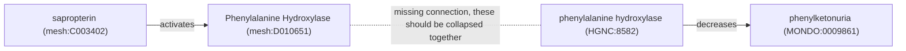

Data and knowledge originating from heterogeneous sources often use
heterogeneous controlled vocabularies and/or ontologies for annotating named
entities. Semantic mappings are essential towards resolving these discrepancies
and integrating in a coherent way. This post highlights how this looks in two
scenarios: when constructing a knowledge graph for graph machine learning and
when constructing a comprehensive lexica for natural language processing, text
mining, and curation.

## Background

Data and knowledge integration are challenging because there exist many
controlled vocabularies, ontologies, taxonomies, thesauri, classifications, and
other resources that mint identifiers with some degree of conceptual overlap,
redundancies, and discrepancies.

### Problem Statement

When integrating data and knowledge from heterogeneous sources that refer to the
same concepts using different identifiers, we get non-trivial duplications and
missing connections in our results.

For example, if we constructed a knowledge graph by combining the
[Comparative Toxicogenomics Database (CTD)](https://ctdbase.org) and the
[Monarch Disease Ontology (MONDO)](https://semantic.farm/mondo), we would get
disconnected mechanisms describing how
[sapropterin](https://ctdbase.org/detail.go?type=chem&acc=C003402) is used to
treat [phenylketonuria](https://semantic.farm/MONDO:0009861) because the CTD
uses the [Medical Subject Headings (MeSH)](https://semantic.farm/mesh) to
describe genes/proteins and MONDO uses the
[HUGO Gene Nomenclature Committee (HGNC)](https://semantic.farm/hgnc).

As a consequence, these redundancies lead to inaccurate results, for example,
when making queries between drugs and diseases or when using machine learning
algorithms to make predictions for new edges.

### Causes

I roughly classify these redundancies into three bins (from left to right in the
figure): similar domain, hierarchically related domain, and non-specific to a
domain. Below, I'll give some concrete examples from the life sciences to
illustrate.

In chemistry, there are dozens of resources that assign identifiers to small
molecules. Many have been constructed with unique scope or purpose such as
MetaboLights for metabolites, SwissLipids for lipids, DrugBank for drugs. Some
have similar scope and purpose, but have been constructed in parallel due to
scientific modeling reasons, such as different disease ontologies modeling
diseases with different parts of the Basic Formal Ontology (BFO). Some have
similar scope and purpose, but have been constructed in parallel due to
non-scientific reasons, such as PubChem and ChEMBL for small molecules with
assay information. As an aside, building resources in an open and collaborative
manner can help reduce proliferation, with the (major) caveat that they don't
satisfy funding bodies nor the requirements for career progression so easily.

In medicine and epidemiology, there are many resources describing diseases,
transmission, response, adverse outcomes, and other facets. Particularly during
the COVID-19 pandemic, many independent controlled vocabularies were constructed
to model information at various levels of specificity. The figure shows the
hierarchical relationships betwee the
[Disease Ontology (DOID)](https://semantic.farm/doid), the
[Infectious Disease Ontology (IDO)](https://semantic.farm/ido), the
[Viral Infectious Disease Ontology (VIDO)](https://semantic.farm/vido), the
[Coronavirus Infectious Disease Ontology (CIDO)](https://semantic.farm/cido),
and the
[COVID-19 Infectious Disease Ontology (IDOCOVID19)](https://semantic.farm/idocovid19).
When effectively reusing terms (as OBO Foundry Ontologies often do), this
doesn't create an issue, but in practice, many resources do not reuse terms for
various reasons.

In the life sciences, there are several controlled vocabularies that cover a
large number of domains such as the
[Medical Subject Headings (MeSH)](https://semantic.farm/mesh),
[National Cancer Institute Thesaurus (NCIT)](https://semantic.farm/ncit), and
[Unified Medical Language System (UMLS)](https://semantic.farm/umls). While they
give good coverage across many domains, these resources are often neither
detailed, precise enough, nor curated as ontologies. Therefore, many controlled
vocabularies use terms from these resources as a base and curate further.
However, this causes redundancy, and in many cases, the group does not correctly
cross-reference back. The
[Ontology for MicroRNA Target (OMIT)](https://semantic.farm/registry/omit) even
imported the entirety of MeSH, but didn't make any cross-references back to the
source, creating even more redundancy.

If you were wondering why for each domain, we couldn't just have a single
resource, then please have a look at
[https://xkcd.com/927](https://xkcd.com/927) :) Though, some resources that have
been around for a long time basically have a monopoly. For example, nobody in
their right mind in 2026 would start their own protein database to compete with
[UniProt](https://uniprot.org).

## Assembly

I want to highlight two groups for whom resolving redundancy has a high impact,
but not necessarily high visibility. The first group is data scientists who
consume knowledge graphs, for example, for graph machine learning. This group is
often unaware of how graphs were constructed (see: any graph machine learning
literature since 2013 that blindly uses FB15k and WN18).

The second group is curators, who want to use a combination of terminology
services like the [Ontology Lookup Service (OLS)](https://www.ebi.ac.uk/ols4/)
and text mining tools to annotate the literature with controlled vocabulary
terms. Curators don't want to (and shouldn't have to) understand the landscape
of related controlled vocabularies for their domain and should just be
responsible with terminology services and text mining tools to find _any_
appropriate term for their curation.

The important point is that software should solve the problem of redundancy, and
it needs to do so by consuming semantic mappings that bridge the gap illustrated
above in the phenylketonuria example.

This leads to the main goal of the post, which is to describe two high-level
workflows that can resolve redundancies and discrepancies when integration data
and knowledge by using semantic mappings. This post isn't about where semantic
mappings come from - see my other posts on SSSOM, JSKOS, and SeMRA for more
background on that.

### Knowledge Graph Assembly

Resolving redundancies when constructing a knowledge graph means standardizing
the subjects, predicates, and objects in triples. For example, if we have
knowledge about ethanol from multiple sources and some identify it using the
ChEBI identifier `16236` while others identify it using the DrugBank identifier
`DB000898`, we will have a similar issue to the phenylketonuria approach. If we
have semantic mappings that denote `CHEBI:16236` and `drugbank:DB000898` are
equivalent, as well as the ruleset that ChEBI identifiers take precedent over
DrugBank identifiers, then we can map the triples from the resource that uses
DrugBank like described in the figure below:

Let's take the ChEBI Ontology and DrugBank pharmacological data as two examples
that both annotate chemical roles. Here are a few scenarios for a given DrugBank
entry (assuming they both use the same `rdfs:subClassOf` relationship):

1. There are no semantic mappings linking it to a ChEBI entry. In this case, the
   subject doesn't need to be mapped.
2. There is a semantic mapping linking it to a ChEBI entry, but there's no
   semantic mapping linking the object to a ChEBI entry. For example, DrugBank
   annotates ethanol as
   [Agents Causing Muscle Toxicity (drugbank.category:DBCAT003935)](https://go.drugbank.com/categories/DBCAT003935).
   Therefore, the subject is mapped but the object is retained.
3. There is a semantic mapping linking it to a CheBI entry and a semantic
   mapping linking the object to the ChEBI entry. For example, ChEBI annotates
   ethanol as a
   [NMDA receptor antagonist (CHEBI:60643)](https://semantic.farm/CHEBI:60643)
   and DrugBank annotates ethanol as a
   [NMDA Receptor Antagonists (drugbank.category:DBCAT002723)](https://go.drugbank.com/categories/DBCAT002723).
   In this case, the DrugBank triple is fully a duplicate of the ChEBI one.
   However, it may have valuable metadata to keep.

As another example, DrugBank annotates ethanol as a
[Cytochrome P-450 CYP3A4 Inhibitors (drugbank.category:DBCAT003232)](https://go.drugbank.com/categories/DBCAT003232).
There's a corresponding term in ChEBI
[EC 1.14.13.97 (taurochenodeoxycholate 6α-hydroxylase) inhibitor, (CHEBI:86501)](https://www.ebi.ac.uk/chebi/search?query=CYP3A4%20Inhibitors),
but there isn't a semantic mapping capturing this. This is a job for the
[SSSOM Curator](https://github.com/cthoyt/sssom-curator/) software and a
semantic mapping repository like
[Biomappings](https://github.com/biopragmatics/biomappings) to store it.

There are _many_ examples of manually constructed workflows that do this
process. While these work (e.g., [Hetionet](https://het.io) was one of the
best), they are brittle towards expansion to new datasets and mappings, and
often hard to keep up-to-date. My goal has been to implement a fully generic and
automated version of this workflow, which I did as part of the
[Semantic Reasoner and Assembler](https://github.com/biopragmatics/semra).
However, describing how it works on a technical level will be part of a future
post.

### Lexicon Assembly

Controlled vocabularies often contain labels and synonyms for their terms that
are useful when constructing lexical indexes (i.e., databases of labels and
synonyms) that can be fed into named entity recognition (NER) and named entity
normalization (NEN) workflows - crucial components of natural language
processing and text mining workflows that are commonly used by curators to
annotate the literature with relationships that eventually become part of
databases that are used to construct knowledge graphs.

However, much like knowledge, synonyms for the same concept might be spread over
multiple different resources. Therefore, we semantic mappings can be used to
group multiple terms together and pool all of their synonyms, which both
improves recall and reduces the number of duplicate groundings that might be
given for a given part of text.

I've already made a technical implementation of this workflow in the
[Biolexica](https://github.com/biopragmatics/biolexica) project, but I'm working
towards generalizing and rebranding it for use outside the biomedical domain. I
previously posted a [simple
demonstration]() using
the underlying NER and NEN technology stack, but just using MeSH - a future post
will show how this works with a coherent lexica for diseases, genes, and other
entity types.
