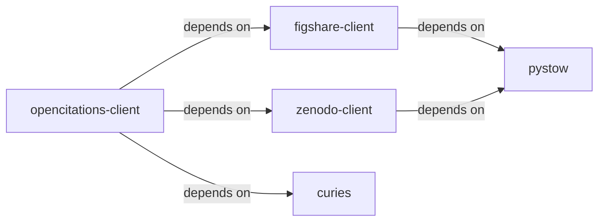
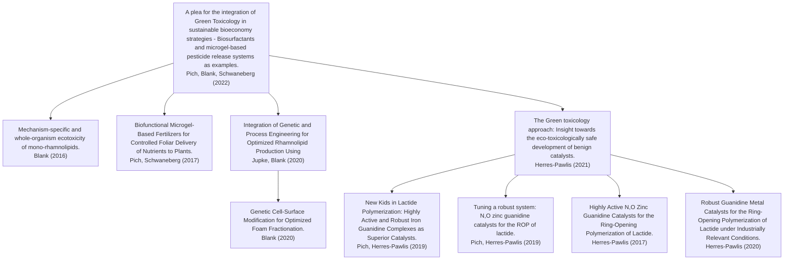

[OpenCitations](https://opencitations.net) aggregates and deduplicates
bibliographic information from CrossRef, Europe PubMed Central, and other
sources to construct a comprehensive, open index of citations between scientific
works. This post describes the
[`opencitations-client`](https://github.com/cthoyt/opencitations-client) package
which wraps the OpenCitations API and implements an automated pipeline for
locally downloading, caching, and accessing OpenCitations in bulk.

## Background

OpenCitations both provides access via an [API](https://api.opencitations.net)
and [bulk data downloads](https://download.opencitations.net) distributed across
FigShare and Zenodo. Importantly, it publishes its data under the CC0 public
domain license to democratize access to citations - previously, this data was
only available through paid access to commercial databases owned by publishers.

While API access can be convenient for _ad-hoc_ usage, it's generally slow,
rate-limited, susceptible to DDoS (e.g., from crawlers), and therefore difficult
(if not impossible) to use in bulk. My solution is to write software that
automates downloading, processing, and caching databases in bulk and provides
fast, highly available, local access. I've previously written about developing
standalone software packages for several large databases including
[DrugBank](),
[ChEMBL](),
[UMLS](),
[ORCiD](), and
[ClinicalTrials.gov]().
Similarly, I maintain several similar workflows in the
[PyOBO software package](https://github.com/biopragmatics/pyobo) for converting
resources into ontology-like data structures. I previously wrote about how this
looks for [HGNC]().

## Building on an Existing Ecosystem

I've been developing a software ecosystem over the last decade to support common
workflows in research data management and data integration. When I start a new
project, I try and reuse or improve existing components from that ecosystem
wherever possible. Importantly, I try and find meaningful ways of organizing
code across my ecosystem to reduce duplication, separate concerns, reduce the
burden of testing, and ease maintenance.

OpenCitations publishes its
[bulk data dumps](https://download.opencitations.net/) across several records in
Figshare and Zenodo. I've previously written
[ `zenodo-client`](https://github.com/cthoyt/zenodo-client/) to interact with
Zenodo's API and orchestrates downloading and caching. `zenodo-client` heavily
builds on [`pystow`](https://github.com/cthoyt/pystow), which implements I/O and
filesystem operations to enable reproducible, automated downloading, caching,
and opening of data.

I had not previously written software to interact with Figshare, so I followed
the form of `zenodo-client` and created a new package,
[`figshare-client`](https://github.com/cthoyt/figshare-client). I'm able to
quickly create new high-quality packages because I've encoded all the wisdom and
experience I've gained over the years in a Cookiecutter template,
[cookiecutter-snekpack](https://github.com/cthoyt/cookiecutter-snekpack), which
I can use to set up a new project in mere minutes.

Along the way, I realized that the archives in Zenodo and Figshare were a
combination of TAR and ZIP archives, each with many CSV files inside. In Python,
TAR and ZIP archives have lots of weird quirks, even though they mostly do the
same thing. However, rather than addressing those issues in
`opencitations-client`, it made more sense to add utility functions in PyStow in
[cthoyt/pystow#125](https://github.com/cthoyt/pystow/pull/125) (tar and zip
archive iteration), which I was much better able to test in the PyStow archive.

A key functionality of OpenCitations is to implement graph-like queries to find
incoming and outgoing citations. I considered several solutions for efficiently
caching and querying graph-like data including pickles and SQLite, but these
were respectively slow and disk inefficient. I found better solutions based on
NumPy's memory maps and was surprised that I couldn't find an implementation in
a popular package (e.g., SciPy). So, I had to decide where to put an
implementation of disk-based cached graph. I didn't want to put it in
OpenCitations nor make a tiny package for just this one operation, so I decided
to expand the scope of PyStow and add it there in
[cthoyt/pystow#121](https://github.com/cthoyt/pystow/pull/121).

Finally, OpenCitations deals with a variety of identifier spaces including
first-party [OpenCitations Metadata IDs (OMIDs)](https://semantic.farm/omid) and
[OpenCitations Citation IDs (OCIs)](https://semantic.farm/oci) as well as
third-party identifiers from Wikidata, OpenAlex, PubMed, DOI, and others. I've
written the [`curies`](https://github.com/biopragmatics/curies) to handle
identifiers in an explicit and transparent way. In the end, the
`opencitations-client` relies on several components from my ecosystem, and of
course, several more generic and popular packages. Here's how the dependencies
look:



## Demo

It's important for software packages to implement simple, top-level APIs that
cover 99% of use cases with reasonable defaults. Most use cases for
OpenCitations are to get incoming/outgoing citations for a DOI, PubMed
identifiers, or OpenCitations identifiers. Here's how this looks:

```python
from curies import Reference
from opencitations_client import get_incoming_citations, get_outgoing_citations

# a CURIE for the DOI for the Bioregistry paper
bioregistry_curie = "doi:10.1038/s41597-022-01807-3"

# who did the Bioregistry paper cite?
outgoing: list[Reference] = get_outgoing_citations(bioregistry_curie)

# who cited the Bioregistry paper?
incoming: list[Reference] = get_incoming_citations(bioregistry_curie)
```

Importantly, each of these functions has a `backend` argument that defaults to
`api` and can be swapped to `local`. Because everything is built on software
that is smart about caching, loading, and data workflows, on the first time
`backend='local'` is used, all processing happens automatically (warning, takes
a few hours on a single core). This function also has a `return_value` argument
that can be used to swap between principled `curies.Reference` data structures
that explicitly encode identifiers, simple string local unique identifiers that
match the input prefix, or full citation objects (only available through
OpenCitations API).

---

While I've been thinking about adding citations to the bibliographic components
of knowledge graph construction workflows for several years, I was finally
pushed to implement `opencitations-client` for the
[Catalaix project](https://catalaix.com), where we're developing new methods for
recycling and reuse of (bio)plastics. I wanted to get all seventeen
laboratories' publications, who they cited, and who cited them as a seed for
information extraction and curation. Here's a small example of a citation
network from those queries:


