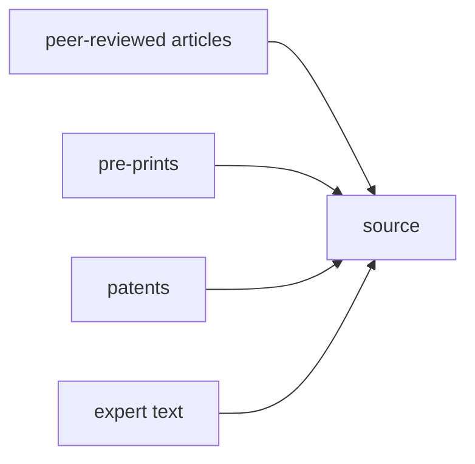

[PubMed](https://pubmed.ncbi.nlm.nih.gov) is an index of nearly 40 million

[`pubmed-downloader`](https://github.com/cthoyt/pubmed-downloader)

## Identifying Relevant Literature

1. Search over pubmed
2. Enrichment of citations

every knowledge graph needs an aspect of literature enrichment. here's what
happened

1. Define some queries for relevant literature. In Catalaix, this is based on
   finding papers authored by people in the consortium
2. Enrich the retrieved literature based on both upstream and downstream
   citations
3. Curate papers as being relevant or not. In RAPTER and Bioregistry project, we
   did this very successfully
4. Run NER and other information extraction workflows on these papers in a
   semi-automated curation look. This part is much more agile in the beginning
   as the data model doesn't need to be set. Though I don't have a taste for it,
   LLMs show potential for quickly constructing novel information extraction
   pipelines, e.g., DRAGON-AI reference?, but in practice, I haven't yet seen
   this be used successfully.

The accelerating rate of publication of peer-reviewed papers, patents,
(electronic) laboratory notebooks (e.g., Chemotion), repositories (e.g.,
RADAR4Chem), and other expert-driven text creates challenges for catalaix
consortium members in finding and understanding relevant publications. The CKG
will aggregate and index all relevant publications and provide catalaix
consortium members with access, e.g., through a Reaxys-like search interface for
chemical names and structures. Such interfaces will uniquely leverage a
combination of public and project-specific ontologies to contextualize searches,
e.g., to find all zinc-containing catalysts of alcoholysis reactions on PET. The
aggregation step will enrich publications with bibliometric metadata such as
publication year, venue, authorships, and citations. The indexing step will
implement information extraction workflows such as named entity recognition
(NER), which can identify substrates, products, catalysts, reagents, chemical
reactions, and other named entities appearing within the text, link them to
appropriate ontology terms, and enable them to be queried through the CKG. On
top of NER, relation extraction workflows can capture relationships between
named entities appearing within the text, such as the classification of a
chemical as a plasticizer or dye. Such workflows are semi-automated, i.e., have
a fully automated initial step followed by a human-in-the-loop curation step to
ensure high quality results. Importantly, such workflows will be connected to
the already existing catalaix Wiki, democratizing the ability for domain experts
within the consortium to contribute to the CKG simply by adding text to the
Wiki.

## Catalaix Use Case

https://github.com/catalaix/catalaix-kg/pull/6
