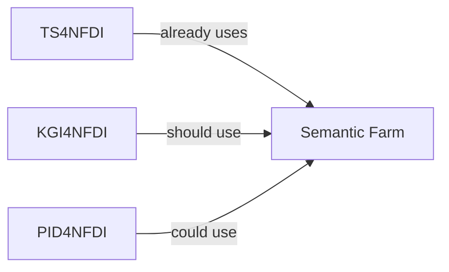

The
[7<sup>th</sup> NFDI4Chem consortium meeting](https://nfdi4chem.de/event/consortium-meeting-7-0/)
took place last week in Jena. This post is a summary of some of the interesting
discussions I had there.

## Ontologies and Mappings

I've been working on ontologies, semantic mappings, and knowledge graphs for
nearly a decade. These interests fit well within NFDI4Chem
[TA4](https://nfdi4chem.de/your-nfdi4chem-team-get-to-know-the-consortium-4/)
and more generally within
[NFDI Section Metadata's Working Group on Ontologies and Mappings](https://github.com/nfdi-de/section-metadata-wg-onto/).
I want to highlight a few discussions I had about these topics at the
7<sup>th</sup> NFDI4Chem consortium meeting:

### Ontology for Theoretical Chemistry

I discussed with Mario Wolter and Philip Strömert on how we could support
Mario's use case of making molecular dynamics and simulation experimental
metadata more fair by constructing an ontology for theoretical chemistry.

The [NFDI4Chem Ontologies Collection](https://semantic.farm/collection/0000014)
on the Semantic Farm (adapted from
[Ontologies4Chem: the landscape of ontologies in chemistry](https://doi.org/10.1515/pac-2021-2007))
lists the Computational Chemistry Ontology from the World Avatar project, but
that resource is effectively unusable, motivating the curation of a new ontology
(which when applicable can map back to the World Avatar ontology).

We plan to use the
[Ontology Development Kit (ODK)](https://incatools.github.io/ontology-development-kit/)
to begin work and will first focus on capturing basis sets used in computation.
The ODK supports us in curating mappings to the World Avatar project's ontology
(when applicable) in the
[Simple Standard for Sharing Ontological Mappings (SSSOM)](https://mapping-commons.github.io/sssom/).
Interestingly, in the week since the conference, we identified parallel work in
the NFDI on the
[Molecular Simulation Ontology (MOLSIM)](https://github.com/CPCLab/molsim-ontology)
which will need to be considered further.

### Semantic Mappings for CHMO

In the weeks leading up to the consortium meeting, I have been discussing with
Philip Strömert how to leverage
[SSSOM Curator](https://github.com/cthoyt/sssom-curator/) to predict and curate
semantic mappings between CHMO, FIX, REX, IUPAC OrangeBook, IUPAC GoldBook, and
DAPHNE4NFDI's PaNET ontology. While his HiWi made initial mappings between CHMO
and GoldBook (among other exciting improvements) in
[NFDI4Chem/rsc-cmo#17](https://github.com/NFDI4Chem/rsc-cmo/pull/17), I was able
to prepare mappings at scale between all resources using SSSOM Curator, then
curate them relatively quickly (within a few hours) in
[nfdi-de/section-metadata-wg-onto#88](https://github.com/nfdi-de/section-metadata-wg-onto/pull/88)
and
[nfdi-de/section-metadata-wg-onto#89](https://github.com/nfdi-de/section-metadata-wg-onto/pull/89).
Philip and I coordinated next steps for the ontology agenda for NFDI4Chem (TA4),
which will include porting several other chemistry ontologies to using the ODK
(RXNO, CHEMINF) and to write manuscript describing how to produce ontology
bridge files from the SSSOM semantic mapping curations.

### Annotating Interfacial Electrochemistry Data

[Albert Engstfeld](https://orcid.org/0000-0002-9686-3948) presented
[echemdb](https://www.echemdb.org/), a community project for interfacial
electrochemistry and local research data management. They recently ported their
data model to [LinkML](https://linkml.io/), but weren't aware of how ontologies
could be used to annotate data. I discussed with him how their free-text
descriptions of electrode types could be replaced with references to terms in
the [Chemical Methods Ontology (CHMO)](https://semantic.farm/chmo) under the
[`CHMO:0002344` (electrode)](http://purl.obolibrary.org/obo/CHMO_0002344)
hierarchy.

Immediately, Albert identified missing electrode terms from CHMO and places
where the terms could be better organized. Luckily, NFDI4Chem is currently under
the process of taking stewardship over CHMO and making a major update, so
NFDI4Chem will be able to support and enable Albert to improve the ontology to
better suit his data resource. In general, this shows the power of the
[open data, open code, open infrastructure (O3)](https://www.nature.com/articles/s41597-024-03406-w)
mindset codified by the
[OBO Foundry Principles](https://academic.oup.com/database/article/doi/10.1093/database/baab069/6410158)
that influenced the original development of CHMO.

### Knowledge Graphs and Graph Machine Learning

I discussed with
[Kenichi Endo](https://www.ipoc.uni-stuttgart.de/pcmc/team/Endo/) and
[Felix Neubauer](https://orcid.org/0009-0008-5367-2034) (U. Stuttgart) how to
find ontologies to annotate their data describing reaction and process steps,
and ultimately how these could be converted into knowledge graphs. I also
discussed graph machine learning methods with them, particularly knowledge graph
embedding models (KGEMs) and the [PyKEEN](https://github.com/pykeen/pykeen/)
graph machine learning library that I co-developed.

### Better Ontological Communication

On the train ride home, I sat with
[Theo Bender](https://orcid.org/0009-0004-4064-6065) and reflected on the
discussions with Albert, Kenichi, and many others. Despite NFDI4Chem being a
nexus of ontology expertise, it's actually the case that many people don't
really know what they are, how to find relevant ontologies for their work, or
how to use them. This is an opportunity for me to participate in
[TA5](https://nfdi4chem.de/your-nfdi4chem-team-get-to-know-the-consortium-5/) to
help improve the educational material NFDI4Chem has, and a call to give more
(less technical talks) demonstrating the usage of ontologies in NFDI4Chem to
motivate others to get excited (tracked in
[NFDI4Chem/knowledge_base#508](https://github.com/NFDI4Chem/knowledge_base/issues/508)).
Further, this ties into discussions about Semantic Farm (see below) and how it's
a tool that can help NFDI4Chem consortium members find the right ontologies for
their work.

## Training Materials and DALIA

On the train ride home, I also discussed with
[Hans-Georg Weinig](https://orcid.org/0009-0009-4519-1959) (GDCh, German
Chemical Society) how NFDI4Chem could incorporate training materials from the
German Chemical Society into [DALIA](https://search.dalia.education/basic/), the
NFDI's search portal for training materials, as part of TA5.

## Semantic Farm

The [Semantic Farm](https://semantic.farm) (previously called the Bioregistry,
now adapted to be domain-agnostic) is a registry of ontologies, controlled
vocabularies, terminologies, and other resources that mint (persistent)
identifiers. While it's already been widely adopted in the biomedical domain
since its creation in 2019 (e.g., by the OBO Foundry, Monarch Initiative), I've
been working to integrate it within NFDI4Chem and other NFDI consortia via the
[NFDI Section Metadata Working Group for Ontology Harmonization and Mapping](https://github.com/nfdi-de/section-metadata-wg-onto/).
I want to highlight a few discussions I had about the Semantic Farm at the
7<sup>th</sup> NFDI4Chem consortium meeting:

### Extending Semantic Farm's Provider Data Model

For each ontology, controlled vocabulary, terminology, and other resources that
mint (persistent) identifiers, the Semantic Farm keeps track of one or more
websites that can provide information about entities from that resource. For
example, there is a first-party provider for the Gene Ontology that shows
information terms like `GO:0032571` (response to vitamin K). There are also many
third party providers such as through the EBI Ontology Lookup Service (OLS) and
Jackson Laboratories' browser.

I talked with [Steffen Neumann](https://orcid.org/0000-0002-7899-7192) about
extending the Semantic Farm's data model for providers to include more
information about:

1. what media types (e.g., HTML, JSON, RDF) the provider returns by default
2. whether content negotiation is possible by sending an `Accept` header to tell
   the server which media type to return

Steffen's use case in NFDI4Chem
[TA3](https://nfdi4chem.de/your-nfdi4chem-team-get-to-know-the-consortium-3/)/[TA6](https://nfdi4chem.de/your-nfdi4chem-team-get-to-know-the-consortium/)
is the Semantic Farm entry for MassBank
([https://semantic.farm/massbank](https://semantic.farm/massbank)). Enabling
Semantic Farm to resolve in different ways will support the development of
computational workflows as well as make it more useful when implementing the
MassBank front-end.

### Adding Semantic Web Interoperability to Semantic Farm's Resolver

I talked with [Egon Willighagen](https://egonw.github.io) (a longtime
collaborator of mine and a member of one of the
[NFDI4Chem advisory boards](https://nfdi4chem.de/the-advisory-boards/)) about
how to extend the "resolver" functionality of Semantic Farm to support content
negotiation. The resolver redirects URLs constructed with a CURIE like
https://semantic.farm/GO:0032571 to the first-party (or best) web page for human
reading.

Egon suggested that if a request contains an `Accept` header asking for
`text/turtle` (or any other RDF-adjacent mimetype) that it could return the list
of related URIs. Importantly, this functionality is already available via the
API
([https://semantic.farm/api/reference/GO:0032571](https://semantic.farm/api/reference/GO:0032571))
and on the front-end
([https://semantic.farm/reference/GO:0032571](https://semantic.farm/reference/GO:0032571)),
but not possible through the resolver endpoint.

In
[biopragmatics/bioregistry#1954](https://github.com/biopragmatics/bioregistry/pull/1954),
I extended the resolver so now it's possible to use `Accept` headers like in the
following:

```python
import requests

res = requests.get(
   "https://semantic.farm/GO:0032571",
   headers={"Accept": "text/turtle"},
)
```

I also added a way of adding query parameters to get the same results when
navigating to
[https://semantic.farm/GO:0032571?format=turtle](https://semantic.farm/GO:0032571?format=turtle)
(note the addition of `?format=turtle`). For both, the following is returned:

```turtle
@prefix rdfs: <http://www.w3.org/2000/01/rdf-schema#> .

<https://semantic.farm/GO:0032571> rdfs:seeAlso <http://bio2rdf.org/go:0032571>,
        <http://identifiers.org/obo.go/GO:0032571>,
        <http://purl.obolibrary.org/obo/GO_0032571>,
        <http://purl.org/obo/owl/GO#GO_0032571>,
        <http://www.geneontology.org/GO:0032571>,
        <http://www.informatics.jax.org/searches/GO.cgi?id=GO:0032571>,
        <http://www.informatics.jax.org/vocab/gene_ontology/GO:0032571>,
        <http://www.pantherdb.org/panther/category.do?categoryAcc=GO:0032571>,
        <https://bioportal.bioontology.org/ontologies/GO/?p=classes&conceptid=http://purl.obolibrary.org/obo/GO_0032571>,
        <https://identifiers.org/GO:0032571>,
        <https://n2t.net/go:0032571>,
        <https://www.ebi.ac.uk/QuickGO/GTerm?id=GO:0032571>,
        <https://www.ebi.ac.uk/QuickGO/term/GO:0032571>,
        <https://www.ebi.ac.uk/ols4/ontologies/go/terms?iri=http://purl.obolibrary.org/obo/GO_0032571>,
        <https://www.nextprot.org/term/GO:0032571> .
```

### Semantic Farm and Base4NFDI

I've been working towards proposing the Semantic Farm as a Base4NFDI service
(despite the recent
[announcement](https://all-chat.nfdi.de/channel/base4nfdi-general?msg=EMuGhpddQqfL748oM)
that Base4NFDI won't be accepting any new proposals for funding). I discussed
this with [Martin Reinhardt](https://orcid.org/0000-0002-1213-5135) and
[Hannah Butz](https://orcid.org/0000-0003-2285-3322) from Base4NFDI at their
poster (photo below borrowed from Martin's
[post on LinkedIn](https://www.linkedin.com/posts/martin-reinhardt_zaf-base4nfdi-nfdi-activity-7460274633150218241-OsNv)).


They had the exciting idea to encourage people to draw on their poster, so I
added the relationships between TS4NFDI, KG4NFDI, and PID4NFDI and the Semantic
Farm. It's possible to see in the photo if you squint, but here's the same
arrows drawn again:



We discussed how the Semantic Farm is already a key service as part of the
TS4NFDI, how it should be adopted by KGI4NFDI (e.g., to make sure that all NFDI
knowledge graphs use the same prefixes, CURIEs, and URIs for the same things),
and how could fit in with PID4NFDI to support them in better communicating what
identifiers do, where they come from, and how they make data FAIR beyond the
limited number of identifier spaces (e.g., DOI, ORCiD, ROR, Handles) on which
they currently focus. They also suggested I attend the
[Base4NFDI User Conference 2026](https://base4nfdi.de/?view=article&id=152:save-the-date-uc4b-2026-in-berlin&catid=8)
in Berlin to communicate these things further.

## Chemotion

I'm currently leading the effort to develop a data infrastructure for the
[Catalaix](https://catalaix.com/en) project which will capture experimental
information about polymerization and depolymerization reactions from both the
literature and experiments in our laboratory. Our researchers are using
Chemotion, so I discussed requirements for programmatically extracting data from
Chemotion with Shashank Harivyasi (KIT), the Chemotion developer responsible for
Chemotion's API. I also discussed with Nicole Jung (KIT) our more general need
to identify and reuse, or develop, an external standard for reaction
information.

---

I'm a big fan of these meetings, especially because they are typically short and
well-attended. While this post focused on bigger picture discussions, I also had
lots of small talks with friends and collaborators like
[Kohulan](https://orcid.org/0000-0003-1066-7792) and
[Chandu](https://orcid.org/0000-0002-2564-3243) that were completely invaluable
to making NFDI4Chem a great experience. I'm looking forward to our next big
in-person meetup at Ontologies4Chem in Limburg in November!
