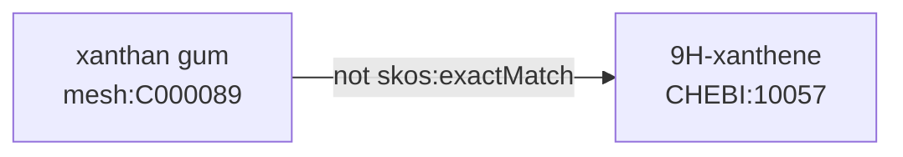
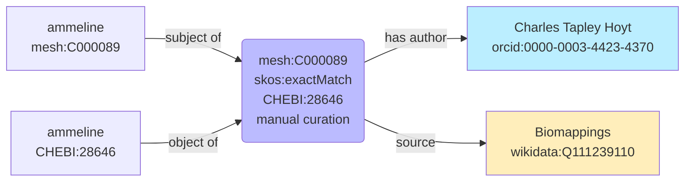
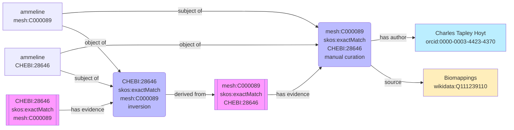
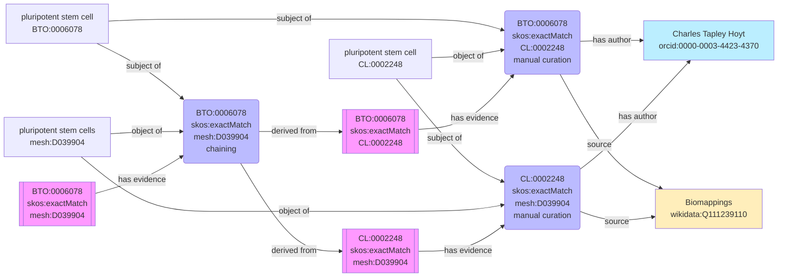
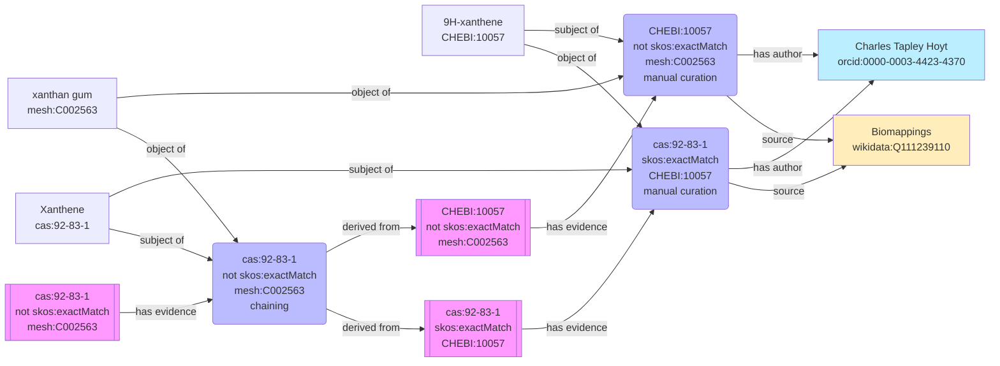
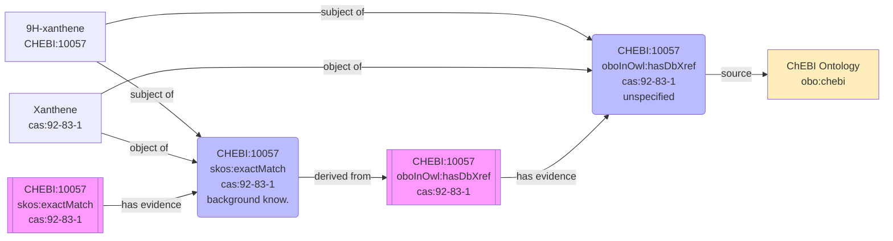

The
[Simple Standard for Sharing Ontological Mappings (SSSOM)](https://mapping-commons.github.io/sssom)
requires semantic mappings to annotate a _justification_ from the
[Semantic Mapping Vocabulary (SEMAPV)](https://semantic.farm/semapv) such as
[`semapv:ManualMappingCuration`](https://semantic.farm/semapv:ManualMappingCuration),
[`semapv:MappingInversion`](https://semantic.farm/semapv:MappingInversion), and
[`semapv:MappingChaining`](https://semantic.farm/semapv:MappingChaining).
However, SSSOM did not have a mechanism for tracking which mappings were used
during inference workflows like inversion or chaining. This post is about my
recent
[SSSOM enhancement proposal](https://github.com/mapping-commons/sssom/issues/537)
to add a new field `derived_from` to support this.

## Background

Before we get started, it's worth defining a few terms about mappings to make
sure that we stay precise.

### Mapping Triple

A _mapping triple_ is a subject, predicate, and object such as `mesh:C000089`,
`skos:exactMatch`, `CHEBI:28646`. By semantic web conventions based on the open
world assumption (OWA), triples are assumed to be true unless stated otherwise.


### Mapping Quadruple

A _mapping quadruple_ is a subject, predicate, object, and truthiness (a
boolean). SSSOM represents the truthiness using the `predicate_modifier` field,
where an empty value means that the mapping is true, and a value of `Not` means
that it is false.

For example, (`mesh:C000089`, `skos:exactMatch`, `CHEBI:28646`, `True`) makes
the example _mapping triple_ from above into a mapping quadruple that explicitly
states its truthiness.


Conversely, (`CHEBI:10057`, `skos:exactMatch`, `mesh:C002563`, `False`) is false
because `CHEBI:10057` refers to 9H-xanthene, a small molecule, and
`mesh:C002563` refers to xanthan gum, a polysaccharide.



By convention, mapping triples are implicitly considered to refer to the
corresponding _true_ mapping quadruple.

### Mapping Record

A _mapping record_ is a subject, predicate, object, truthiness, and other
metadata about the mapping that appears in the SSSOM
[Mapping](https://mapping-commons.github.io/sssom/Mapping/) data model. A
mapping record best be visualized by reifying the triple (i.e., make into a
node) to show how additional metadata is connected.



Note that I'm playing a bit fast and loose with the semantics of the predicates
relating the mapping record to other components. This is explicitly specified as
part of SSSOM, but I don't think super instructive here, so I've used more
human-readable labels.

## Motivation

I've been thinking about the large-scale aggregation and inference over semantic
mappings for several years now. My initial work resulted in the implementation
of the
[Semantic Mapping Reasoner and Assembler (SeMRA)](https://github.com/biopragmatics/semra)
and the publication of its companion article
[Assembly and reasoning over semantic mappings at scale for biomedical data integration](https://doi.org/10.1093/bioinformatics/btaf542).

Initially, SeMRA implemented a custom data model that was similar to SSSOM, but
had a more explicit provenance model for which mapping records (e.g., from
SSSOM) were used to infer new mapping quadruples. As SeMRA and its applications
have matured, I have been able to backport many of its good ideas to SSSOM. This
post is specifically about how I've proposed a simple, optional, explicit
provenance model that allows mapping records in SSSOM produced by inference to
reference the set of mapping quadruples that were used during inference, in a
new `derived_from` slot.

### Reference the Triple, Quadruple, or Record?

This slot is deliberately under-specified, but there's a key nuance that the
values in this field should point to identifiers for mapping quadruples, not
mapping triples nor mapping records for the following reasons:

1. Mapping triples are insufficient: without the judgment of whether a mapping
   is true or false, then an algorithm could accidentally conclude from
   `A skos:exactMatch B` and `B (not) skos:exactMatch C` that
   `A skos:exactMatch C`. This is why mapping triples are insufficient
2. Inference happens on the mapping quadruple level
3. Full mapping records are inflexible: the SSSOM data should be flexible so if
   additional evidence (i.e., records) for a given mapping quadruple are found,
   then the confidence in the inferred/derived mapping (e.g., chained or
   inverted) can be adjusted accordingly. This is possible because most chaining
   and inversion algorithms logically operate on mapping quadruples, and not on
   records.

Note: the local unique identifiers used for mappings in this example are related
to the proposal in https://github.com/ts4nfdi/mapping-sameness-identifier (which
currently is under review). For now, the SSSOM specification isn't prescribing
how to assign identifiers to mapping quadruples.

## Contribution

See the original issue
[mapping-commons/sssom#537](https://github.com/mapping-commons/sssom/issues/537)
and pull request
[mapping-commons/sssom#548](https://github.com/mapping-commons/sssom/pull/548).
This post is an extension of the documentation I wrote in that PR
([https://mapping-commons.github.io/sssom/dev/inference](https://mapping-commons.github.io/sssom/dev/inference)).

I implemented the `derived_from` field in
[SSSOM Pydantic](https://github.com/cthoyt/sssom-pydantic) in
[cthoyt/sssom-pydantic#108](https://github.com/cthoyt/sssom-pydantic/pull/108).
Subsequently, while preparing this post, I implemented a mechanism for
generating the pretty [Mermaid](https://mermaid.js.org/) diagrams I've used
throughout this post in
[cthoyt/sssom-pydantic#129](https://github.com/cthoyt/sssom-pydantic/pull/129).

Here's how this looks in Python:

```python
from curies import Converter, NamableReference, NamedReference
from curies.vocabulary import charlie, manual_mapping_curation, mapping_chaining, exact_match

from sssom_pydantic import SemanticMapping, hash_triple_to_reference

CONVERTER = Converter.from_prefix_map({
    "BTO": "http://purl.obolibrary.org/obo/CHEBI_",
    "CL": "http://purl.obolibrary.org/obo/CL_",
    "mesh": "http://id.nlm.nih.gov/mesh/",
    "wikidata": "http://www.wikidata.org/entity/",
    "orcid": "https://orcid.org/",
    "semapv": "https://w3id.org/semapv/vocab/",
    "skos": "http://www.w3.org/2004/02/skos/core#",

})

E1 = NamedReference.from_curie("BTO:0006078", name="pluripotent stem cell")
E2 = NamedReference.from_curie("CL:0002248", name="pluripotent stem cell")
E3 = NamedReference.from_curie("mesh:D039904", name="Pluripotent Stem Cells")
SOURCE = NamableReference.from_curie("wikidata:Q111239110", name="Biomappings")

m1 = SemanticMapping(
    subject=E1,
    predicate=exact_match,
    object=E2,
    justification=manual_mapping_curation,
    authors=[charlie],
    source=SOURCE,
)
m2 = SemanticMapping(
    subject=E2,
    predicate=exact_match,
    object=E3,
    justification=manual_mapping_curation,
    authors=[charlie],
    source=SOURCE,
)
m3 = SemanticMapping(
    subject=E1,
    predicate=exact_match,
    object=E3,
    justification=mapping_chaining,
    # This is the new part!
    derived_from=[
        hash_triple_to_reference(m1, CONVERTER),
        hash_triple_to_reference(m2, CONVERTER),
    ],
)
```

Damien Goutte-Gattat also implemented the `derived_from` in
[SSSOM Java](https://github.com/gouttegd/sssom-java) in
[gouttegd/sssom-java#19](https://github.com/gouttegd/sssom-java/pull/19).

## Examples

To finish off this post, I've included five real-world examples combining
manually curated mappings from
[Biomappings](https://github.com/biopragmatics/biomappings) and the ChEBI ontology that
show off three types of inference: inversion, chaining, and background
knowledge-based mapping.

### Inversion

A mapping inversion workflow inverts the mapping predicate then swaps subject
and object components. For example, the mapping predicate `skos:narrowMatch`
and`skos:broadMatch` are inverses and `skos:exactMatch` is its own inverse. More
information about mapping predicates can be found in the
[SSSOM documentation](https://mapping-commons.github.io/sssom/mapping-predicates/).

The introduction of the `derived_from` field allows an inverted mapping record
to refer back to the mapping it was derived from.

In the example below, a manually curated mapping between MeSH and ChEBI's terms
for ammeline is inverted.



<details>
<summary>Source SSSOM TSV</summary>

| subject_id   | subject_label | predicate_id    | object_id    | object_label | mapping_justification        | author_id                 | mapping_source      | derived_from                                                             |
| :----------- | :------------ | :-------------- | :----------- | :----------- | :--------------------------- | :------------------------ | :------------------ | :----------------------------------------------------------------------- |
| mesh:C000089 | ammeline      | skos:exactMatch | CHEBI:28646  | ammeline     | semapv:ManualMappingCuration | orcid:0000-0003-4423-4370 | wikidata:Q111239110 |                                                                          |
| CHEBI:28646  | ammeline      | skos:exactMatch | mesh:C000089 | ammeline     | semapv:MappingInversion      |                           |                     | mapping:36a1f9244ea7641a90987c82f33c25c0c13712ee8f48207b2a0825f8a4e4e26a |

</details>

## Chaining

A mapping chaining workflow applies
[SSSOM chaining rules](https://mapping-commons.github.io/sssom/chaining-rules/)
to combine one or more mappings who share subjects/objects. The resulting
mappings should be tagged with `semapv:MappingChaining` as a justification.

Depending on the implementation, directionality is important, so inferring
inverted mappings before chaining is important.



<details>
<summary>Source SSSOM TSV</summary>

| subject_id  | subject_label         | predicate_id    | object_id    | object_label           | mapping_justification        | author_id                 | mapping_source      | derived_from                                                             |
| :---------- | :-------------------- | :-------------- | :----------- | :--------------------- | :--------------------------- | :------------------------ | :------------------ | :----------------------------------------------------------------------- | ------------------------------------------------------------------------ |
| BTO:0006078 | pluripotent stem cell | skos:exactMatch | CL:0002248   | pluripotent stem cell  | semapv:ManualMappingCuration | orcid:0000-0003-4423-4370 | wikidata:Q111239110 |                                                                          |
| CL:0002248  | pluripotent stem cell | skos:exactMatch | mesh:D039904 | pluripotent stem cells | semapv:ManualMappingCuration | orcid:0000-0003-4423-4370 | wikidata:Q111239110 |                                                                          |
| BTO:0006078 | pluripotent stem cell | skos:exactMatch | mesh:D039904 | pluripotent stem cells | semapv:MappingChaining       |                           |                     | mapping:8a12a396b85642cccfc799fb24320c51a4aabf3294780cb31116d45f773a2572 | mapping:988ce14e26fdbf24aeb27b4d8b5ad4bcc25b5cdb46be4e674bfa88a2abe12264 |

</details>

## Chaining with Negatives

When I wrote the initial
[SSSOM chaining rules](https://mapping-commons.github.io/sssom/chaining-rules/),
I did not include any examples on how negative modifiers interact with the
rules. This example is a prospective look on how negative mappings and positive
mappings could interact. I will be making some improvements to the SSSOM docs
with additional concrete rules soon.



<details>
<summary>Source SSSOM TSV</summary>

| subject_id  | subject_label | predicate_id    | predicate_modifier | object_id    | object_label | mapping_justification        | author_id                 | mapping_source      | derived_from                                                              |
| :---------- | :------------ | :-------------- | :----------------- | :----------- | :----------- | :--------------------------- | :------------------------ | :------------------ | :------------------------------------------------------------------------ | ------------------------------------------------------------------------ |
| CHEBI:10057 | 9H-xanthene   | skos:exactMatch | Not                | mesh:C002563 | xanthan gum  | semapv:ManualMappingCuration | orcid:0000-0003-4423-4370 | wikidata:Q111239110 |                                                                           |
| cas:92-83-1 | Xanthene      | skos:exactMatch |                    | CHEBI:10057  | 9H-xanthene  | semapv:ManualMappingCuration | orcid:0000-0003-4423-4370 | wikidata:Q111239110 |                                                                           |
| cas:92-83-1 | Xanthene      | skos:exactMatch | Not                | mesh:C002563 | xanthan gum  | semapv:MappingChaining       |                           |                     | mapping:58f24ccfaf71431276da873c9e7b77ea61a2425e4e8b283b943542290deb292b~ | mapping:bb1162fb2afb1c519c0aa8be98c352061720af220e2d052c571a1fecabff9800 |

</details>

## Background Knowledge

Inference based on background knowledge was one of the key contributions of
SeMRA. For example, it's known that mappings in ChEBI to CAS are exact matches,
but by curation convention, they're annotated with the less precise
`oboInOwl:hasDbXref`. Workflows that incorporate this knowledge should be tagged
with `semapv:BackgroundKnowledgeBasedMatching` as a mapping justification.

In this example, I show how a poorly specified mapping from ChEBI is upgraded to
an exact match.



<details>
<summary>Source SSSOM TSV</summary>

| subject_id  | subject_label | predicate_id       | predicate_label              | object_id   | object_label | mapping_justification                   | mapping_source | derived_from                                                             |
| :---------- | :------------ | :----------------- | :--------------------------- | :---------- | :----------- | :-------------------------------------- | :------------- | :----------------------------------------------------------------------- |
| CHEBI:10057 | 9H-xanthene   | oboInOwl:hasDbXref | has database cross-reference | cas:92-83-1 | Xanthene     | semapv:UnspecifiedMatching              | obo:chebi      |                                                                          |
| CHEBI:10057 | 9H-xanthene   | skos:exactMatch    |                              | cas:92-83-1 | Xanthene     | semapv:BackgroundKnowledgeBasedMatching |                | mapping:887c2cc0c006b49df5fa0bc281e23bd3722880d5096e27218082bd6edf96f59e |

</details>

## End-to-End Inference

This end-to-end example demonstrates the cumulation of inversion, chaining, and
background-based workflows. While it only starts with two mappings, it shows how
the successive application of these workflows can give full transparency and
auditability in the process of inference.

In real-world scenarios, I would want to use the mesh-cas exact match to
automatically integrate data, such as in the construction of a knowledge graph.
In case this mapping is adjacent to a node important for a prediction, I would
want to be able to fully audit how that node was constructed via this mapping
diagram.


<details>
<summary>Source SSSOM TSV</summary>

| subject_id   | subject_label      | predicate_id       | predicate_label              | object_id      | object_label       | mapping_justification                   | mapping_source      | derived_from                                                             | author_id                                                                |
| :----------- | :----------------- | :----------------- | :--------------------------- | :------------- | :----------------- | :-------------------------------------- | :------------------ | :----------------------------------------------------------------------- | :----------------------------------------------------------------------- | --- |
| CHEBI:133530 | tyramine sulfate   | oboInOwl:hasDbXref | has database cross-reference | cas:30223-92-8 | Tyramine sulfate   | semapv:UnspecifiedMatching              | obo:chebi           |                                                                          |                                                                          |
| CHEBI:133530 | tyramine sulfate   | skos:exactMatch    |                              | cas:30223-92-8 | Tyramine sulfate   | semapv:BackgroundKnowledgeBasedMatching |                     | mapping:0b8eb968c306d65e1715a7b0961f6a4d99b5b19081edb67cee701fd887af1290 |                                                                          |
| CHEBI:133530 | tyramine sulfate   | skos:exactMatch    |                              | mesh:C027957   | tyramine O-sulfate | semapv:ManualMappingCuration            | wikidata:Q111239110 |                                                                          | orcid:0000-0003-4423-4370                                                |
| mesh:C027957 | tyramine O-sulfate | skos:exactMatch    |                              | CHEBI:133530   | tyramine sulfate   | semapv:MappingInversion                 |                     | mapping:b8d737b89a421bd6ca058314564c9ed507cbfe3ec4a2e82979fefdfe708019ea |                                                                          |
| mesh:C027957 | tyramine O-sulfate | skos:exactMatch    |                              | cas:30223-92-8 | Tyramine sulfate   | semapv:MappingChaining                  |                     | mapping:a0022401f47964288ecc1ab706d79b4d4abc10edf33d0a71953834a0b0b3c24c | mapping:1036c55358639c5db78ada181ac38d8eda337e83efe1db901716d101777f8474 |     |

</details>
