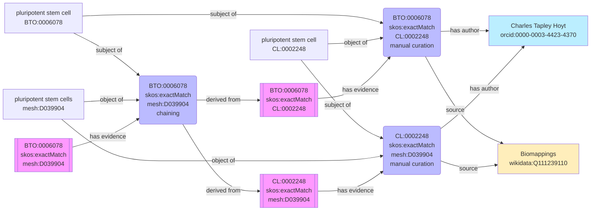
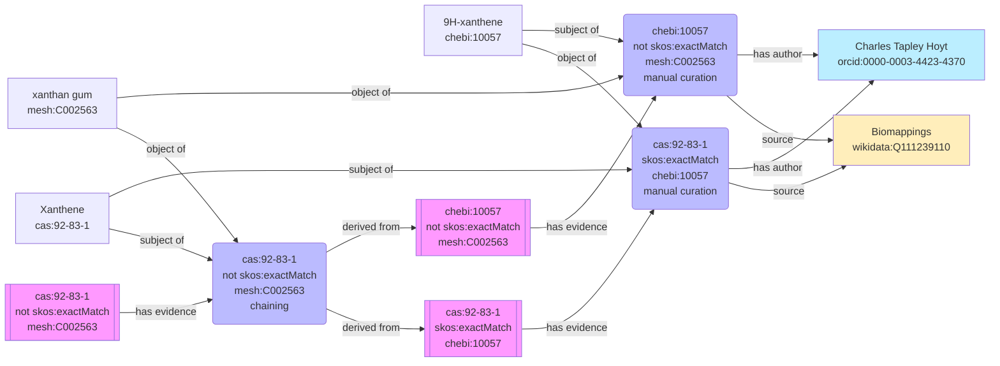
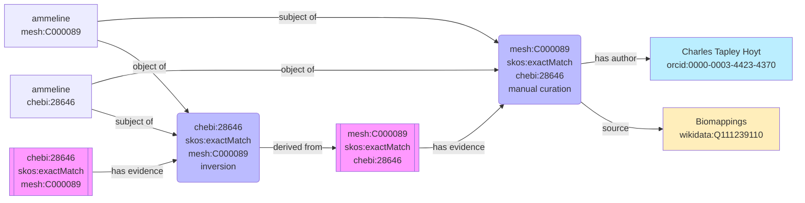
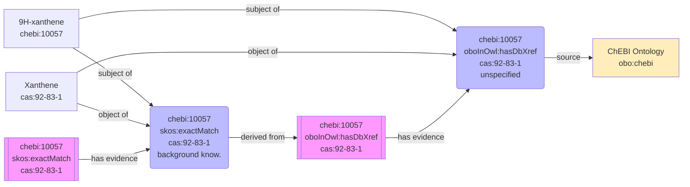
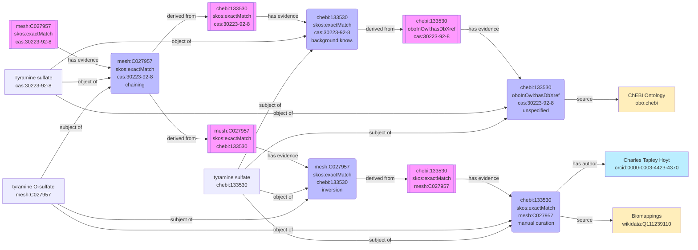

https://github.com/biopragmatics/semra


Updates to SSSOM

- https://github.com/mapping-commons/sssom/issues/537
- https://github.com/mapping-commons/sssom/pull/548

Updates to SSSOM Pydantic

- https://github.com/cthoyt/sssom-pydantic/pull/108 implemented `derived_from`
- https://github.com/cthoyt/sssom-pydantic/pull/129 added mermaid visualization

# Inference

There are several mechanisms for inference:

- Inference via chaining (see [chaining rules](chaining-rules.md)), which should
  be tagged with `semapv:MappingChaining` as a justification
- Inference via mapping inversion, which should be tagged with
  `semapv:MappingInversion` as a justification
- Inference via prior knowledge, which should be tagged with
  `semapv:BackgroundKnowledgeBasedMatching` as a justification

## Background on Mapping Triples, Quadruples, and Records

This section provides a brief background on different ways of referencing a
mapping appearing in SSSOM.

A mapping triple has a subject, predicate, and object as in (`mesh:C000089`,
`skos:exactMatch`, `CHEBI:28646`). A mapping triple does not clarify the
judgment on whether a triple is true or false, nor how the mapping was created.

A mapping quadruple has a subject, predicate, object, and predicate modifier.
The addition of the predicate modifier allows a mapping quadruple to explicitly
denote the judgment on whether a triple is true or false. For example,
(`mesh:C000089`, `skos:exactMatch`, `CHEBI:28646`, True) explicitly represents
that the above subject, predicate, object triple is true, while (`CHEBI:10057`,
`skos:exactMatch`, `mesh:C002563`, False) is false because `CHEBI:10057` refers
to 9H-xanthene, a small molecule, and `mesh:C002563` refers to xanthan gum, a
polysaccharide. By convention, mapping triples are implicitly considered to
refer to the "true" mapping quadruple.

A mapping record refers to the subject, predicate, object, predicate modifier,
and all other fields in the SSSOM data model (except where otherwise stated in
["Hashing a SSSOM mapping record"](spec-support-hashing.md), such as the
`record_id`).

## Referring to Evidence

The `derived_from` field was introduced in
[#537](https://github.com/mapping-commons/sssom/issues/537) in order to
reference the original subject-predicate-object-predicate modifier quadruple
from which new mappings are inferred/derived.

The following example demonstrates how the `derived_from` field can be leveraged
in two scenarios:

1. mapping chaining. The table contains a SKOS exact match from `mesh:C000089`
   to `CHEBI:28646` and from `CHEBI:28646` to `cas:645-92-1`. The third row of
   the table contains a SKOS exact match from `mesh:C000089` to `cas:645-92-1`
   produced through mapping chaining. The `derived_from` column in this row
   contains CURIEs referring to the
   `mesh:C000089`-`skos:exactMatch`-`CHEBI:28646`-True and
   `CHEBI:28646`-`skos:exactMatch`-`cas:645-92-1`-True mapping quadruples,
   concatenated with a pipe
2. mapping inversion. The fourth row of the table contains a SKOS exact match
   from `CHEBI:28646` to `mesh:C000089` produced through mapping inversion of
   the first row of the table. The `derived_from` column in this row contains
   the CURIE referring to the
   `mesh:C000089`-`skos:exactMatch`-`CHEBI:28646`-True quad.

```
# curie_map:
#   cas:  	https://commonchemistry.cas.org/detail?cas_rn=
#   CHEBI: http://purl.obolibrary.org/obo/CHEBI_
#   mesh: http://id.nlm.nih.gov/mesh/
#   orcid: https://orcid.org/
#   semapv: https://w3id.org/semapv/vocab/
#   skos: http://www.w3.org/2004/02/skos/core#
#   mapping: https://example.com/mapping/
# license: https://creativecommons.org/publicdomain/zero/1.0/
# mapping_set_id: https://github.com/mapping-commons/sssom/blob/master/examples/schema/derived_from.sssom.tsv
# creator_id:
#  - orcid:0000-0003-4423-4370
```

| subject_id   | subject_label | predicate_id    | object_id    | object_label | mapping_justification        | derived_from                                                                                                                                       | comment                                                                                                |
| ------------ | ------------- | --------------- | ------------ | ------------ | ---------------------------- | -------------------------------------------------------------------------------------------------------------------------------------------------- | ------------------------------------------------------------------------------------------------------ |
| mesh:C000089 | ammeline      | skos:exactMatch | CHEBI:28646  | ammeline     | semapv:ManualMappingCuration |                                                                                                                                                    |                                                                                                        |
| CHEBI:28646  | ammeline      | skos:exactMatch | cas:645-92-1 | Ammeline     | semapv:ManualMappingCuration |                                                                                                                                                    |                                                                                                        |
| mesh:C000089 | ammeline      | skos:exactMatch | cas:645-92-1 | Ammeline     | semapv:MappingChaining       | mapping:36a1f9244ea7641a90987c82f33c25c0c13712ee8f48207b2a0825f8a4e4e26a\|mapping:bb768f0b1e1643298f4df1a381001f6ed68fcc8fff49b371f0235b51dbab9e1e | this example needs to refer to the first two mappings in this table by mapping sameness identifier     |
| CHEBI:28646  | ammeline      | skos:exactMatch | mesh:C000089 | Ammeline     | semapv:MappingInversion      | mapping:36a1f9244ea7641a90987c82f33c25c0c13712ee8f48207b2a0825f8a4e4e26a                                                                           | this example just needs to refer to the first mapping in this table by the mapping sameness identifier |

For the purposes of inference, the mapping quadruple should be used:

1. Mapping triples are insufficient: without the judgment of whether a mapping
   is true or false, then an algorithm could accidentally conclude from
   `A skos:exactMatch B` and `B (not) skos:exactMatch C` that
   `A skos:exactMatch C`. This is why mapping triples are insufficient
2. Full mapping records are inflexible: the SSSOM data should be flexible so if
   additional evidence (i.e., records) for a given mapping quadruple are found,
   then the confidence in the inferred/derived mapping (e.g., chained or
   inverted) can be adjusted accordingly. This is possible because most chaining
   and inversion algorithms logically operate on mapping quadruples, and not on
   records.

Note: the local unique identifiers used for mappings in this example are related
to the proposal in https://github.com/ts4nfdi/mapping-sameness-identifier (which
currently is under review). For now, the SSSOM specification isn't prescribing
how to assign identifiers to mapping quadruples.

## Chaining

The following

| subject_id   | subject_label         | predicate_id    | object_id    | object_label           | mapping_justification        | author_id                 | mapping_source      | derived_from                                                                                                                                      |
|:-------------|:----------------------|:----------------|:-------------|:-----------------------|:-----------------------------|:--------------------------|:--------------------|:--------------------------------------------------------------------------------------------------------------------------------------------------|
| BTO:0006078  | pluripotent stem cell | skos:exactMatch | CL:0002248   | pluripotent stem cell  | semapv:ManualMappingCuration | orcid:0000-0003-4423-4370 | wikidata:Q111239110 |                                                                                                                                                |
| CL:0002248   | pluripotent stem cell | skos:exactMatch | mesh:D039904 | pluripotent stem cells | semapv:ManualMappingCuration | orcid:0000-0003-4423-4370 | wikidata:Q111239110 |                                                                                                                                                |
| BTO:0006078  | pluripotent stem cell | skos:exactMatch | mesh:D039904 | pluripotent stem cells | semapv:MappingChaining       |                        |                  | mapping:8a12a396b85642cccfc799fb24320c51a4aabf3294780cb31116d45f773a2572|mapping:988ce14e26fdbf24aeb27b4d8b5ad4bcc25b5cdb46be4e674bfa88a2abe12264 |



## Chaining with Negatives

| subject_id   | subject_label   | predicate_id    | predicate_modifier   | object_id    | object_label   | mapping_justification        | author_id                 | mapping_source      | derived_from                                                                                                                                       |
|:-------------|:----------------|:----------------|:---------------------|:-------------|:---------------|:-----------------------------|:--------------------------|:--------------------|:---------------------------------------------------------------------------------------------------------------------------------------------------|
| chebi:10057  | 9H-xanthene     | skos:exactMatch | Not                  | mesh:C002563 | xanthan gum    | semapv:ManualMappingCuration | orcid:0000-0003-4423-4370 | wikidata:Q111239110 |                                                                                                                                                 |
| cas:92-83-1  | Xanthene        | skos:exactMatch |                   | chebi:10057  | 9H-xanthene    | semapv:ManualMappingCuration | orcid:0000-0003-4423-4370 | wikidata:Q111239110 |                                                                                                                                                 |
| cas:92-83-1  | Xanthene        | skos:exactMatch | Not                  | mesh:C002563 | xanthan gum    | semapv:MappingChaining       |                        |                  | mapping:58f24ccfaf71431276da873c9e7b77ea61a2425e4e8b283b943542290deb292b~|mapping:bb1162fb2afb1c519c0aa8be98c352061720af220e2d052c571a1fecabff9800 |



## Inversion

| subject_id   | subject_label   | predicate_id    | object_id    | object_label   | mapping_justification        | author_id                 | mapping_source      | derived_from                                                             |
|:-------------|:----------------|:----------------|:-------------|:---------------|:-----------------------------|:--------------------------|:--------------------|:-------------------------------------------------------------------------|
| mesh:C000089 | ammeline        | skos:exactMatch | chebi:28646  | ammeline       | semapv:ManualMappingCuration | orcid:0000-0003-4423-4370 | wikidata:Q111239110 |                                                                       |
| chebi:28646  | ammeline        | skos:exactMatch | mesh:C000089 | ammeline       | semapv:MappingInversion      |                        |                  | mapping:36a1f9244ea7641a90987c82f33c25c0c13712ee8f48207b2a0825f8a4e4e26a |



## Background Knowledge

| subject_id   | subject_label   | predicate_id       | predicate_label              | object_id   | object_label   | mapping_justification                   | mapping_source   | derived_from                                                             |
|:-------------|:----------------|:-------------------|:-----------------------------|:------------|:---------------|:----------------------------------------|:-----------------|:-------------------------------------------------------------------------|
| chebi:10057  | 9H-xanthene     | oboInOwl:hasDbXref | has database cross-reference | cas:92-83-1 | Xanthene       | semapv:UnspecifiedMatching              | obo:chebi        |                                                                       |
| chebi:10057  | 9H-xanthene     | skos:exactMatch    |                           | cas:92-83-1 | Xanthene       | semapv:BackgroundKnowledgeBasedMatching |               | mapping:887c2cc0c006b49df5fa0bc281e23bd3722880d5096e27218082bd6edf96f59e |



## End-to-End Inference

| subject_id   | subject_label      | predicate_id       | predicate_label              | object_id      | object_label       | mapping_justification                   | mapping_source      | derived_from                                                                                                                                      | author_id                 |
|:-------------|:-------------------|:-------------------|:-----------------------------|:---------------|:-------------------|:----------------------------------------|:--------------------|:--------------------------------------------------------------------------------------------------------------------------------------------------|:--------------------------|
| chebi:133530 | tyramine sulfate   | oboInOwl:hasDbXref | has database cross-reference | cas:30223-92-8 | Tyramine sulfate   | semapv:UnspecifiedMatching              | obo:chebi           |                                                                                                                                                |                        |
| chebi:133530 | tyramine sulfate   | skos:exactMatch    |                           | cas:30223-92-8 | Tyramine sulfate   | semapv:BackgroundKnowledgeBasedMatching |                  | mapping:0b8eb968c306d65e1715a7b0961f6a4d99b5b19081edb67cee701fd887af1290                                                                          |                        |
| chebi:133530 | tyramine sulfate   | skos:exactMatch    |                           | mesh:C027957   | tyramine O-sulfate | semapv:ManualMappingCuration            | wikidata:Q111239110 |                                                                                                                                                | orcid:0000-0003-4423-4370 |
| mesh:C027957 | tyramine O-sulfate | skos:exactMatch    |                           | chebi:133530   | tyramine sulfate   | semapv:MappingInversion                 |                  | mapping:b8d737b89a421bd6ca058314564c9ed507cbfe3ec4a2e82979fefdfe708019ea                                                                          |                        |
| mesh:C027957 | tyramine O-sulfate | skos:exactMatch    |                           | cas:30223-92-8 | Tyramine sulfate   | semapv:MappingChaining                  |                  | mapping:a0022401f47964288ecc1ab706d79b4d4abc10edf33d0a71953834a0b0b3c24c|mapping:1036c55358639c5db78ada181ac38d8eda337e83efe1db901716d101777f8474 |                        |


