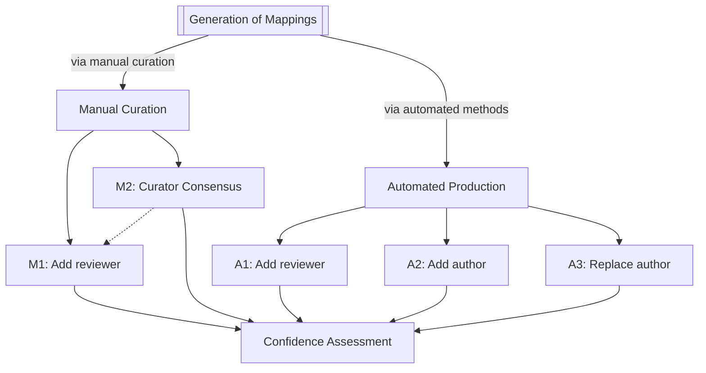

A flowchart.

[Simple Standard for Sharing Ontological Mappings (SSSOM)](https://mapping-commons.github.io/sssom/).

The following SSSOM omits the metadata - standard
[Semantic Farm](https://semantic.farm/) prefixes should be assumed (previously called Bioregistry).

The following SSSOM contains two mappings between the
[Monarch Disease Ontology (MONDO)](https://semantic.farm/mondo) - one that was produced
through [SSSOM Curator's](https://github.com/cthoyt/sssom-curator)
lexical matching workflow, and one that was manually curated.

The way the mappings were captured is reflected in the `mapping_justification`
field via [Semantic Mapping Vocabulary (SEMAPV)](https://semantic.farm/semapv)
terms - the lexical matching gets
[semapv:LexicalMatching](https://semantic.farm/semapv:LexicalMatching) and the manual curation gets
[semapv:ManualMappingCuration](https://semantic.farm/ManualMappingCuration).

The kind of mapping also strongly suggests what metadata gets added to the mapping. The lexical mapping has information
about the mapping tool (and could additionally include fields like
[subject_match_field](https://mapping-commons.github.io/sssom/dev/subject_match_field/),
[object_match_field](https://mapping-commons.github.io/sssom/dev/object_match_field/),
and [match_string](https://mapping-commons.github.io/sssom/dev/match_string/)). Importantly, the manual curation
contains an `author_id` for the individual who did the curation. Both kinds of mappings include a
[confidence](https://mapping-commons.github.io/sssom/dev/confidence/), which allows either the mapping tool or the
curator to self-report the confidence in the mapping's correctness.

| subject_id                                           | subject_label         | predicate_id                                             | object_id                                    | object_label          | mapping_justification                                                       | author_id                                                                    | mapping_tool  | mapping_tool_id                                                  | mapping_tool_version | confidence |
|------------------------------------------------------|-----------------------|----------------------------------------------------------|----------------------------------------------|-----------------------|-----------------------------------------------------------------------------|------------------------------------------------------------------------------|---------------|------------------------------------------------------------------|----------------------|------------|
| [MONDO:0005641](https://semantic.farm/MONDO:0005641) | aleutian mink disease | [skos:exactMatch](https://semantic.farm/skos:exactMatch) | [DOID:2934](https://semantic.farm/DOID:2934) | aleutian mink disease | [semapv:ManualMappingCuration](https://semantic.farm/ManualMappingCuration) | [orcid:0000-0003-4423-4370](https://semantic.farm/orcid:0000-0003-4423-4370) |               |                                                                  |                      | 0.99       |
| [MONDO:0005676](https://semantic.farm/MONDO:0005676) | borna disease         | [skos:exactMatch](https://semantic.farm/skos:exactMatch) | [DOID:5154](https://semantic.farm/DOID:5154) | borna disease         | [semapv:LexicalMatching](https://semantic.farm/semapv:LexicalMatching)      |                                                                              | SSSOM Curator | [wikidata:Q138902949](https://semantic.farm/wikidata:Q138902949) | 0.6.3                | 0.778      |

## M1: Add Reviewer

the first and most obvious semantic mapping review workflow is for a second curator to review the work
of the first one. SSSOM allows a reviewer to add into the `reviewer_id` slot their ORCID and optionally
add their level of _agreement_ in the [reviewer_agreement](https://mapping-commons.github.io/sssom/dev/match_string/) field, where -1.0 means full
disagreement, 0.0 means unsure, and 1.0 means full agreement.

The reviewer can also add the optional `review_date`, which is helpful for historical purposes when understanding
the lifecycle of a mapping, e.g., compared to the `mapping_date`.

| subject_id                                           | subject_label         | predicate_id                                             | object_id                                    | object_label          | mapping_justification                                                       | author_id                                                                    | confidence | reviewer_id                                                                  | reviewer_agreement |
|------------------------------------------------------|-----------------------|----------------------------------------------------------|----------------------------------------------|-----------------------|-----------------------------------------------------------------------------|------------------------------------------------------------------------------|------------|------------------------------------------------------------------------------|--------------------|
| [MONDO:0005641](https://semantic.farm/MONDO:0005641) | aleutian mink disease | [skos:exactMatch](https://semantic.farm/skos:exactMatch) | [DOID:2934](https://semantic.farm/DOID:2934) | aleutian mink disease | [semapv:ManualMappingCuration](https://semantic.farm/ManualMappingCuration) | [orcid:0000-0003-4423-4370](https://semantic.farm/orcid:0000-0003-4423-4370) | 0.99       | [orcid:0000-0001-5208-3432](https://semantic.farm/orcid:0000-0001-5208-3432) | 1.0                |

Warning: this workflow is _destructive_, meaning that the identity of the record changes. 
It's not recommended to try and avoid changing the identity of the mapping by creating a new record
that only has a review

## M2: Curator Consensus

the second semantic mapping review workflow is to have a second (or more) curators manually curate the same mapping in isolation,
then to compare the results.

the curator consensus workflow can also feed into the review workflow, as each mapping can be reviewed separately.

| subject_id                                           | subject_label         | predicate_id                                             | object_id                                    | object_label          | mapping_justification                                                       | author_id                                                                    | confidence |
|------------------------------------------------------|-----------------------|----------------------------------------------------------|----------------------------------------------|-----------------------|-----------------------------------------------------------------------------|------------------------------------------------------------------------------|------------|
| [MONDO:0005641](https://semantic.farm/MONDO:0005641) | aleutian mink disease | [skos:exactMatch](https://semantic.farm/skos:exactMatch) | [DOID:2934](https://semantic.farm/DOID:2934) | aleutian mink disease | [semapv:ManualMappingCuration](https://semantic.farm/ManualMappingCuration) | [orcid:0000-0003-4423-4370](https://semantic.farm/orcid:0000-0003-4423-4370) | 0.99       |
| [MONDO:0005641](https://semantic.farm/MONDO:0005641) | aleutian mink disease | [skos:exactMatch](https://semantic.farm/skos:exactMatch) | [DOID:2934](https://semantic.farm/DOID:2934) | aleutian mink disease | [semapv:ManualMappingCuration](https://semantic.farm/ManualMappingCuration) | [orcid:0000-0003-1307-2508](https://semantic.farm/0000-0003-1307-2508)       | 0.98       |

Warning: this workflow is _idempotent_, meaning that the identity of the original record does _not_ change.
