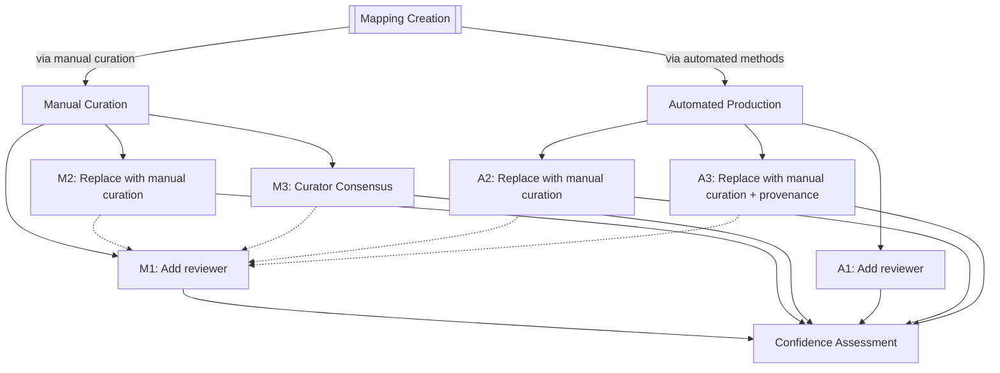

This post describes several complementary workflows for reviewing semantic
mappings in the
[Simple Standard for Sharing Ontological Mappings (SSSOM)](https://mapping-commons.github.io/sssom/)
generated by either manual curation or (semi-)automated methods. It then
demonstrates how the [SSSOM Curator](https://github.com/cthoyt/sssom-curator)
software package implements some of these workflows for the
[Biomappings](https://github.com/biopragmatics/biomappings) project.

This post continues the series on my current work in
[NFDI4Chem](https://nfdi4chem.de) and
[NFDI Section Metadata Working Group on Ontology Harmonization and Mapping](https://github.com/nfdi-de/section-metadata-wg-onto)
to support [Philip Strömert](https://github.com/StroemPhi) and
[Noura Rayya](https://github.com/NRayya) in revitalizing the
[Chemical Methods Ontology (CHMO)](https://semantic.farm/chmo). It is the next
logical step following my recent post on [comparing manually curated
SSSOM](), which effectively
prioritized discrepancies in a curator consensus workflow that needed to be
reviewed and/or edited. This post helps organize thinking about how to approach
this.

## Classification of Review Workflows

The main goal of this post is to present several different workflows and
strategies for reviewing both manually curated semantic mappings and predicted
semantic mappings in the
[Simple Standard for Sharing Ontological Mappings (SSSOM)](https://mapping-commons.github.io/sssom/)
format.

The table below contains four semantic mappings in the SSSOM TSV format that
I'll use as examples through this post. They are drawn from the
community-curated [Biomappings](https://github.com/biopragmatics/biomappings)
project and [current work](https://github.com/rsc-ontology/rsc-cmo/pull/77) on
the [Chemical Methods Ontology (CHMO)](https://semantic.farm) driven by
NFDI4Chem. Rather than showing valid SSSOM TSV file each time, I'm going to omit
the mapping set metadata. You should assume that I'm always using stadard
prefixes from the [Semantic Farm](https://semantic.farm/) (previously called
Bioregistry), except in the case of the `record_id` column where I added dummy
identifiers using the `ex:` prefix for ease of reference throughout this post.

The first two example mappings `ex:1` and `ex:2` are manually curated. This is
reflected in the `mapping_justification` field which contains
[Semantic Mapping Vocabulary (SEMAPV)](https://semantic.farm/semapv) term
[semapv:ManualMappingCuration](https://semantic.farm/ManualMappingCuration). The
second two example mappings are lexical predictions from the Biomappings project
produced through [SSSOM Curator's](https://github.com/cthoyt/sssom-curator)
lexical matching workflow and therefore have
[semapv:LexicalMatching](https://semantic.farm/semapv:LexicalMatching) as their
justifications.

The mapping justification also strongly suggests what metadata gets added to the
mapping. The manually curated mappings contains an `author_id` for the
individual who did the curation. The lexical mappings have information about the
mapping tool (and could additionally include fields like
[subject_match_field](https://w3id.org/sssom/subject_match_field),
[object_match_field](https://w3id.org/sssom/object_match_field), and
[match_string](https://w3id.org/sssom/match_string)). Both kinds of mappings
include a [confidence](https://w3id.org/sssom/confidence), which allows either
the mapping tool or the curator to self-report the confidence in the mapping's
correctness.

| record_id | subject_id                                           | subject_label                    | predicate_id                                             | object_id                                          | object_label                         | mapping_justification                                                       | author_id                                                                    | mapping_tool  | mapping_tool_id                                                  | mapping_tool_version | confidence |
| --------- | ---------------------------------------------------- | -------------------------------- | -------------------------------------------------------- | -------------------------------------------------- | ------------------------------------ | --------------------------------------------------------------------------- | ---------------------------------------------------------------------------- | ------------- | ---------------------------------------------------------------- | -------------------- | ---------: |
| ex:1      | [MONDO:0005641](https://semantic.farm/MONDO:0005641) | aleutian mink disease            | [skos:exactMatch](https://semantic.farm/skos:exactMatch) | [DOID:2934](https://semantic.farm/DOID:2934)       | aleutian mink disease                | [semapv:ManualMappingCuration](https://semantic.farm/ManualMappingCuration) | [orcid:0000-0003-4423-4370](https://semantic.farm/orcid:0000-0003-4423-4370) |               |                                                                  |                      |       0.99 |
| ex:2      | [FIX:0000629](https://semantic.farm/FIX:0000629)     | pulsed field gel electrophoresis | [skos:exactMatch](https://semantic.farm/skos:exactMatch) | [CHMO:0002315](https://semantic.farm/CHMO:0002315) | pulsed-field electrophoresis         | [semapv:ManualMappingCuration](https://semantic.farm/ManualMappingCuration) | [orcid:0009-0009-1663-1003](https://semantic.farm/orcid:0009-0009-1663-1003) |               |                                                                  |                      |        0.8 |
| ex:3      | [MONDO:0005676](https://semantic.farm/MONDO:0005676) | borna disease                    | [skos:exactMatch](https://semantic.farm/skos:exactMatch) | [DOID:5154](https://semantic.farm/DOID:5154)       | borna disease                        | [semapv:LexicalMatching](https://semantic.farm/semapv:LexicalMatching)      |                                                                              | SSSOM Curator | [wikidata:Q138902949](https://semantic.farm/wikidata:Q138902949) | 0.6.3                |      0.778 |
| ex:4      | [MONDO:0015053](https://semantic.farm/MONDO:0015053) | hereditary angioedema type 1     | [skos:exactMatch](https://semantic.farm/skos:exactMatch) | [mesh:D056829](https://semantic.farm/mesh:D056829) | Hereditary Angioedema Types I and II | [semapv:LexicalMatching](https://semantic.farm/semapv:LexicalMatching)      |                                                                              | SSSOM Curator | [wikidata:Q138902949](https://semantic.farm/wikidata:Q138902949) | 0.6.3                |       0.54 |

### M1: Reviewing a Manually Curated Mapping

The most obvious review workflow for manually curated semantic mappings is for a
second curator (the reviewer) to decide if they agree, disagree, or are unsure
about the correctness of the manually curated semantic mapping. The reviewer
then adds their ORCiD into the `reviewer_id` column and their level of agreement
in the [reviewer_agreement](https://w3id.org/sssom/reviewer_agreement) column,
in which $+1.0$ means full agreement, $0.0$ means ambivalence, and $-1.0$ means
full disagreement. The reviewer can optionally add the date of review in the
[ `review_date`](https://w3id.org/sssom/review_date) column to support
historical analyses, e.g., that help understand the lifecycles of mappings.

The following example illustrates what it would look like if Nicole Vasilevsky
(one of the primary maintainers of MONDO) positively reviewed the manually
curated mapping between the MONDO and DOID terms for _aleutian mink disease_
from `ex:1`. Scroll to the right to see the `reviewer_id` and
`reviewer_agreement` columns, which appear in the order prescribed by the
[TSV serialization](https://mapping-commons.github.io/sssom/dev/spec-formats-tsv/)
section of the SSSOM Specification.

| record_id | subject_id                                           | subject_label         | predicate_id                                             | object_id                                    | object_label          | mapping_justification                                                       | author_id                                                                    | confidence | reviewer_id                                                                  | reviewer_agreement |
| --------- | ---------------------------------------------------- | --------------------- | -------------------------------------------------------- | -------------------------------------------- | --------------------- | --------------------------------------------------------------------------- | ---------------------------------------------------------------------------- | ---------- | ---------------------------------------------------------------------------- | -----------------: |
| ex:5      | [MONDO:0005641](https://semantic.farm/MONDO:0005641) | aleutian mink disease | [skos:exactMatch](https://semantic.farm/skos:exactMatch) | [DOID:2934](https://semantic.farm/DOID:2934) | aleutian mink disease | [semapv:ManualMappingCuration](https://semantic.farm/ManualMappingCuration) | [orcid:0000-0003-4423-4370](https://semantic.farm/orcid:0000-0003-4423-4370) | 0.99       | [orcid:0000-0001-5208-3432](https://semantic.farm/orcid:0000-0001-5208-3432) |                1.0 |

The following example illustrates what it looked like when Philip Strömert (one
of the new maintainers of CHMO) negatively reviewed the manually curated mapping
between the FIX and CHMO terms in `ex:2`, which actually should have the
relation that the
[FIX:0000629 (pulsed field gel electrophoresis)](https://semantic.farm/FIX:0000629)
is narrower than
[CHMO:0002315 (pulsed-field electrophoresis)](https://semantic.farm/CHMO:0002315).
Therefore, the `reviewer_agreement` is set to -1.0, meaning full disagree.

| record_id | subject_id                                       | subject_label                    | predicate_id                                             | object_id                                           | object_label                 | mapping_justification                                                       | author_id                                                                    | confidence | reviewer_id                                                                  | reviewer_agreement |
| --------- | ------------------------------------------------ | -------------------------------- | -------------------------------------------------------- | --------------------------------------------------- | ---------------------------- | --------------------------------------------------------------------------- | ---------------------------------------------------------------------------- | ---------: | ---------------------------------------------------------------------------- | -----------------: |
| ex:6      | [FIX:0000629](https://semantic.farm/FIX:0000629) | pulsed field gel electrophoresis | [skos:exactMatch](https://semantic.farm/skos:exactMatch) | [CHMO:0002315](https://semantic-.farm/CHMO:0002315) | pulsed-field electrophoresis | [semapv:ManualMappingCuration](https://semantic.farm/ManualMappingCuration) | [orcid:0009-0009-1663-1003](https://semantic.farm/orcid:0009-0009-1663-1003) |        0.8 | [orcid:0000-0002-1595-3213](https://semantic.farm/orcid:0000-0002-1595-3213) |               -1.0 |

It's not so common to have a situation where the reviewer will be fully
ambivalent and annotate the `reviewer_agreement` as $0.0$, so no example is
given for this scenario.

> [!WARNING]
>
> Note that this review workflow is _destructive_ - it alters the identity of
> the semantic mapping record (i.e., a row in the SSSOM file). Importantly, this
> means that the semantic mapping record's
> [hash](https://mapping-commons.github.io/sssom/dev/spec-support-hashing/)
> changes. This is an important implementation detail depending on how you or
> your semantic mapping review software persists its semantic mappings.

This workflow is implemented in SSSOM Pydantic in
[sssom_pydantic.process.review ()](https://sssom-pydantic.readthedocs.io/en/latest/api/sssom_pydantic.process.review.html).
SSSOM Pydantic models semantic mappings as frozen objects, meaning that no
operations happen in-place (i.e., all are _destructive_).

### M2: Replacing a Manually Curated Mapping

The primary disadvantage with workflow M1 for reviewing a manually curated
mapping is that when the reviewer disagrees, the workflow does not give the
opportunity for the reviewer to either explicitly mark the mapping as incorrect
or to fix it. The first version of the M2 workflow is to replace the original
with a new mapping explicitly marking it as incorrect by making the following
changes:

1. Invert the `predicate_modifier` (which almost always just means adding one)
2. Replace the reference in the `author_id` column with the reviewer's ORCiD
3. Replace the original author's confidence with the reviewer's

Below, the first version of workflow M2 is applied to `ex:2`:

| record_id | subject_id                                       | subject_label                    | predicate_id                                             | predicate_modifier | object_id                                           | object_label                 | mapping_justification                                                       | author_id                                                                    | confidence |
| --------- | ------------------------------------------------ | -------------------------------- | -------------------------------------------------------- | ------------------ | --------------------------------------------------- | ---------------------------- | --------------------------------------------------------------------------- | ---------------------------------------------------------------------------- | ---------: |
| ex:7      | [FIX:0000629](https://semantic.farm/FIX:0000629) | pulsed field gel electrophoresis | [skos:exactMatch](https://semantic.farm/skos:exactMatch) | Not                | [CHMO:0002315](https://semantic-.farm/CHMO:0002315) | pulsed-field electrophoresis | [semapv:ManualMappingCuration](https://semantic.farm/ManualMappingCuration) | [orcid:0000-0002-1595-3213](https://semantic.farm/orcid:0000-0002-1595-3213) |       0.95 |

The second version of the workflow M2 is applicable when the reviewer knows how
to fix the mapping. In the pulsed-field electrophoresis example, the mapping can
be fixed by changing the predicate from exact match to narrow match. Similarly,
the old mapping gets replaced with the reviewer's ORCiD as the new author, a new
predicate, a new confidence, and any other relevant changes.

| record_id | subject_id                                       | subject_label                    | predicate_id                                               | object_id                                           | object_label                 | mapping_justification                                                       | author_id                                                                    | confidence |
| --------- | ------------------------------------------------ | -------------------------------- | ---------------------------------------------------------- | --------------------------------------------------- | ---------------------------- | --------------------------------------------------------------------------- | ---------------------------------------------------------------------------- | ---------: |
| ex:8      | [FIX:0000629](https://semantic.farm/FIX:0000629) | pulsed field gel electrophoresis | [skos:narrowMatch](https://semantic.farm/skos:narrowMatch) | [CHMO:0002315](https://semantic-.farm/CHMO:0002315) | pulsed-field electrophoresis | [semapv:ManualMappingCuration](https://semantic.farm/ManualMappingCuration) | [orcid:0000-0002-1595-3213](https://semantic.farm/orcid:0000-0002-1595-3213) |       0.95 |

After, this mapping can once again undergo mapping workflow M1!

### M3: Achieving Curator Consensus

In the workflow M3, two or more curators are tasked to independently manually
curate mappings (e.g., between the same two resources). The appearance of the
same mapping in two or more of the curators results can be used as a stand-in
for review. Conversely, workflow M3 can also amplify systematically incorrect
correct, e.g., where every curator makes the same mistake because of some
qualities of the resources being curated.

While I was locked down with my parents and sister (a microbiologist) during the
COVID-19 pandemic, I trained her in semantic mapping curation, then she made
significant contributions to the original Biomappings paper and then to disease
mappings in MONDO and DOID. I could imagine recuriting her for a curator
consensus scenario, where she would independently add `ex:9` with her own
confidence (and any other columns).

| record_id | subject_id                                           | subject_label         | predicate_id                                             | object_id                                    | object_label          | mapping_justification                                                       | author_id                                                                    | confidence |
| --------- | ---------------------------------------------------- | --------------------- | -------------------------------------------------------- | -------------------------------------------- | --------------------- | --------------------------------------------------------------------------- | ---------------------------------------------------------------------------- | ---------: |
| ex:1      | [MONDO:0005641](https://semantic.farm/MONDO:0005641) | aleutian mink disease | [skos:exactMatch](https://semantic.farm/skos:exactMatch) | [DOID:2934](https://semantic.farm/DOID:2934) | aleutian mink disease | [semapv:ManualMappingCuration](https://semantic.farm/ManualMappingCuration) | [orcid:0000-0003-4423-4370](https://semantic.farm/orcid:0000-0003-4423-4370) |       0.99 |
| ex:9      | [MONDO:0005641](https://semantic.farm/MONDO:0005641) | aleutian mink disease | [skos:exactMatch](https://semantic.farm/skos:exactMatch) | [DOID:2934](https://semantic.farm/DOID:2934) | aleutian mink disease | [semapv:ManualMappingCuration](https://semantic.farm/ManualMappingCuration) | [orcid:0000-0003-1307-2508](https://semantic.farm/orcid:0000-0003-1307-2508) |       0.98 |

After applying workflow M3, the comparison workflow I proposed [in a previous
post]() can be used to highlight discrepancies that
can be reviewed with workflow M1 and/or M2.

> [!NOTE]
>
> Unlike workflows M1 and M2, this review workflow is _idempotent_ - it does not
> alter the identity of the semantic mapping record (i.e., a row in the SSSOM
> file).

### A1: Reviewing a Predicted Mapping

This workflow operates similarly to workflow M1 where a reviewer adds their
information into the `reviewer_id`, `reviewer_agreement`, and `review_date`
slots. However, the disadvantage of this workflow is that justifications for
predicted mappings such as
[semapv:LexicalMatching](https://semantic.farm/semapv:LexicalMatching) and
[semapv:SemanticSimilarityThresholdMatching](https://semantic.farm/semapv:SemanticSimilarityThresholdMatching)
are weaker, and review does not upgrade their justification to
[semapv:ManualMappingCuration](https://semantic.farm/semapv:ManualMappingCuration),
which is implicitly more trustworthy.

In the following example, mapping `ex:3` is reviewed with high agreement.

| record_id | subject_id                                           | subject_label | predicate_id                                             | object_id                                    | object_label  | mapping_justification                                                  | mapping_tool  | mapping_tool_id                                                  | mapping_tool_version | confidence | reviewer_id                                                                  | reviewer_agreement |
| --------- | ---------------------------------------------------- | ------------- | -------------------------------------------------------- | -------------------------------------------- | ------------- | ---------------------------------------------------------------------- | ------------- | ---------------------------------------------------------------- | -------------------- | ---------: | ---------------------------------------------------------------------------- | -----------------: |
| ex:10     | [MONDO:0005676](https://semantic.farm/MONDO:0005676) | borna disease | [skos:exactMatch](https://semantic.farm/skos:exactMatch) | [DOID:5154](https://semantic.farm/DOID:5154) | borna disease | [semapv:LexicalMatching](https://semantic.farm/semapv:LexicalMatching) | SSSOM Curator | [wikidata:Q138902949](https://semantic.farm/wikidata:Q138902949) | 0.6.3                |      0.778 | [orcid:0000-0001-5208-3432](https://semantic.farm/orcid:0000-0001-5208-3432) |                1.0 |

Conversely, in the following example, mapping `ex:4` is reviewed, with high
disagreement.

| record_id | subject_id                                           | subject_label                | predicate_id                                             | object_id                                          | object_label                         | mapping_justification                                                  | mapping_tool  | mapping_tool_id                                                  | mapping_tool_version | confidence | reviewer_id                                                                  | reviewer_agreement |
| --------- | ---------------------------------------------------- | ---------------------------- | -------------------------------------------------------- | -------------------------------------------------- | ------------------------------------ | ---------------------------------------------------------------------- | ------------- | ---------------------------------------------------------------- | -------------------- | ---------: | ---------------------------------------------------------------------------- | -----------------: |
| ex:11     | [MONDO:0015053](https://semantic.farm/MONDO:0015053) | hereditary angioedema type 1 | [skos:exactMatch](https://semantic.farm/skos:exactMatch) | [mesh:D056829](https://semantic.farm/mesh:D056829) | Hereditary Angioedema Types I and II | [semapv:LexicalMatching](https://semantic.farm/semapv:LexicalMatching) | SSSOM Curator | [wikidata:Q138902949](https://semantic.farm/wikidata:Q138902949) | 0.6.3                |       0.54 | [orcid:0000-0001-5208-3432](https://semantic.farm/orcid:0000-0001-5208-3432) |               -1.0 |

This workflow is implemented in SSSOM Pydantic in
[sssom_pydantic.process.review ()](https://sssom-pydantic.readthedocs.io/en/latest/api/sssom_pydantic.process.review.html).
The implementation is shared for workflow W1 and A1.

### A2: Replacing a Predicted Mapping with a Manual Curation

In this workflow that mirrors workflow M2, a reviewer of a predicted mapping
overwrites the predicted mapping with a manual curation. Unlike M2, this
workflow importantly includes the following changes:

- Update the mapping justification to
  [semapv:ManualMappingCuration](https://semantic.farm/semapv:ManualMappingCuration)
- Drop mapping tool and prediction-related fields
- Fill out the `author_id` field and `confidence` (not the `reviewer_id` and
  `reviewer_agreement`)

The following example shows this workflow applied to mapping `ex:3`:

| record_id | subject_id                                           | subject_label | predicate_id                                             | object_id                                    | object_label  | mapping_justification                                                  | author_id                                                                    | confidence |
| --------- | ---------------------------------------------------- | ------------- | -------------------------------------------------------- | -------------------------------------------- | ------------- | ---------------------------------------------------------------------- | ---------------------------------------------------------------------------- | ---------: |
| ex:12     | [MONDO:0005676](https://semantic.farm/MONDO:0005676) | borna disease | [skos:exactMatch](https://semantic.farm/skos:exactMatch) | [DOID:5154](https://semantic.farm/DOID:5154) | borna disease | [semapv:LexicalMatching](https://semantic.farm/semapv:LexicalMatching) | [orcid:0000-0001-5208-3432](https://semantic.farm/orcid:0000-0001-5208-3432) |        1.0 |

I'm going to omit showing what happens when you want to reject a mapping (`Not`
gets added) or update the predicate. These both work as expected in light of
workflow M2. Similarly, the results of any application of workflow A2 can then
be reviewed with workflow M1 after.

This workflow is implemented in SSSOM Pydantic in
[sssom_pydantic.process.curate ()](<[https://sssom-pydantic.readthedocs.io/en/latest/api/sssom_pydantic.process.review.html](https://sssom-pydantic.readthedocs.io/en/latest/api/sssom_pydantic.process.curate.html)>).
SSSOM Pydantic models semantic mappings as frozen objects, meaning that no
operations happen in-place (i.e., all are _destructive_).

### A3: Deriving a Manual Curation from a Predicted Mapping

One of the drawbacks of workflow A2 is that it throws away provenance
information from the lexical mapping. Depending on your use case, it might be
desired to keep that. Workflow A3 extends workflow A2 to keep the original
mapping intact and simply append the new mapping. Importantly, the new mapping
uses the [derived_from](https://w3id.org/sssom/derived_from) field to point back
to original predicted mapping record via the
[SSSOM record hash](https://mapping-commons.github.io/sssom/spec-support-hashing/).
This is implemented in SSSOM Pydantic (note, the example hash in `ex:13` is made
up, I might add a real one later).

| record_id | subject_id                                           | subject_label | predicate_id                                             | object_id                                    | object_label  | mapping_justification                                                       | author_id                                                                    | mapping_tool  | mapping_tool_id                                                  | mapping_tool_version | confidence | derived_from        |
| --------- | ---------------------------------------------------- | ------------- | -------------------------------------------------------- | -------------------------------------------- | ------------- | --------------------------------------------------------------------------- | ---------------------------------------------------------------------------- | ------------- | ---------------------------------------------------------------- | -------------------- | ---------: | ------------------- |
| ex:3      | [MONDO:0005676](https://semantic.farm/MONDO:0005676) | borna disease | [skos:exactMatch](https://semantic.farm/skos:exactMatch) | [DOID:5154](https://semantic.farm/DOID:5154) | borna disease | [semapv:LexicalMatching](https://semantic.farm/semapv:LexicalMatching)      |                                                                              | SSSOM Curator | [wikidata:Q138902949](https://semantic.farm/wikidata:Q138902949) | 0.6.3                |      0.778 |                     |
| ex:13     | [MONDO:0005676](https://semantic.farm/MONDO:0005676) | borna disease | [skos:exactMatch](https://semantic.farm/skos:exactMatch) | [DOID:5154](https://semantic.farm/DOID:5154) | borna disease | [semapv:ManualMappingCuration](https://semantic.farm/ManualMappingCuration) | [orcid:0000-0003-4423-4370](https://semantic.farm/orcid:0000-0003-4423-4370) |               |                                                                  |                      |       0.99 | `mapping:CED101AFD` |

This workflow is implemented by a combination of SSSOM Pydantic's `curate()`
function and the harness implemented by SSSOM Curator, but the way that mappings
get persisted are ultimately an implementation detail.

## Demo

In the following demo, I show how the
[SSSOM Curator](https://github.com/cthoyt/sssom-curator), which runs the
[Biomappings](https://github.com/biopragmatics/biomappings) project, implements
workflow A2 while curating some CHMO and IUPAC Goldbook mappings.

<iframe width="100%" height="500" src="https://www.youtube.com/embed/FkXkOhT8gdc?si=fwlqCPTttYTxy1oR&amp;start=448" title="YouTube video player" frameborder="0" allow="accelerometer; autoplay; clipboard-write; encrypted-media; gyroscope; picture-in-picture; web-share" referrerpolicy="strict-origin-when-cross-origin" allowfullscreen></iframe>

  

## Parting Thoughts

### Review with LLMs

Nico Matentzoglu, _et al._ (2023) published
[MapperGPT: large language models for linking and mapping entities](https://arxiv.org/abs/2310.03666),
which suggests that agentic workflows such as those based on large language
models (LLMs) could be used to _review_ semantic mappings. Since 2023, several
others have investigated the idea as well. I'm skeptical of the use of the word
_review_ here - I think that the `reviewer_id` slot should be reserved only
review by a human (or group humans; the slot is multivalued). In my opinion, the
point of review is to add a trustworthy judgment to a semantic mapping. I'm not
against the use of (semi-) automated methods for producing mappings, but it
seems silly to have one automated method to assess another one.

### Back to CHMO

At the top of the post, I mentioned the main goal was to help think through the
curator consensus scenario for CHMO, in which we had two curators produce
hundreds of mostly overlapping mappings. The workflow from [the previous
post]() identified mappings that
were manually curated, but had conflicts, so this meant that we need to apply a
combination of workflow M1 to accept the correct mappings and workflow M2 to
mark the incorrect ones or fix them. Then, either the consensus workflow M3
could be used for the rest, or Philip could do lots of painstaking work and do
workflow M1. Since we want this to be a gold standard, he's going to go down the
M1 route and do a careful review of everything from the perspective of the
student's curations. Then, we could always apply the whole comparison workflow
again and take a quick final pass!

### Confidence Model

Each of the workflows presented here has drawbacks and might be appropriate
depending on your goals and the software you're using. In the end, you might
have a combination of manually curated and automatically generated mappings,
some of which are reviewed and some of which are not.

The next step is to collapse many evidences into a single mapping that can be
used for downstream applications of semantic mappings, such as in the
construction of knowledge graphs. Part of that is to estimate the confidence of
the consensus mapping. I originally started thinking about these ideas while
developing the
[Semantic Mapping Reasoner and Assembler (SeMRA)](https://github.com/biopragmatics/semra),
but refined and generalized the ideas to be applicable to arbitrary semantic
mappings in SSSOM
[here](https://mapping-commons.github.io/sssom/dev/confidence-model). In a
follow-up post, I'll write more about the SSSOM confidence model and the
algorithm I proposed for estimating combine confidences.
