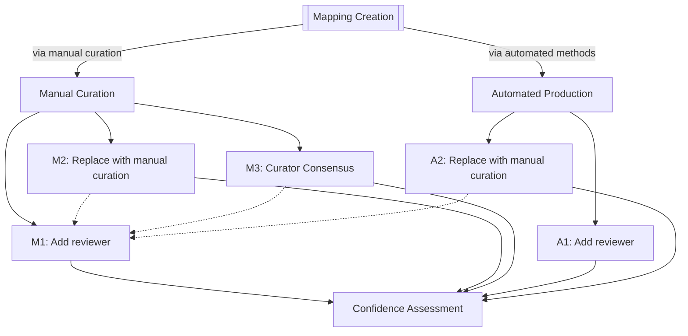

This post describes and categorizes several different workflows for reviewing
semantic mappings, both created through manual curation and (semi-)automated
methods.

Why:

1. follow-up to post about the [sssom comparion
   workflow]()
2. have to decide how to go about reviewing student mappings for CHMO
3. thinking about implementation of the web-based mechanism in SSSOM-Curator

A flowchart.

[Simple Standard for Sharing Ontological Mappings (SSSOM)](https://mapping-commons.github.io/sssom/).

The following SSSOM omits the metadata - standard
[Semantic Farm](https://semantic.farm/) prefixes should be assumed (previously
called Bioregistry).

The following SSSOM contains two mappings between the
[Monarch Disease Ontology (MONDO)](https://semantic.farm/mondo) - one that was
produced through [SSSOM Curator's](https://github.com/cthoyt/sssom-curator)
lexical matching workflow, and one that was manually curated.

The way the mappings were captured is reflected in the `mapping_justification`
field via [Semantic Mapping Vocabulary (SEMAPV)](https://semantic.farm/semapv)
terms - the lexical matching gets
[semapv:LexicalMatching](https://semantic.farm/semapv:LexicalMatching) and the
manual curation gets
[semapv:ManualMappingCuration](https://semantic.farm/ManualMappingCuration).

The kind of mapping also strongly suggests what metadata gets added to the
mapping. The lexical mapping has information about the mapping tool (and could
additionally include fields like
[subject_match_field](https://w3id.org/sssom/subject_match_field),
[object_match_field](https://w3id.org/sssom/object_match_field), and
[match_string](https://w3id.org/sssom/match_string)). Importantly, the manual
curation contains an `author_id` for the individual who did the curation. Both
kinds of mappings include a [confidence](https://w3id.org/sssom/confidence),
which allows either the mapping tool or the curator to self-report the
confidence in the mapping's correctness.

| record_id | subject_id                                           | subject_label                    | predicate_id                                             | object_id                                          | object_label                         | mapping_justification                                                       | author_id                                                                    | mapping_tool  | mapping_tool_id                                                  | mapping_tool_version | confidence |
| --------- | ---------------------------------------------------- | -------------------------------- | -------------------------------------------------------- | -------------------------------------------------- | ------------------------------------ | --------------------------------------------------------------------------- | ---------------------------------------------------------------------------- | ------------- | ---------------------------------------------------------------- | -------------------- | ---------: |
| ex:1      | [MONDO:0005641](https://semantic.farm/MONDO:0005641) | aleutian mink disease            | [skos:exactMatch](https://semantic.farm/skos:exactMatch) | [DOID:2934](https://semantic.farm/DOID:2934)       | aleutian mink disease                | [semapv:ManualMappingCuration](https://semantic.farm/ManualMappingCuration) | [orcid:0000-0003-4423-4370](https://semantic.farm/orcid:0000-0003-4423-4370) |               |                                                                  |                      |       0.99 |
| ex:2      | [FIX:0000629](https://semantic.farm/FIX:0000629)     | pulsed field gel electrophoresis | [skos:exactMatch](https://semantic.farm/skos:exactMatch) | [CHMO:0002315](https://semantic.farm/CHMO:0002315) | pulsed-field electrophoresis         | [semapv:ManualMappingCuration](https://semantic.farm/ManualMappingCuration) | [orcid:0009-0009-1663-1003](https://semantic.farm/orcid:0009-0009-1663-1003) |               |                                                                  |                      |        0.8 |
| ex:3      | [MONDO:0005676](https://semantic.farm/MONDO:0005676) | borna disease                    | [skos:exactMatch](https://semantic.farm/skos:exactMatch) | [DOID:5154](https://semantic.farm/DOID:5154)       | borna disease                        | [semapv:LexicalMatching](https://semantic.farm/semapv:LexicalMatching)      |                                                                              | SSSOM Curator | [wikidata:Q138902949](https://semantic.farm/wikidata:Q138902949) | 0.6.3                |      0.778 |
| ex:4      | [MONDO:0015053](https://semantic.farm/MONDO:0015053) | hereditary angioedema type 1     | [skos:exactMatch](https://semantic.farm/skos:exactMatch) | [mesh:D056829](https://semantic.farm/mesh:D056829) | Hereditary Angioedema Types I and II | [semapv:LexicalMatching](https://semantic.farm/semapv:LexicalMatching)      |                                                                              | SSSOM Curator | [wikidata:Q138902949](https://semantic.farm/wikidata:Q138902949) | 0.6.3                |       0.54 |

## M1: Reviewing a Manually Curated Mapping

The most obvious review workflow for manually curated semantic mappings is for a
second curator (the reviewer) to decide if they agree, disagree, or are unsure
about the correctness of the manually curated semantic mapping. The reviewer
then adds their ORCiD into the `reviewer_id` column and their level of agreement
in the [reviewer_agreement](https://w3id.org/sssom/reviewer_agreement) column,
in which $+1.0$ means full agreement, $0.0$ means ambivalence, and $-1.0$ means
full disagreement. The reviewer can optionally add the date of review in the
[ `review_date`](https://w3id.org/sssom/review_date) column to support
historical analyses, e.g., that help understand the lifecycles of mappings.

The following example illustrates what it would look like if Nicole Vasilevsky
(one of the primary maintainers of MONDO) positively reviewed the manually
curated mapping between the MONDO and DOID terms for _aleutian mink disease_
from `ex:1`. Scroll to the right to see the `reviewer_id` and
`reviewer_agreement` columns, which appear in the order prescribed by the
[TSV serialization](https://mapping-commons.github.io/sssom/dev/spec-formats-tsv/)
section of the SSSOM Specification.

| record_id | subject_id                                           | subject_label         | predicate_id                                             | object_id                                    | object_label          | mapping_justification                                                       | author_id                                                                    | confidence | reviewer_id                                                                  | reviewer_agreement |
| --------- | ---------------------------------------------------- | --------------------- | -------------------------------------------------------- | -------------------------------------------- | --------------------- | --------------------------------------------------------------------------- | ---------------------------------------------------------------------------- | ---------- | ---------------------------------------------------------------------------- | -----------------: |
| ex:5      | [MONDO:0005641](https://semantic.farm/MONDO:0005641) | aleutian mink disease | [skos:exactMatch](https://semantic.farm/skos:exactMatch) | [DOID:2934](https://semantic.farm/DOID:2934) | aleutian mink disease | [semapv:ManualMappingCuration](https://semantic.farm/ManualMappingCuration) | [orcid:0000-0003-4423-4370](https://semantic.farm/orcid:0000-0003-4423-4370) | 0.99       | [orcid:0000-0001-5208-3432](https://semantic.farm/orcid:0000-0001-5208-3432) |                1.0 |

The following example illustrates what it looked like when Philip Strömert (one
of the new maintainers of CHMO) negatively reviewed the manually curated mapping
between the FIX and CHMO terms in `ex:2`, which actually should have the
relation that the
[FIX:0000629 (pulsed field gel electrophoresis)](https://semantic.farm/FIX:0000629)
is narrower than
[CHMO:0002315 (pulsed-field electrophoresis)](https://semantic.farm/CHMO:0002315).
Therefore, the `reviewer_agreement` is set to -1.0, meaning full disagree.

| record_id | subject_id                                       | subject_label                    | predicate_id                                             | object_id                                           | object_label                 | mapping_justification                                                       | author_id                                                                    | confidence | reviewer_id                                                                  | reviewer_agreement |
| --------- | ------------------------------------------------ | -------------------------------- | -------------------------------------------------------- | --------------------------------------------------- | ---------------------------- | --------------------------------------------------------------------------- | ---------------------------------------------------------------------------- | ---------: | ---------------------------------------------------------------------------- | -----------------: |
| ex:6      | [FIX:0000629](https://semantic.farm/FIX:0000629) | pulsed field gel electrophoresis | [skos:exactMatch](https://semantic.farm/skos:exactMatch) | [CHMO:0002315](https://semantic-.farm/CHMO:0002315) | pulsed-field electrophoresis | [semapv:ManualMappingCuration](https://semantic.farm/ManualMappingCuration) | [orcid:0009-0009-1663-1003](https://semantic.farm/orcid:0009-0009-1663-1003) |        0.8 | [orcid:0000-0002-1595-3213](https://semantic.farm/orcid:0000-0002-1595-3213) |               -1.0 |

It's not so common to have a situation where the reviewer will be fully
ambivalent and annotate the `reviewer_agreement` as $0.0$, so no example is
given for this scenario.

> [!WARNING]
>
> Note that this review workflow is _destructive_ - it alters the identity of
> the semantic mapping record (i.e., a row in the SSSOM file). Importantly, this
> means that the semantic mapping record's
> [hash](https://mapping-commons.github.io/sssom/dev/spec-support-hashing/)
> changes. This is an important implementation detail depending on how you or
> your semantic mapping review software persists its semantic mappings.

## M2: Replacing a Manually Curated Mapping

The primary disadvantage with M1 workflow for reviewing a manually curated
mapping is that when the reviewer disagrees, it does not have the opportunity to
either explicitly mark the mapping as incorrect. The first version of the M2
workflow is to replace the original with a new mapping with the following
changes:

1. Invert the `predicate_modifier` (which almost always just means adding one)
2. Replace the reference in the `author_id` column with the reviewer's ORCiD
3. Replace the original author's confidence with the reviewer's

| record_id | subject_id                                       | subject_label                    | predicate_id                                             | predicate_modifier | object_id                                           | object_label                 | mapping_justification                                                       | author_id                                                                    | confidence |
| --------- | ------------------------------------------------ | -------------------------------- | -------------------------------------------------------- | ------------------ | --------------------------------------------------- | ---------------------------- | --------------------------------------------------------------------------- | ---------------------------------------------------------------------------- | ---------: |
| ex:7      | [FIX:0000629](https://semantic.farm/FIX:0000629) | pulsed field gel electrophoresis | [skos:exactMatch](https://semantic.farm/skos:exactMatch) | Not                | [CHMO:0002315](https://semantic-.farm/CHMO:0002315) | pulsed-field electrophoresis | [semapv:ManualMappingCuration](https://semantic.farm/ManualMappingCuration) | [orcid:0000-0002-1595-3213](https://semantic.farm/orcid:0000-0002-1595-3213) |       0.95 |

The second version of the M2 workflow is applicable when the reviewer knows how
to fix the mapping. In the pulsed-field electrophoresis example, the mapping can
be fixed by changing the predicate from exact match to narrow match. Similarly,
the old mapping gets replaced with the reviewer's ORCiD as the new author, a new
predicate, a new confidence, and any other relevant changes.

| record_id | subject_id                                       | subject_label                    | predicate_id                                               | object_id                                           | object_label                 | mapping_justification                                                       | author_id                                                                    | confidence |
| --------- | ------------------------------------------------ | -------------------------------- | ---------------------------------------------------------- | --------------------------------------------------- | ---------------------------- | --------------------------------------------------------------------------- | ---------------------------------------------------------------------------- | ---------: |
| ex:8      | [FIX:0000629](https://semantic.farm/FIX:0000629) | pulsed field gel electrophoresis | [skos:narrowMatch](https://semantic.farm/skos:narrowMatch) | [CHMO:0002315](https://semantic-.farm/CHMO:0002315) | pulsed-field electrophoresis | [semapv:ManualMappingCuration](https://semantic.farm/ManualMappingCuration) | [orcid:0000-0002-1595-3213](https://semantic.farm/orcid:0000-0002-1595-3213) |       0.95 |

After, this mapping can once again undergo mapping workflow M1!

## M3: Achieving Curator Consensus

the second semantic mapping review workflow is to have a second (or more)
curators manually curate the same mapping in isolation, then to compare the
results.

the curator consensus workflow can also feed into the review workflow, as each
mapping can be reviewed separately.

in this example, I could imagine recruiting my sister for help in curation, like
we did on the original Biomappings paper while we were both sitting home
together during the pandemic.

| record_id | subject_id                                           | subject_label         | predicate_id                                             | object_id                                    | object_label          | mapping_justification                                                       | author_id                                                                    | confidence |
| --------- | ---------------------------------------------------- | --------------------- | -------------------------------------------------------- | -------------------------------------------- | --------------------- | --------------------------------------------------------------------------- | ---------------------------------------------------------------------------- | ---------: |
| ex:1      | [MONDO:0005641](https://semantic.farm/MONDO:0005641) | aleutian mink disease | [skos:exactMatch](https://semantic.farm/skos:exactMatch) | [DOID:2934](https://semantic.farm/DOID:2934) | aleutian mink disease | [semapv:ManualMappingCuration](https://semantic.farm/ManualMappingCuration) | [orcid:0000-0003-4423-4370](https://semantic.farm/orcid:0000-0003-4423-4370) |       0.99 |
| ex:9      | [MONDO:0005641](https://semantic.farm/MONDO:0005641) | aleutian mink disease | [skos:exactMatch](https://semantic.farm/skos:exactMatch) | [DOID:2934](https://semantic.farm/DOID:2934) | aleutian mink disease | [semapv:ManualMappingCuration](https://semantic.farm/ManualMappingCuration) | [orcid:0000-0003-1307-2508](https://semantic.farm/orcid:0000-0003-1307-2508) |       0.98 |

> [!NOTE]
>
> Note that this review workflow is _idempotent_ - it does not alter the
> identity of the semantic mapping record (i.e., a row in the SSSOM file).

## A1: Reviewing a Predicted Mapping

this workflow is effectively equivalent to M1, in which a reviewer of a
predicted mapping adds their review into the `reviewer_id` slot. The
disadvantage of this workflow in the situation that the reviewer is highly
confident in the correctness of the manual curation, that it doesn't explicitly
capture this in the mapping justification. This motivates the next workflow

| subject_id                                           | subject_label | predicate_id                                             | object_id                                    | object_label  | mapping_justification                                                  | mapping_tool  | mapping_tool_id                                                  | mapping_tool_version | confidence | reviewer_id                                                                  | reviewer_agreement |
| ---------------------------------------------------- | ------------- | -------------------------------------------------------- | -------------------------------------------- | ------------- | ---------------------------------------------------------------------- | ------------- | ---------------------------------------------------------------- | -------------------- | ---------: | ---------------------------------------------------------------------------- | -----------------: |
| [MONDO:0005676](https://semantic.farm/MONDO:0005676) | borna disease | [skos:exactMatch](https://semantic.farm/skos:exactMatch) | [DOID:5154](https://semantic.farm/DOID:5154) | borna disease | [semapv:LexicalMatching](https://semantic.farm/semapv:LexicalMatching) | SSSOM Curator | [wikidata:Q138902949](https://semantic.farm/wikidata:Q138902949) | 0.6.3                |      0.778 | [orcid:0000-0001-5208-3432](https://semantic.farm/orcid:0000-0001-5208-3432) |                1.0 |

## A2.1: Replacing a Predicted Mapping with a Manual Curation

In the case where the author is sure about their review, then the mapping can be
overwritten with a manual curation. Then, the mapping tool and lexical
prediction metadata are dropped, the `author_id` is filled out, and the
`confidence` is overwritten with the curator's confidence.

| subject_id                                           | subject_label | predicate_id                                             | object_id                                    | object_label  | mapping_justification                                                  | author_id                                                                    | confidence |
| ---------------------------------------------------- | ------------- | -------------------------------------------------------- | -------------------------------------------- | ------------- | ---------------------------------------------------------------------- | ---------------------------------------------------------------------------- | ---------: |
| [MONDO:0005676](https://semantic.farm/MONDO:0005676) | borna disease | [skos:exactMatch](https://semantic.farm/skos:exactMatch) | [DOID:5154](https://semantic.farm/DOID:5154) | borna disease | [semapv:LexicalMatching](https://semantic.farm/semapv:LexicalMatching) | [orcid:0000-0001-5208-3432](https://semantic.farm/orcid:0000-0001-5208-3432) |        1.0 |

TODO: give example of disagreement and of ambivalence

## A2.2 Replacing a Predicted Mapping with a Manual Curation (with full provenance)

If full provenance is desired, then the original mapping can be retained, and
the curated mapping can use the
[derived_from](https://w3id.org/sssom/derived_from) field to point back to
original predicted mapping record via the
[SSSOM record hash](https://mapping-commons.github.io/sssom/spec-support-hashing/).
This is implemented in SSSOM Pydantic (note, the example hash is made up).

| subject_id                                           | subject_label | predicate_id                                             | object_id                                    | object_label  | mapping_justification                                                       | author_id                                                                    | mapping_tool  | mapping_tool_id                                                  | mapping_tool_version | confidence | derived_from        |
| ---------------------------------------------------- | ------------- | -------------------------------------------------------- | -------------------------------------------- | ------------- | --------------------------------------------------------------------------- | ---------------------------------------------------------------------------- | ------------- | ---------------------------------------------------------------- | -------------------- | ---------: | ------------------- |
| [MONDO:0005676](https://semantic.farm/MONDO:0005676) | borna disease | [skos:exactMatch](https://semantic.farm/skos:exactMatch) | [DOID:5154](https://semantic.farm/DOID:5154) | borna disease | [semapv:ManualMappingCuration](https://semantic.farm/ManualMappingCuration) | [orcid:0000-0003-4423-4370](https://semantic.farm/orcid:0000-0003-4423-4370) |               |                                                                  |                      |       0.99 | `mapping:CED101AFD` |
| [MONDO:0005676](https://semantic.farm/MONDO:0005676) | borna disease | [skos:exactMatch](https://semantic.farm/skos:exactMatch) | [DOID:5154](https://semantic.farm/DOID:5154) | borna disease | [semapv:LexicalMatching](https://semantic.farm/semapv:LexicalMatching)      |                                                                              | SSSOM Curator | [wikidata:Q138902949](https://semantic.farm/wikidata:Q138902949) | 0.6.3                |      0.778 |                     |

## on LLMs

I don't consider machine-assisted review to be review, but rather a different
form of prediction.

[MapperGPT: large language models for linking and mapping entities](https://arxiv.org/abs/2310.03666)
from Nico Matentzoglu, _et al._ (2023)

The usage of a machine for review is simply not accomplishing the goal, which is
to increase the confidence
